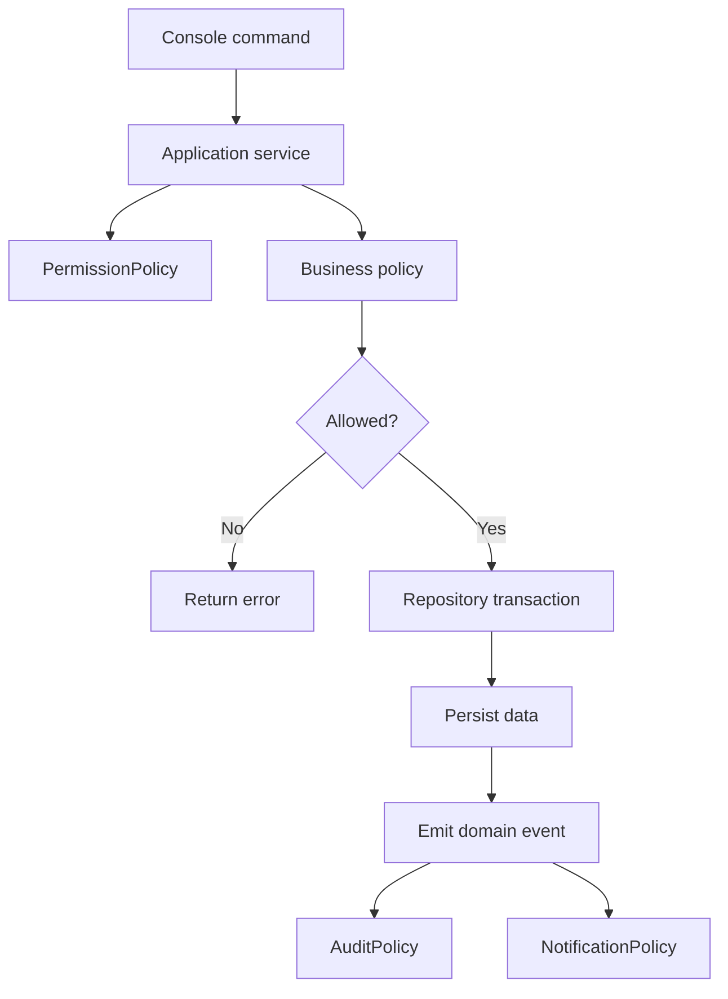

# Plan 01 - Foundation Architecture

## 1. Mục tiêu

Thiết lập nền kiến trúc để các module nghiệp vụ có thể triển khai độc lập nhưng vẫn dùng chung policy layer, repository và console runtime.

## 2. Module liên quan

- [Policy Layer](../modules/00-policy-layer.md)
- [Tenant, Restaurant, Branch](../modules/01-tenant-restaurant-branch.md)
- [Console CMD Runtime](../modules/15-console-mvp-runtime.md)

## 3. Cấu trúc thư mục đề xuất

```text
src/
  console/
    customer_menu_console
    kitchen_console
    cashier_console
    manager_console
  application/
    table_service
    menu_service
    order_service
    kitchen_service
    payment_service
    recommendation_service
    reporting_service
  policies/
    table_policy
    ordering_policy
    approval_policy
    pricing_policy
    payment_policy
    kitchen_routing_policy
    notification_policy
    recommendation_policy
    inventory_policy
    permission_policy
    audit_policy
  domain/
    entities
    enums
    value_objects
  infrastructure/
    database
    repositories
    seed
  shared/
    result
    errors
    date_time
```

Tên thư mục có thể đổi theo ngôn ngữ lập trình, nhưng ranh giới trách nhiệm nên giữ như trên.

## 4. Thành phần cần triển khai

| Thành phần | Vai trò |
| --- | --- |
| `ApplicationService` | Điều phối use case |
| `Policy` | Quyết định business rule |
| `Repository` | Đọc/ghi database |
| `Command` | Input cho service |
| `Query` | Input truy vấn dữ liệu |
| `Result` | Trả về success/failure thống nhất |
| `DomainEvent` | Sự kiện nghiệp vụ |

## 5. Luồng gọi chuẩn



## 6. Kế hoạch triển khai

| Bước | Việc cần làm | Kết quả |
| --- | --- | --- |
| 1 | Tạo cấu trúc project | Có thư mục/lớp module cơ bản |
| 2 | Tạo `Result`/`ErrorCode` dùng chung | Service trả lỗi thống nhất |
| 3 | Tạo enum trạng thái domain | Không dùng string rải rác |
| 4 | Tạo repository interface hoặc module DB | Service không query trực tiếp |
| 5 | Tạo policy interface đơn giản | Workflow gọi policy |
| 6 | Tạo domain event dispatcher đơn giản | Audit/notification nhận event |

## 7. Business rules nền

| Rule | Ý nghĩa |
| --- | --- |
| Console không được tự đổi trạng thái domain | Tránh nghiệp vụ nằm trong UI |
| Service phải gọi policy trước khi ghi DB | Giữ mở rộng business rule |
| Mọi command quan trọng phải có actor | Phục vụ permission và audit |
| Mọi dữ liệu nghiệp vụ phải có branch context | Chuẩn bị mở rộng multi-branch |

## 8. Tiêu chí hoàn thành

- Có thể tạo một service đơn giản và gọi từ console.
- Có thể trả lỗi nghiệp vụ bằng `Result`.
- Có thể ghi một domain event.
- Có thể gọi policy trong service.
- Có seed config mặc định cho Casual dining.
