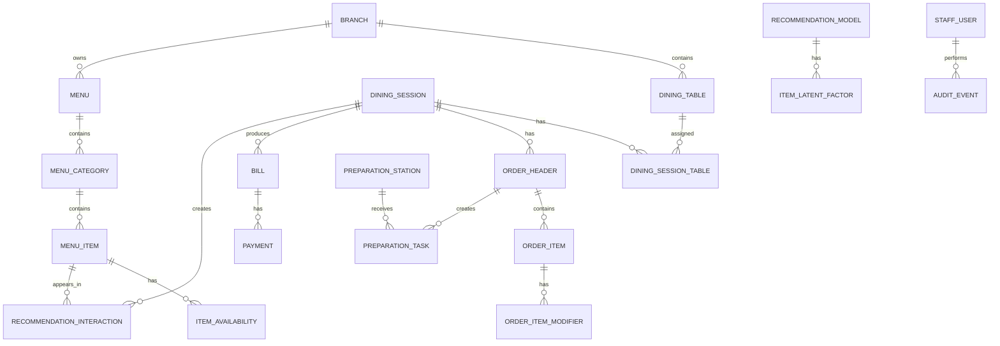

# Plan 02 - Database & Seed Data

## 1. Mục tiêu

Thiết kế và tạo database đủ cho MVP: bàn, phiên bàn, menu, trạng thái món, order, bếp, bill, notification, audit và recommendation.

## 2. Module liên quan

- [Menu Catalog](../modules/03-menu-catalog.md)
- [Inventory & Availability](../modules/11-inventory-availability.md)
- [Table & Dining Session](../modules/02-table-dining-session.md)
- [Order Management](../modules/05-order-management.md)
- [Payment & Billing](../modules/07-payment-billing.md)
- [Food Recommendation](../modules/04-food-recommendation.md)

## 3. Nhóm bảng cần có

| Nhóm | Bảng |
| --- | --- |
| Tenant/branch | `tenants`, `restaurants`, `branches`, `branch_configs` |
| Staff | `staff_users`, `roles`, `staff_role_assignments` |
| Table/session | `dining_tables`, `table_devices`, `dining_sessions`, `dining_session_tables` |
| Menu | `menus`, `menu_categories`, `menu_items`, `menu_item_variants`, `modifier_groups`, `modifier_options` |
| Availability | `item_availability`, `availability_history` |
| Order | `order_headers`, `order_items`, `order_item_modifiers`, `order_status_history` |
| Kitchen | `preparation_stations`, `preparation_tasks`, `task_items`, `task_status_history` |
| Billing | `bills`, `bill_lines`, `bill_adjustments`, `payments` |
| Notification | `notifications`, `notification_recipients` |
| Audit | `audit_events`, `config_versions` |
| Recommendation | `recommendation_interactions`, `recommendation_models`, `item_latent_factors`, `session_latent_factors` |

## 4. ERD MVP tổng hợp



## 5. Seed data cần có

| Nhóm | Dữ liệu seed |
| --- | --- |
| Branch | `branch_main` |
| Staff | Manager, cashier, waiter, kitchen |
| Table | 8 đến 12 bàn |
| Station | Kitchen, Bar |
| Menu category | Food, Drink, Dessert |
| Menu item | 15 đến 25 món |
| Availability | Tất cả món `available` ban đầu |
| Recommendation | Item pair rules cơ bản |
| History demo | 30 đến 50 dining sessions để train latent factor |

## 6. Dữ liệu menu và trạng thái món

Thông tin món:

```text
menu_items
  id
  category_id
  name
  description
  base_price
  image_url
  catalog_status
```

Trạng thái bán:

```text
item_availability
  branch_id
  item_id
  availability_status
  is_visible
  is_orderable
  reason
  updated_by
  updated_at
```

## 7. Kế hoạch triển khai

| Bước | Việc cần làm | Kết quả |
| --- | --- | --- |
| 1 | Chọn database phù hợp MVP | Có DB local chạy được |
| 2 | Tạo schema các bảng lõi | Có bảng domain chính |
| 3 | Tạo seed tenant/branch/staff | Có actor demo |
| 4 | Tạo seed table/station/menu | Có dữ liệu gọi món |
| 5 | Tạo seed lịch sử order | Có dữ liệu report/recommendation |
| 6 | Viết repository cơ bản | Service đọc/ghi DB |

## 8. Tiêu chí hoàn thành

- Chạy seed tạo được dữ liệu demo.
- Customer/Menu CMD đọc được menu.
- Cashier CMD thấy được bàn.
- Kitchen CMD thấy được station.
- Latent factor có đủ dữ liệu train tối thiểu.
