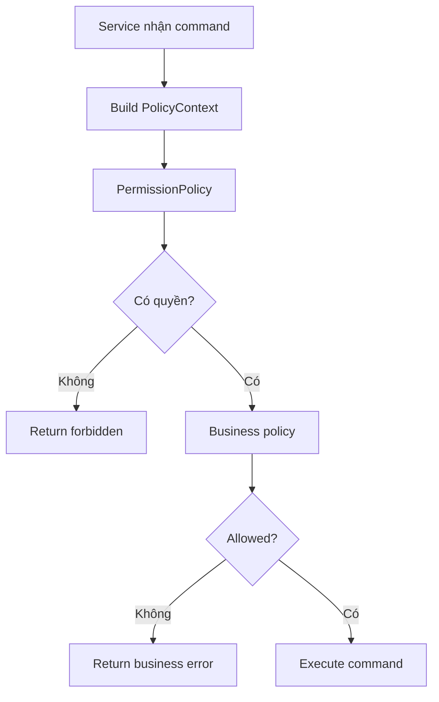

# Plan 03 - Policy Layer Implementation

## 1. Mục tiêu

Triển khai policy layer để workflow không bị phụ thuộc vào nhiều nhánh `if else`. Mỗi policy nhận context và trả về decision.

## 2. Policy cần có trong MVP

| Policy | Module | Quyết định |
| --- | --- | --- |
| `PermissionPolicy` | Staff | Actor có được thao tác không |
| `TablePolicy` | Table | Mở/ghép/chuyển/đóng bàn |
| `OrderingPolicy` | Order | Có được submit order không |
| `ApprovalPolicy` | Order | Order có cần duyệt không |
| `InventoryPolicy` | Inventory | Món có orderable không |
| `PricingPolicy` | Pricing | Tính tiền |
| `PaymentPolicy` | Payment | Có được request/confirm payment không |
| `KitchenRoutingPolicy` | Kitchen | Món đi station nào |
| `NotificationPolicy` | Notification | Event gửi cho ai |
| `RecommendationPolicy` | Recommendation | Chọn strategy gợi ý |
| `AuditPolicy` | Audit | Event nào cần log |

## 3. Kiểu dữ liệu policy

```text
PolicyContext
  actor
  branchId
  sessionId
  tableId
  orderId
  config
  currentTime
```

```text
PolicyDecision
  allowed
  decision
  reasons
  metadata
```

## 4. Workflow mẫu



## 5. Kế hoạch triển khai

| Bước | Việc cần làm | Kết quả |
| --- | --- | --- |
| 1 | Tạo `PolicyContext` | Input thống nhất |
| 2 | Tạo `PolicyDecision` | Output thống nhất |
| 3 | Tạo `PermissionPolicy` trước | Chặn command sai role |
| 4 | Tạo `TablePolicy` | Mở/ghép/chuyển bàn |
| 5 | Tạo `OrderingPolicy` + `ApprovalPolicy` | Submit và duyệt order |
| 6 | Tạo `InventoryPolicy` | Chặn món hết |
| 7 | Tạo `PaymentPolicy` | Chặn thanh toán sai trạng thái |
| 8 | Tạo `RecommendationPolicy` | Chọn latent factor hoặc fallback |

## 6. Config Casual dining

```json
{
  "table": {
    "openingMode": "staff_manual",
    "allowMerge": true,
    "allowTransfer": true
  },
  "ordering": {
    "allowMultipleOrdersPerSession": true,
    "approvalMode": "staff_required"
  },
  "payment": {
    "timing": "after_meal",
    "confirmation": "staff_manual"
  },
  "recommendation": {
    "latentFactorEnabled": true,
    "fallbackWhenModelMissing": true
  }
}
```

## 7. Tiêu chí hoàn thành

- Service không check role bằng `if role == ...` rải rác.
- Các command quan trọng đều gọi policy.
- Policy có lỗi rõ ràng để CMD in ra cho người dùng.
- Có thể đổi config mà không sửa workflow chính.
