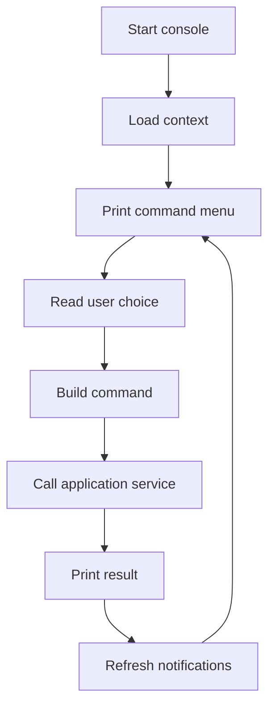

# Plan 04 - Console CMD Runtime

## 1. Mục tiêu

Triển khai nhiều cửa sổ CMD để mô phỏng các vai trò trong nhà hàng.

## 2. Cửa sổ cần có

| Console | Context | Actor |
| --- | --- | --- |
| `Customer/Menu CMD` | `tableId` | Khách tại bàn |
| `Kitchen CMD` | `stationId` | Kitchen staff |
| `Cashier/Staff CMD` | `staffId` | Cashier/reception/waiter |
| `Manager CMD` | `staffId` | Manager |

## 3. Nguyên tắc

- CMD chỉ hiển thị menu và nhận input.
- CMD gọi application service.
- CMD không tự đổi trạng thái order/bill/task.
- CMD nhận lỗi từ service và in ra màn hình.
- Notification dùng refresh/polling.

## 4. Command loop chung

## 5. Kế hoạch triển khai

| Bước | Việc cần làm | Kết quả |
| --- | --- | --- |
| 1 | Tạo console base loop | Các CMD dùng chung pattern |
| 2 | Tạo Customer/Menu CMD | Xem menu, cart, submit order |
| 3 | Tạo Cashier/Staff CMD | Mở bàn, duyệt order, payment |
| 4 | Tạo Kitchen CMD | Xem task, update preparing/ready |
| 5 | Tạo Manager CMD | CRUD menu, report, train model |
| 6 | Thêm notification refresh | CMD thấy event mới |

## 6. Mapping command sang service

| Console command | Service |
| --- | --- |
| `OpenTable` | `TableService.openTable` |
| `MergeTable` | `TableService.mergeTable` |
| `TransferTable` | `TableService.transferTable` |
| `ViewMenu` | `MenuService.getCustomerMenu` |
| `SubmitOrder` | `OrderService.submitOrder` |
| `AcceptOrder` | `OrderService.acceptOrder` |
| `RequestCancelOrderItem` | `OrderService.requestCancelOrderItem` |
| `ApproveCancelOrderItem` | `OrderService.approveCancelOrderItem` |
| `RejectCancelOrderItem` | `OrderService.rejectCancelOrderItem` |
| `StartTask` | `KitchenService.startTask` |
| `MarkTaskReady` | `KitchenService.markTaskReady` |
| `RequestBill` | `PaymentService.requestBill` |
| `ConfirmPayment` | `PaymentService.confirmPayment` |
| `TrainRecommendationModel` | `RecommendationService.trainModel` |

## 7. Tiêu chí hoàn thành

- Có thể mở nhiều CMD cùng lúc.
- CMD này thay đổi dữ liệu thì CMD khác refresh thấy thay đổi.
- Luồng demo end-to-end chạy được.
- Lỗi nghiệp vụ hiển thị rõ, ví dụ bàn chưa mở, món hết, order chưa duyệt.
