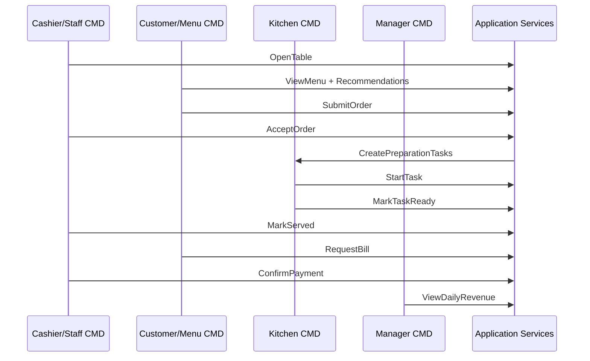

# Plan 05 - Core Business Flow

## 1. Mục tiêu

Triển khai luồng vận hành Casual dining từ lúc mở bàn đến lúc thanh toán và đóng bàn.

## 2. Luồng end-to-end

## 3. Phase triển khai nghiệp vụ

### Phase 1 - Table/session

| Task | Kết quả |
| --- | --- |
| Implement `OpenTable` | Tạo session |
| Implement `MergeTable` | Session có nhiều bàn |
| Implement `TransferTable` | Chuyển bàn không mất order |
| Implement `RequestService` | Gọi nhân viên |

### Phase 2 - Menu/inventory

| Task | Kết quả |
| --- | --- |
| Implement `GetCustomerMenu` | Khách xem món orderable |
| Implement `CreateMenuItem` | Manager thêm món |
| Implement `SetItemAvailability` | Bật/tắt món |
| Implement snapshot data | Order lưu tên/giá tại thời điểm submit |

### Phase 3 - Order/approval

| Task | Kết quả |
| --- | --- |
| Implement cart in CMD | Khách chọn món |
| Implement `SubmitOrder` | Tạo order chờ duyệt |
| Implement `AcceptOrder` | Order accepted |
| Implement `RejectOrder` | Order rejected |
| Implement `RequestCancelOrderItem` | Khách yêu cầu hủy món đặt nhầm |
| Implement `ApproveCancelOrderItem` | Nhân viên hủy món trước khi bếp làm |

### Phase 4 - Kitchen

| Task | Kết quả |
| --- | --- |
| Implement routing by category | Food đi kitchen, drink đi bar |
| Implement `GetStationTasks` | Kitchen CMD xem task |
| Implement `StartTask` | Task preparing |
| Implement `MarkTaskReady` | Task ready và báo waiter |

### Phase 5 - Billing/payment

| Task | Kết quả |
| --- | --- |
| Implement `RequestBill` | Tạo bill từ session |
| Implement `CalculateSessionBill` | Tính subtotal, fee, tax |
| Implement `ConfirmPayment` | Bill paid |
| Implement `CloseSession` | Bàn chuyển cleaning |

## 4. Business rules cần đảm bảo

| Rule | Kiểm tra bằng policy |
| --- | --- |
| Bàn phải active mới order được | `OrderingPolicy` |
| Món hết không được order | `InventoryPolicy` |
| Order cần staff duyệt | `ApprovalPolicy` |
| Hủy món đặt nhầm tùy trạng thái bếp | `CancellationPolicy` |
| Bill chỉ paid bởi cashier/manager | `PermissionPolicy`, `PaymentPolicy` |
| Session billing không được gọi thêm món | `PaymentPolicy`, `OrderingPolicy` |
| Task ready phải báo phục vụ | `NotificationPolicy` |

## 5. Tiêu chí hoàn thành

- Demo được một bàn gọi nhiều order.
- Demo được ghép bàn hoặc chuyển bàn.
- Demo được món hết hàng bị chặn.
- Demo được hủy món đặt nhầm trước khi bếp làm.
- Demo được bếp nhận task và báo ready.
- Demo được thanh toán cuối bữa.
- Report doanh thu tăng sau khi bill paid.
