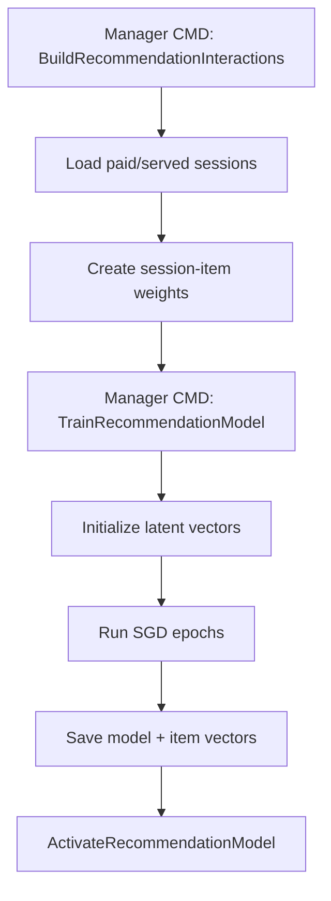
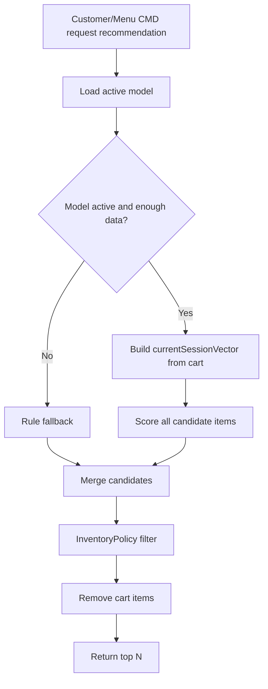

# Plan 06 - Recommendation Latent Factor

## 1. Mục tiêu

Triển khai recommendation hybrid: latent factor khi có dữ liệu, rule-based fallback khi chưa đủ dữ liệu.

## 2. Module liên quan

- [Food Recommendation](../modules/04-food-recommendation.md)
- [AI/ML Latent Factor Deep Dive](../modules/04a-ai-ml-latent-factor-deep-dive.md)
- [Reporting](../modules/13-reporting.md)
- [Menu Catalog](../modules/03-menu-catalog.md)
- [Inventory & Availability](../modules/11-inventory-availability.md)

## 3. Dữ liệu cần có

| Dữ liệu | Nguồn |
| --- | --- |
| `DiningSession` | Phiên bàn |
| `OrderItem` | Món đã gọi |
| `MenuItem` | Món trong menu |
| `Bill/Payment` | Xác định session hợp lệ |
| `ItemAvailability` | Lọc món hết |

Không cần lịch sử khách hàng cá nhân trong MVP. `DiningSession` được xem như user tạm thời.

## 4. Bảng cần triển khai

| Bảng | Vai trò |
| --- | --- |
| `recommendation_interactions` | Session-item matrix |
| `recommendation_models` | Metadata model |
| `item_latent_factors` | Vector món |
| `session_latent_factors` | Vector session train |
| `recommendation_training_runs` | Lịch sử train |
| `recommendation_events` | Click/add từ gợi ý |

## 5. Workflow train model



## 6. Workflow recommend



## 7. Kế hoạch triển khai

| Bước | Việc cần làm | Kết quả |
| --- | --- | --- |
| 1 | Tạo bảng recommendation | Có nơi lưu model/vector |
| 2 | Tạo seed order history | Có dữ liệu học |
| 3 | Implement `BuildRecommendationInteractions` | Có matrix session-item |
| 4 | Implement SGD latent factor | Có item vector |
| 5 | Implement fallback strategy | Không bị rỗng khi thiếu model |
| 6 | Implement recommend from cart | Gợi ý theo món đang chọn |
| 7 | Track recommendation event | Đo được hiệu quả gợi ý |

## 8. Công thức MVP

```text
interactionWeight = 1 + log(1 + quantity)
prediction = dot(sessionVector, itemVector) + itemBias
currentSessionVector = average(itemVector of cartItems)
```

Nếu cart rỗng:

```text
use best_seller fallback
```

## 9. Tiêu chí hoàn thành

- Manager CMD train được model.
- Customer/Menu CMD nhận được gợi ý khi cart có món.
- Món hết hàng không xuất hiện trong gợi ý.
- Nếu không có model, hệ thống vẫn trả best seller.
- Có thể giải thích vì sao MVP không cần lịch sử khách hàng cá nhân.
