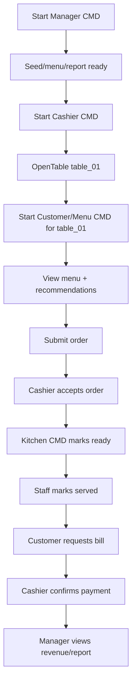

# Plan 07 - Testing & Demo

## 1. Mục tiêu

Chuẩn bị test case và kịch bản demo để chứng minh hệ thống hoạt động đúng nghiệp vụ.

## 2. Test theo module

| Module | Test chính |
| --- | --- |
| Policy | Command bị chặn khi sai quyền/trạng thái |
| Table | Mở bàn, ghép bàn, chuyển bàn, đóng bàn |
| Menu | Món active hiển thị, món sold out bị chặn |
| Order | Submit, accept, reject, cancel |
| Kitchen | Task pending, preparing, ready |
| Payment | Request bill, confirm paid, không paid hai lần |
| Notification | Event tạo notification đúng role |
| Recommendation | Latent factor, fallback, filter sold out |
| Reporting | Bill paid mới tính doanh thu |
| Audit | Hành động nhạy cảm có log |

## 3. Demo script chính

## 4. Demo edge cases

| Tình huống | Kết quả mong muốn |
| --- | --- |
| Submit order khi bàn chưa mở | Bị `OrderingPolicy` chặn |
| Gọi món sold out | Bị `InventoryPolicy` chặn |
| Kitchen cố confirm payment | Bị `PermissionPolicy` chặn |
| Request bill rồi gọi thêm món | Bị chặn |
| Chuyển bàn sau khi có order | Order/bill vẫn thuộc session |
| Khách đặt nhầm và hủy trước khi bếp làm | Món bị hủy, bill không tính món đó |
| Khách hủy khi bếp đã preparing | Bị chặn hoặc cần manager approval |
| Không có latent model | Recommendation fallback best seller |

## 5. Checklist trước demo

- Có ít nhất 8 bàn seed.
- Có ít nhất 15 món seed.
- Có staff cho manager, cashier, kitchen, waiter.
- Có lịch sử order để train latent factor.
- Có ít nhất một món sold out để test.
- Có ít nhất một rule item pair để fallback.
- Có thể chạy 4 CMD cùng lúc.

## 6. Tiêu chí đạt MVP

- Chạy được luồng end-to-end không cần sửa dữ liệu tay.
- Các cửa sổ CMD đồng bộ qua database.
- Các policy chặn được lỗi nghiệp vụ chính.
- Recommendation hoạt động cả khi có và không có model.
- Báo cáo doanh thu và món bán chạy đọc được dữ liệu thật từ bill/order.
- Audit log ghi được hành động quan trọng.
