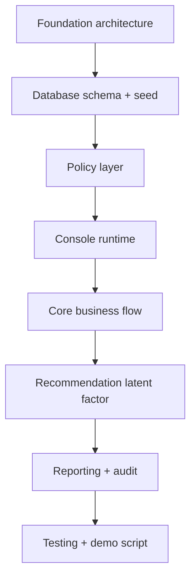

# Kế Hoạch Triển Khai Code - Restaurant Ordering MVP

## 1. Mục tiêu

Bộ tài liệu này chuyển phần phân tích nghiệp vụ thành kế hoạch triển khai code cho MVP Casual dining chạy bằng nhiều cửa sổ CMD.

MVP không tập trung vào UI đẹp. Mục tiêu là chứng minh được:

- Mỗi module nghiệp vụ có service và policy riêng.
- Các cửa sổ CMD chỉ là lớp giao diện, không chứa nghiệp vụ sâu.
- Database lưu được menu, bàn, order, bếp, bill, notification, audit và recommendation data.
- Workflow vận hành nhà hàng chạy được từ đầu đến cuối.

## 2. Danh sách kế hoạch

| Thứ tự | File | Nội dung |
| --- | --- | --- |
| 01 | [01-foundation-architecture-plan.md](01-foundation-architecture-plan.md) | Kiến trúc code, module, service, repository, policy |
| 02 | [02-database-seed-plan.md](02-database-seed-plan.md) | Database schema, seed data, dữ liệu demo |
| 03 | [03-policy-layer-plan.md](03-policy-layer-plan.md) | Triển khai policy layer thay vì `if else` trong workflow |
| 04 | [04-console-runtime-plan.md](04-console-runtime-plan.md) | Triển khai nhiều cửa sổ CMD cho từng actor |
| 05 | [05-core-business-flow-plan.md](05-core-business-flow-plan.md) | Luồng mở bàn, gọi món, duyệt order, bếp, thanh toán |
| 06 | [06-recommendation-latent-factor-plan.md](06-recommendation-latent-factor-plan.md) | Gợi ý món bằng latent factor và fallback |
| 07 | [07-testing-demo-plan.md](07-testing-demo-plan.md) | Test case, kịch bản demo, tiêu chí hoàn thành |

## 3. Thứ tự triển khai đề xuất

## 4. MVP scope

| Nhóm | Làm trong MVP |
| --- | --- |
| Runtime | Nhiều CMD window |
| Restaurant | Một tenant, một nhà hàng, một chi nhánh |
| Table | Mở bàn, ghép bàn, chuyển bàn, đóng bàn |
| Menu | CRUD món, danh mục, trạng thái còn/hết |
| Order | Gửi order, nhân viên duyệt, gửi bếp/bar |
| Kitchen | KDS mô phỏng bằng CMD |
| Payment | Bill cuối bữa, xác nhận thủ công |
| Notification | DB polling hoặc refresh bằng CMD |
| Recommendation | Latent factor đơn giản + fallback |
| Report | Doanh thu ngày, món bán chạy |
| Audit | Log hành động quan trọng |

## 5. Không làm trong MVP

- Web/tablet UI hoàn chỉnh.
- Payment gateway thật.
- Máy in nhiệt thật.
- Cảm biến bàn.
- Reservation đầy đủ.
- Multi-tenant SaaS đầy đủ.
- Split bill.
- Buffet rule.
- AI recommendation nâng cao ngoài latent factor.

## 6. Nguyên tắc code

- Controller/console không xử lý nghiệp vụ sâu.
- Application service điều phối workflow.
- Policy quyết định rule nghiệp vụ.
- Repository đọc/ghi database.
- Entity lưu dữ liệu domain.
- Audit và notification đi theo domain event.
- Order/bill luôn lưu snapshot để không bị sai khi menu đổi giá.
