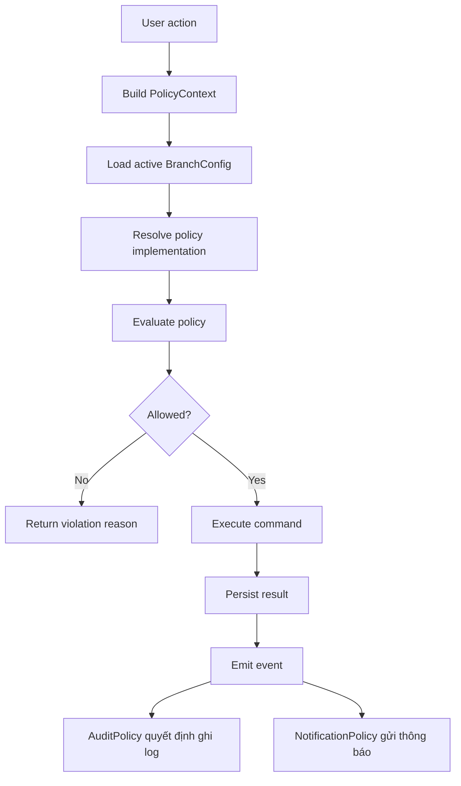

# Module 00 - Policy Layer

## 1. Mục tiêu

Policy Layer là lớp quyết định nghiệp vụ cho **nhà hàng Casual dining**. Workflow chính chỉ gọi policy, không tự viết nhiều nhánh `if else` trong CMD/service.

Với sản phẩm này, policy layer nên ở mức nhẹ:

- Dùng config lưu trong database hoặc file seed.
- Mỗi policy là một service nhỏ.
- Mỗi policy nhận `context`, trả về `decision`.
- Không cần xây rule engine phức tạp.
- Không cần hỗ trợ nhiều profile nhà hàng trong MVP.

## 1.1. Baseline Casual dining

| Nhóm | Rule nền |
| --- | --- |
| Table | Nhân viên mở bàn thủ công, một bàn chỉ có một active session |
| Session | Một session có thể có nhiều order và nhiều bàn khi ghép bàn |
| Order | Khách submit order, staff phải duyệt trước khi bếp làm |
| Cancellation | Khách được yêu cầu hủy món đặt nhầm theo trạng thái món |
| Kitchen | Món được route theo category đến `kitchen` hoặc `bar` |
| Payment | Thanh toán cuối bữa, cashier xác nhận thủ công |
| Recommendation | Latent factor nếu có model, fallback nếu thiếu dữ liệu |
| Notification | DB polling cho các cửa sổ CMD |

## 2. Nguyên tắc thiết kế

| Nguyên tắc | Ý nghĩa |
| --- | --- |
| Workflow gọi policy | Workflow không tự quyết định nghiệp vụ chi tiết |
| Policy đọc config | Rule thay đổi qua cấu hình thay vì sửa nhiều nơi |
| Decision rõ ràng | Mỗi policy trả về kết quả dễ kiểm thử |
| Có reason | Khi từ chối hành động phải có lý do |
| Có version | Config quan trọng nên lưu version để truy vết |

## 3. Policy registry đề xuất

| Policy | Dùng trong module | Quyết định |
| --- | --- | --- |
| `TablePolicy` | Table & Dining Session | Có được mở/đóng bàn không |
| `OrderingPolicy` | Order Management | Có được gửi/sửa/hủy order không |
| `ApprovalPolicy` | Order Management | Order có cần nhân viên duyệt không |
| `CancellationPolicy` | Order Management | Có được hủy món/order đã đặt nhầm không |
| `PricingPolicy` | Pricing/Billing | Tính giá, phí, thuế, giảm giá |
| `PaymentPolicy` | Payment & Billing | Thanh toán khi nào, ai xác nhận |
| `KitchenRoutingPolicy` | Kitchen Routing | Món đi bếp hay bar |
| `NotificationPolicy` | Notification | Sự kiện nào gửi cho ai |
| `RecommendationPolicy` | Food Recommendation | Gợi ý món nào cho khách |
| `InventoryPolicy` | Inventory/Menu | Món hết hàng xử lý ra sao |
| `PermissionPolicy` | Staff/Permission | Role nào được làm hành động nào |
| `AuditPolicy` | Audit Log | Sự kiện nào cần ghi log |

## 4. Policy context chung

```json
{
  "tenantId": "tenant_default",
  "restaurantId": "restaurant_default",
  "branchId": "branch_default",
  "actor": {
    "type": "staff",
    "staffId": "staff_001",
    "roles": ["cashier"]
  },
  "table": {
    "tableId": "table_01",
    "status": "occupied"
  },
  "session": {
    "sessionId": "session_001",
    "status": "active"
  },
  "configVersion": "v1"
}
```

## 5. Policy decision chung

```json
{
  "allowed": true,
  "decision": "staff_approval_required",
  "reasons": [],
  "metadata": {
    "nextStatus": "awaiting_approval"
  }
}
```

Khi bị từ chối:

```json
{
  "allowed": false,
  "decision": "blocked",
  "reasons": [
    {
      "code": "TABLE_NOT_ACTIVE",
      "message": "Bàn chưa được mở nên không thể gửi order."
    }
  ],
  "metadata": {}
}
```

## 6. Flow áp dụng policy



## 7. Config Casual dining mặc định

```json
{
  "table": {
    "openingMode": "staff_manual",
    "singleActiveSessionPerTable": true,
    "allowTransfer": true,
    "allowMerge": true,
    "allowMergeWhileBilling": false,
    "allowTransferWhileBilling": false
  },
  "ordering": {
    "allowMultipleOrdersPerSession": true,
    "approvalMode": "staff_required",
    "allowCustomerCancel": true,
    "cancelWindowSeconds": 90,
    "allowCancelBeforeKitchenStart": true,
    "managerApprovalWhenPreparing": true
  },
  "payment": {
    "timing": "after_meal",
    "confirmation": "staff_manual",
    "splitBill": false,
    "allowRequestBillWithPreparingItems": false
  },
  "kitchen": {
    "routingMode": "category_based",
    "stations": ["kitchen", "bar"]
  },
  "recommendation": {
    "strategies": ["latent_factor", "best_seller", "item_pair", "replacement"],
    "maxItems": 6,
    "latentFactorEnabled": true,
    "minInteractionsToUseModel": 30,
    "fallbackWhenModelMissing": true
  }
}
```

## 8. Mapping policy vào command

| Command | Policy cần gọi |
| --- | --- |
| `OpenTable` | `PermissionPolicy`, `TablePolicy`, `AuditPolicy` |
| `SubmitOrder` | `OrderingPolicy`, `InventoryPolicy`, `PricingPolicy`, `ApprovalPolicy` |
| `AcceptOrder` | `PermissionPolicy`, `ApprovalPolicy`, `KitchenRoutingPolicy`, `NotificationPolicy` |
| `RequestCancelOrderItem` | `CancellationPolicy`, `NotificationPolicy`, `AuditPolicy` |
| `ApproveCancelOrderItem` | `PermissionPolicy`, `CancellationPolicy`, `PricingPolicy`, `NotificationPolicy`, `AuditPolicy` |
| `MarkItemReady` | `PermissionPolicy`, `NotificationPolicy`, `AuditPolicy` |
| `RequestBill` | `PaymentPolicy`, `PricingPolicy` |
| `ConfirmPayment` | `PermissionPolicy`, `PaymentPolicy`, `AuditPolicy` |
| `RecommendItems` | `RecommendationPolicy`, `InventoryPolicy` |

## 8.1. Business rules xuyên module

| Rule ID | Rule | Policy |
| --- | --- | --- |
| GLOBAL_001 | CMD không được tự đổi trạng thái domain | Tất cả service |
| GLOBAL_002 | Mọi command nhạy cảm phải có actor/context | `PermissionPolicy` |
| GLOBAL_003 | Một session billing không được submit order mới | `OrderingPolicy`, `PaymentPolicy` |
| GLOBAL_004 | Món hết không được submit/recommend | `InventoryPolicy` |
| GLOBAL_005 | Mọi hủy món phải có lý do và audit | `CancellationPolicy`, `AuditPolicy` |
| GLOBAL_006 | Bill chỉ tính món không bị cancelled | `PricingPolicy` |
| GLOBAL_007 | Notification phải đi qua policy, không gửi thẳng từ CMD | `NotificationPolicy` |

## 8.2. Edge cases xuyên module

| Edge case | Cách xử lý |
| --- | --- |
| Config đổi giữa lúc session active | Session hiện tại dùng config version đã snapshot |
| CMD refresh chậm | Mọi command validate lại trạng thái DB mới nhất |
| Staff sai role gọi command | `PermissionPolicy` trả forbidden |
| Dữ liệu menu thay đổi khi khách đang xem cart | Submit order validate lại item/price/availability |
| Một event tạo notification trùng | Notification service dùng idempotency key theo event |

## 9. Lưu ý triển khai

- Trong MVP, có thể viết mỗi policy là một class/service.
- Không cần interface quá phức tạp, nhưng nên thống nhất input/output.
- Các rule đơn giản có thể dùng `switch` hoặc `if` bên trong policy, nhưng không rải trong controller/workflow.
- Controller chỉ nhận request, gọi service, service gọi policy.
- Nên viết test riêng cho từng policy vì policy là nơi chứa nghiệp vụ.
