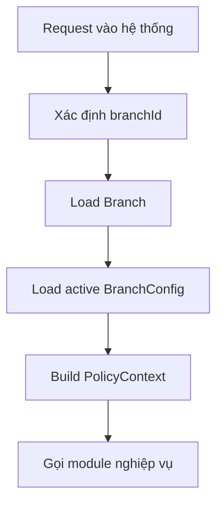

# Module 01 - Tenant, Restaurant, Branch

## 1. Mục tiêu

Module này lưu thông tin nhà hàng Casual dining, một chi nhánh chính và cấu hình vận hành. MVP không triển khai chuỗi hoặc multi-tenant SaaS.

## 1.1. Phạm vi Casual dining

| Quyết định | Giá trị |
| --- | --- |
| `businessProfile` | Cố định `casual_dining` |
| Số restaurant | 1 |
| Số branch | 1 |
| Config | Có version, nhưng không có wizard nhiều mô hình |
| Feature | Chỉ bật feature phục vụ Casual dining |

## 2. Phạm vi

| Nội dung | MVP Casual dining | Ngoài phạm vi Casual dining MVP |
| --- | --- | --- |
| Tenant | Một tenant mặc định | Không triển khai |
| Restaurant | Một nhà hàng Casual dining | Không triển khai |
| Branch | Một chi nhánh | Không triển khai |
| Branch config | Cấu hình chung cho workflow Casual dining | Chỉ versioning |
| Operating hour | Lưu giờ mở cửa cơ bản | Không dùng rule phức tạp |

## 3. Entity đề xuất

| Entity | Ý nghĩa |
| --- | --- |
| `Tenant` | Chủ thể sở hữu dữ liệu |
| `Restaurant` | Nhà hàng hoặc thương hiệu |
| `Branch` | Cơ sở vận hành cụ thể |
| `BranchConfig` | Cấu hình policy đang dùng |
| `OperatingHour` | Giờ mở cửa |
| `BusinessProfile` | Mô hình nhà hàng, ví dụ `casual_dining` |

## 4. Policy liên quan

### 4.1. BranchConfigPolicy

Quyết định config nào đang active cho chi nhánh.

Input:

- `branchId`.
- `configVersion`.
- `businessProfile`.

Output:

- Config active.
- Policy version.
- Các feature đang bật/tắt.

### 4.2. FeaturePolicy

Kiểm tra module/tính năng có được bật hay không.

Ví dụ:

```json
{
  "features": {
    "reservation": false,
    "recommendation": true,
    "qrPayment": false,
    "thermalPrinter": false,
    "splitBill": false
  }
}
```

## 5. Workflow load cấu hình



## 6. Business rules

| Rule ID | Rule | MVP |
| --- | --- | --- |
| TENANT_001 | Mọi dữ liệu nghiệp vụ phải thuộc một tenant | Có |
| BRANCH_001 | Một request phải xác định được branch | Có |
| CONFIG_001 | Mỗi branch có một config active | Có |
| CONFIG_002 | Config thay đổi cần lưu version | Nên có |
| FEATURE_001 | Tính năng tắt thì không cho gọi API tương ứng | Có |
| CASUAL_CONFIG_001 | `businessProfile` phải là `casual_dining` | Có |
| CASUAL_CONFIG_002 | Không cho bật feature ngoài MVP như buffet/reservation/payment gateway | Có |
| CASUAL_CONFIG_003 | Config active phải có version để order/bill snapshot | Có |

## 6.1. Edge cases

| Edge case | Cách xử lý |
| --- | --- |
| Không tìm thấy branch config active | Dùng seed config mặc định hoặc chặn hệ thống khởi động |
| Manager bật feature không thuộc Casual dining MVP | `FeaturePolicy` từ chối |
| Config đổi khi có session active | Session cũ giữ `configVersion`, session mới dùng version mới |
| Seed thiếu staff manager/cashier | Không cho demo workflow, báo lỗi seed |

## 7. Gợi ý dữ liệu seed

```json
{
  "tenant": {
    "id": "tenant_default",
    "name": "Default Tenant"
  },
  "restaurant": {
    "id": "restaurant_casual",
    "name": "Casual Dining Demo"
  },
  "branch": {
    "id": "branch_main",
    "name": "Main Branch",
    "businessProfile": "casual_dining"
  }
}
```

## 8. API/Use case

| Use case | Actor |
| --- | --- |
| Xem thông tin nhà hàng | Manager |
| Cập nhật cấu hình chi nhánh | Manager |
| Xem giờ mở cửa | Customer/Staff |
| Bật/tắt feature | Manager |

## 9. Lưu ý triển khai

- MVP có thể seed sẵn tenant/restaurant/branch.
- Không cần màn hình quản trị multi-tenant.
- Các module khác nên nhận `branchId`, không tự giả định global config.
- `BranchConfig` là nơi nối platform với policy layer.
