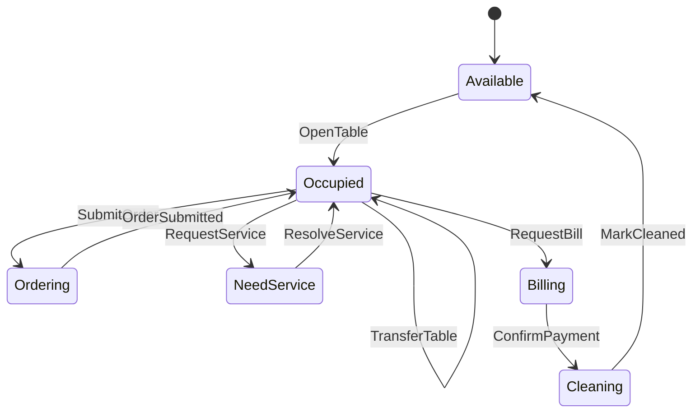
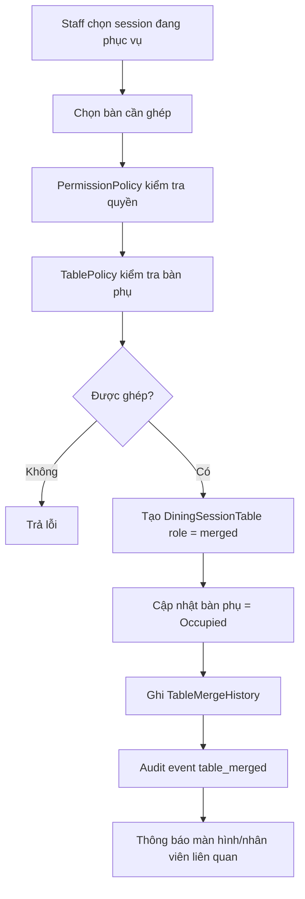
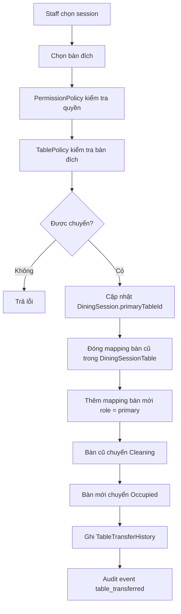
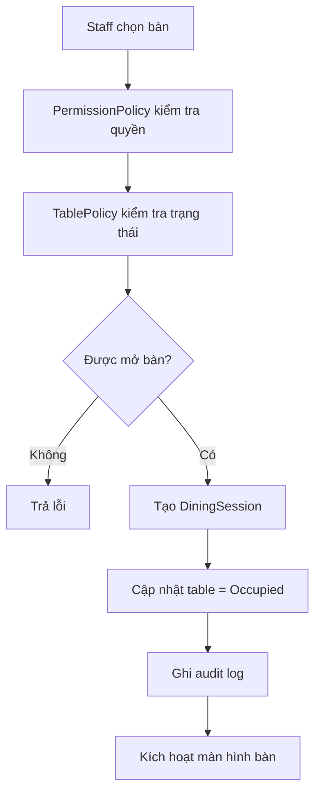

# Module 02 - Table & Dining Session

## 1. Mục tiêu

Module này quản lý bàn vật lý và phiên khách đang sử dụng bàn. Với Casual dining, `DiningSession` là trung tâm vận hành: một bàn được mở, khách gọi nhiều order, cuối bữa tạo bill và đóng session.

## 1.1. Phạm vi Casual dining

| Quyết định | Giá trị |
| --- | --- |
| Mở bàn | Staff mở thủ công |
| Ghép bàn | Có, dùng chung một session và một bill |
| Chuyển bàn | Có, không làm mất order/bill |
| Tách bill | Không thuộc MVP |
| Reservation | Không thuộc MVP |
| Cảm biến bàn | Không thuộc MVP |

## 2. Phạm vi

| Nội dung | MVP Casual dining | Ngoài phạm vi Casual dining MVP |
| --- | --- | --- |
| Mở bàn | Nhân viên mở thủ công | QR hoặc cảm biến tự mở |
| Thiết bị bàn | Gắn cố định với bàn | Tablet gán động |
| Một bàn active | Một bàn chỉ có một session active | Giữ nguyên rule này kể cả khi ghép/chuyển bàn |
| Ghép bàn | Thiết kế và có thể triển khai mức cơ bản | Ghép nhiều session, tách bàn lại |
| Chuyển bàn | Thiết kế và có thể triển khai mức cơ bản | Chuyển khu vực, chuyển nhiều bàn cùng lúc |
| Gọi nhân viên | Khách bấm gọi hỗ trợ | Phân công theo khu vực |
| Đóng bàn | Sau khi thanh toán | Timeout hoặc auto close |

## 3. Entity đề xuất

| Entity | Thuộc tính chính |
| --- | --- |
| `DiningTable` | `id`, `code`, `name`, `area`, `capacity`, `status` |
| `TableDevice` | `id`, `tableId`, `deviceCode`, `status` |
| `DiningSession` | `id`, `primaryTableId`, `openedBy`, `openedAt`, `closedAt`, `status`, `guestCount` |
| `DiningSessionTable` | `id`, `sessionId`, `tableId`, `role`, `joinedAt`, `leftAt`, `status` |
| `TableStatusHistory` | `tableId`, `fromStatus`, `toStatus`, `actorId`, `createdAt` |
| `TableMergeHistory` | `id`, `sessionId`, `sourceTableId`, `targetTableId`, `actorId`, `reason`, `createdAt` |
| `TableTransferHistory` | `id`, `sessionId`, `fromTableId`, `toTableId`, `actorId`, `reason`, `createdAt` |
| `ServiceRequest` | `sessionId`, `type`, `message`, `status` |

### 3.1. Ghi chú mô hình dữ liệu

Ban đầu một `DiningSession` thường gắn với một bàn chính qua `primaryTableId`. Khi cần ghép bàn, không nên tạo order/bill mới cho bàn phụ. Thay vào đó, thêm bản ghi vào `DiningSessionTable`.

Ví dụ:

| Session | Bàn | Vai trò |
| --- | --- | --- |
| `session_01` | `table_01` | `primary` |
| `session_01` | `table_02` | `merged` |

Cách này giúp:

- Order và bill vẫn thuộc một `DiningSession`.
- Một session có thể phục vụ nhiều bàn vật lý.
- Chuyển bàn không cần chuyển order/bill.
- Lịch sử ghép/chuyển bàn vẫn truy vết được.

## 4. Policy liên quan

### 4.1. TablePolicy

Quyết định bàn có được mở, đóng, chuyển trạng thái hay không.

Input:

- `actor`.
- `table`.
- `activeSession`.
- `targetTable`.
- `sessionTables`.
- `branchConfig.table`.

Output:

- `allowed`.
- `nextTableStatus`.
- `nextSessionStatus`.
- `affectedTables`.
- `reasons`.

Rule MVP:

```json
{
  "openingMode": "staff_manual",
  "singleActiveSessionPerTable": true,
  "allowMerge": true,
  "allowTransfer": true,
  "allowMergeWhileBilling": false,
  "allowTransferWhileBilling": false
}
```

Các quyết định chính của `TablePolicy`:

| Action | Policy quyết định |
| --- | --- |
| `OpenTable` | Bàn có đang `Available` không, actor có quyền không |
| `MergeTable` | Bàn phụ có trống không, session có active không |
| `TransferTable` | Bàn đích có trống không, session có đang billing không |
| `RequestBill` | Có món chưa xử lý không, session có được chuyển billing không |
| `CloseSession` | Bill đã paid chưa, các bàn liên quan chuyển trạng thái nào |

### 4.2. PermissionPolicy

Kiểm tra ai được mở/đóng/ghép/chuyển bàn. Trong MVP:

- `reception`.
- `cashier`.
- `manager`.

Với `waiter`, có thể cho phép mở bàn và gọi hỗ trợ, nhưng ghép/chuyển bàn nên giới hạn cho `reception`, `cashier` hoặc `manager` để tránh sai bill.

## 5. Trạng thái bàn



## 6. Thiết kế ghép bàn

Ghép bàn dùng khi một nhóm khách cần thêm bàn vật lý nhưng vẫn dùng chung một phiên phục vụ và một bill.

### 6.1. Nguyên tắc

- Chỉ ghép bàn vào một `DiningSession` đang active.
- Bàn phụ phải đang `Available`.
- Bàn phụ sau khi ghép chuyển sang `Occupied`.
- Bàn phụ không tạo `DiningSession` riêng.
- Mọi order mới vẫn gắn với session gốc.
- Khi thanh toán xong, tất cả bàn trong session chuyển sang `Cleaning`.

### 6.2. Workflow ghép bàn



### 6.3. Ví dụ dữ liệu sau khi ghép

```json
{
  "sessionId": "session_01",
  "primaryTableId": "table_01",
  "tables": [
    {
      "tableId": "table_01",
      "role": "primary",
      "status": "active"
    },
    {
      "tableId": "table_02",
      "role": "merged",
      "status": "active"
    }
  ]
}
```

## 7. Thiết kế chuyển bàn

Chuyển bàn dùng khi khách đổi từ bàn hiện tại sang bàn khác, ví dụ bàn lỗi thiết bị, khách muốn đổi vị trí hoặc cần bàn lớn hơn.

### 7.1. Nguyên tắc

- Chỉ chuyển bàn cho `DiningSession` đang active.
- Bàn đích phải `Available`.
- Order, bill, service request vẫn giữ nguyên `sessionId`.
- `primaryTableId` được cập nhật nếu chuyển bàn chính.
- Bàn cũ chuyển sang `Cleaning` hoặc `Available` tùy policy.
- Nếu session đang ghép nhiều bàn, cần xác định chuyển bàn nào trong nhóm.

### 7.2. Hai kiểu chuyển bàn

| Kiểu | Mô tả | MVP |
| --- | --- | --- |
| Chuyển bàn chính | Chuyển toàn bộ session từ bàn A sang bàn B | Nên làm |
| Chuyển một bàn trong nhóm ghép | Đổi một bàn phụ sang bàn khác | Có thể làm sau |

### 7.3. Workflow chuyển bàn chính



### 7.4. Ví dụ dữ liệu sau khi chuyển bàn

```json
{
  "sessionId": "session_01",
  "primaryTableId": "table_05",
  "transfer": {
    "fromTableId": "table_01",
    "toTableId": "table_05",
    "reason": "Khách muốn đổi vị trí"
  }
}
```

## 8. Workflow mở bàn



## 9. Business rules

| Rule ID | Rule | MVP |
| --- | --- | --- |
| TABLE_001 | Chỉ staff có quyền mới được mở bàn | Có |
| TABLE_002 | Bàn `Available` mới được mở | Có |
| TABLE_003 | Một bàn chỉ có một active session | Có |
| TABLE_004 | Bàn đang `Billing` không được gọi thêm món | Có |
| TABLE_005 | Chỉ đóng session khi bill đã paid | Có |
| TABLE_006 | Mọi đổi trạng thái bàn phải ghi history | Nên có |
| TABLE_007 | Chỉ ghép bàn `Available` vào session `Active` | Có |
| TABLE_008 | Bàn đã ghép dùng chung bill với session gốc | Có |
| TABLE_009 | Không cho ghép bàn khi session đang `Billing` | Có |
| TABLE_010 | Chỉ chuyển sang bàn đích `Available` | Có |
| TABLE_011 | Chuyển bàn không được làm mất order/bill cũ | Có |
| TABLE_012 | Ghép/chuyển bàn phải ghi audit log | Có |
| TABLE_013 | Một session billing không được ghép/chuyển bàn | Có |
| TABLE_014 | Customer/Menu CMD ở bàn cũ phải reload context sau chuyển bàn | Có |
| TABLE_015 | Tất cả bàn trong session paid phải chuyển `Cleaning` | Có |

## 10. API/Command gợi ý

| Command | Mô tả |
| --- | --- |
| `OpenTable(tableId)` | Mở bàn và tạo session |
| `GetActiveSession(tableId)` | Lấy session hiện tại |
| `MergeTable(sessionId, targetTableId, reason)` | Ghép bàn trống vào session hiện tại |
| `TransferTable(sessionId, fromTableId, toTableId, reason)` | Chuyển session hoặc một bàn trong session sang bàn khác |
| `GetSessionTables(sessionId)` | Lấy danh sách bàn thuộc session |
| `RequestService(sessionId)` | Khách gọi nhân viên |
| `RequestBill(sessionId)` | Chuyển sang trạng thái billing |
| `CloseSession(sessionId)` | Đóng session sau thanh toán |
| `MarkTableCleaned(tableId)` | Chuyển bàn về available |

## 11. Edge cases

- Nhân viên mở bàn đã có session active.
- Thiết bị bàn gửi order nhưng session đã đóng.
- Khách yêu cầu thanh toán khi còn món chưa served.
- Thu ngân xác nhận thanh toán hai lần.
- Bàn bị mất kết nối thiết bị nhưng session vẫn active.
- Staff ghép một bàn đã có khách/session active.
- Staff chuyển bàn sang bàn đang `Billing` hoặc `Cleaning`.
- Khách đang order trên màn hình bàn cũ trong lúc staff chuyển bàn.
- Session đã ghép nhiều bàn nhưng staff chỉ muốn chuyển một bàn phụ.
- Bill được request ngay sau khi vừa ghép bàn, cần tính tất cả order theo session.
- Cashier chuyển bàn khi Customer CMD đang submit order.
- Ghép bàn phụ nhưng bàn phụ đang có notification chưa xử lý từ session cũ.
- Staff đánh dấu cleaned một bàn trong nhóm ghép trước khi bill paid.

## 11.1. Cách xử lý edge case quan trọng

| Edge case | Policy xử lý | Kết quả |
| --- | --- | --- |
| Submit order trong lúc chuyển bàn | `OrderingPolicy` kiểm tra session active theo `sessionId`, không theo table cũ | Order vẫn thuộc session đúng |
| Ghép bàn khi session billing | `TablePolicy` chặn | Trả lý do "Bàn đang thanh toán" |
| Chuyển sang bàn đang cleaning | `TablePolicy` chặn | Staff phải mark cleaned trước |
| Customer CMD ở bàn cũ sau chuyển | `DeviceBindingPolicy` trả context mới hoặc yêu cầu reload | Tránh gửi order sai bàn |

## 12. Lưu ý triển khai

- `DiningSession` nên là khóa liên kết chính của order và bill.
- Không nên gắn order trực tiếp vào `tableId` vì bàn có thể được dùng nhiều lần trong ngày.
- Khi đóng session, nên snapshot tổng bill và trạng thái cuối.
- Nên truy vấn session active qua `DiningSessionTable`, không chỉ qua `DiningSession.primaryTableId`.
- Khi ghép/chuyển bàn, nên cập nhật trong transaction: session mapping, table status, history và audit.
- Nếu bàn có màn hình cố định, sau khi chuyển bàn cần thông báo cả màn hình bàn cũ và bàn mới để reload context.
