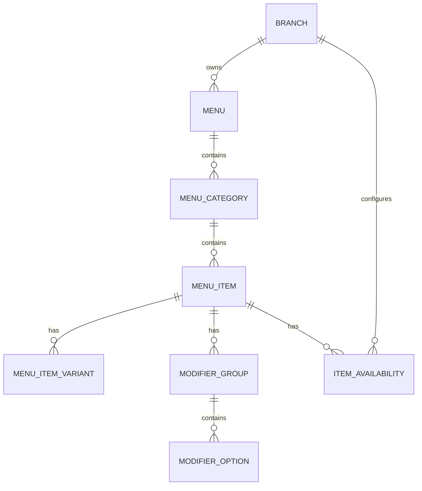
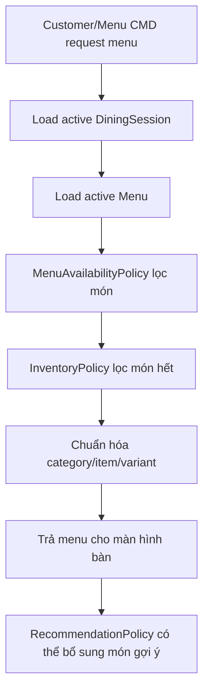

# Module 03 - Menu Catalog

## 1. Mục tiêu

Menu Catalog quản lý danh mục món, món ăn, biến thể, topping/tuỳ chọn và trạng thái catalog của món. Đây là nguồn dữ liệu chính cho màn hình đặt món, order, pricing, recommendation và inventory.

## 1.1. Phạm vi Casual dining

| Quyết định | Giá trị |
| --- | --- |
| Menu | Một menu chính cho chi nhánh |
| Category | Food, Drink, Dessert hoặc nhóm tương tự |
| Modifier | Tùy chọn đơn giản, không combo phức tạp |
| Combo/set | Không thuộc MVP |
| Menu theo giờ | Không thuộc MVP |
| Giá theo chi nhánh | Không thuộc MVP |

## 2. Phạm vi

| Nội dung | MVP Casual dining | Ngoài phạm vi Casual dining MVP |
| --- | --- | --- |
| Category | Món chính, đồ uống, tráng miệng | Menu nhiều cấp |
| Item | Tên, ảnh, mô tả, giá, trạng thái catalog | Allergen, dinh dưỡng |
| Variant | Size hoặc lựa chọn đơn giản | Variant phức tạp |
| Modifier | Topping/ghi chú đơn giản | Modifier group bắt buộc |
| Combo | Chưa làm | Combo/set menu |
| Availability | Bật/tắt món thủ công | Theo kho hoặc giờ bán |

## 3. Entity đề xuất

| Entity | Thuộc tính chính |
| --- | --- |
| `Menu` | `id`, `branchId`, `name`, `status` |
| `MenuCategory` | `id`, `menuId`, `name`, `displayOrder` |
| `MenuItem` | `id`, `categoryId`, `name`, `description`, `basePrice`, `imageUrl`, `catalogStatus` |
| `MenuItemVariant` | `id`, `itemId`, `name`, `priceDelta` |
| `ModifierGroup` | `id`, `itemId`, `name`, `minSelect`, `maxSelect` |
| `ModifierOption` | `id`, `groupId`, `name`, `priceDelta` |
| `ItemAvailability` | `branchId`, `itemId`, `availabilityStatus`, `isVisible`, `isOrderable`, `updatedAt` |
| `MenuItemSnapshot` | Snapshot giá/tên khi tạo order |

## 4. Cơ sở dữ liệu lưu món và trạng thái

### 4.1. Món ăn được lưu ở đâu

Thông tin gốc của món ăn được lưu trong nhóm bảng của `Menu Catalog`:

| Bảng | Lưu dữ liệu gì | Ví dụ |
| --- | --- | --- |
| `menus` | Menu đang dùng cho chi nhánh | Menu chính, menu đồ uống |
| `menu_categories` | Nhóm món | Món chính, đồ uống, tráng miệng |
| `menu_items` | Thông tin món | Tên, mô tả, ảnh, giá cơ bản |
| `menu_item_variants` | Biến thể món | Size M/L, nóng/lạnh |
| `modifier_groups` | Nhóm tùy chọn | Topping, độ cay |
| `modifier_options` | Tùy chọn cụ thể | Thêm phô mai, ít đá |

`menu_items` là bảng chính để lưu món ăn. Tuy nhiên bảng này chỉ nên lưu trạng thái vòng đời của món trong catalog, ví dụ:

- `draft`: món mới tạo, chưa bán.
- `active`: món đang nằm trong menu.
- `hidden`: món tạm ẩn khỏi khách.
- `archived`: món ngừng kinh doanh, giữ lại để đọc lịch sử order cũ.

### 4.2. Trạng thái còn/hết món được lưu ở đâu

Trạng thái vận hành như còn món, hết món, tạm ngừng bán trong ngày không nên lưu trực tiếp trong `menu_items`. Nên lưu ở `item_availability`.

Lý do:

- Cùng một món có thể còn ở chi nhánh này nhưng hết ở chi nhánh khác.
- Trạng thái hết món thay đổi thường xuyên hơn thông tin món.
- Order cũ vẫn cần đọc được món dù món hiện tại đã ẩn hoặc archived.
- Recommendation và order validation cần kiểm tra trạng thái bán mới nhất.

Trong MVP một chi nhánh, `item_availability` vẫn nên có `branchId` để giữ khả năng mở rộng.

| Bảng | Field quan trọng | Ý nghĩa |
| --- | --- | --- |
| `item_availability` | `branchId` | Chi nhánh áp dụng |
| `item_availability` | `itemId` | Món được áp dụng |
| `item_availability` | `availabilityStatus` | `available`, `sold_out`, `temporarily_unavailable` |
| `item_availability` | `isVisible` | Có hiển thị cho khách không |
| `item_availability` | `isOrderable` | Có cho đặt không |
| `item_availability` | `reason` | Lý do hết/tạm ngừng bán |
| `item_availability` | `updatedBy`, `updatedAt` | Ai cập nhật và lúc nào |

### 4.3. Sơ đồ lưu trữ menu



### 4.4. Ví dụ dữ liệu

`menu_items`:

```json
{
  "id": "item_001",
  "categoryId": "cat_food",
  "name": "Cơm gà sốt tiêu",
  "description": "Cơm gà dùng kèm sốt tiêu đen",
  "basePrice": 65000,
  "imageUrl": "images/com-ga-sot-tieu.jpg",
  "catalogStatus": "active"
}
```

`item_availability`:

```json
{
  "branchId": "branch_main",
  "itemId": "item_001",
  "availabilityStatus": "available",
  "isVisible": true,
  "isOrderable": true,
  "reason": null,
  "updatedBy": "manager_001",
  "updatedAt": "2026-06-04T13:00:00"
}
```

## 5. Policy liên quan

### 5.1. MenuAvailabilityPolicy

Quyết định món có được hiển thị và đặt hay không.

Input:

- `itemId`.
- `branchId`.
- `currentTime`.
- `inventoryStatus`.

Output:

- `visible`.
- `orderable`.
- `reason`.

### 5.2. InventoryPolicy

Nếu món hết hàng:

- MVP: không cho đặt và không gợi ý.
- Extension: cho đặt nhưng cần nhân viên xác nhận hoặc gợi ý món thay thế.

## 6. Workflow lấy menu cho Customer/Menu CMD



## 7. Business rules

| Rule ID | Rule | MVP |
| --- | --- | --- |
| MENU_001 | Chỉ món `active` mới hiển thị cho khách | Có |
| MENU_002 | Món `sold_out` không cho đặt | Có |
| MENU_003 | Giá item phải snapshot vào order item | Có |
| MENU_004 | Category có `displayOrder` để sắp xếp menu | Có |
| MENU_005 | Modifier phải nằm trong giới hạn `minSelect/maxSelect` | Nên có |
| MENU_006 | Manager mới được sửa menu | Có |
| MENU_007 | `catalogStatus` và `availabilityStatus` phải tách riêng | Có |
| MENU_008 | Order không được đọc giá trực tiếp từ menu sau khi đã submit | Có |
| MENU_009 | Món `hidden` không hiển thị cho khách nhưng staff vẫn xem được | Có |
| MENU_010 | Món `archived` không được thêm vào order mới | Có |
| MENU_011 | Món mới tạo phải có `item_availability` mặc định | Có |

## 8. API/Command gợi ý

| Command/Query | Mô tả |
| --- | --- |
| `GetCustomerMenu(tableId)` | Menu cho khách tại bàn |
| `CreateMenuItem` | Thêm món |
| `UpdateMenuItem` | Sửa món |
| `SetItemAvailability` | Bật/tắt còn món |
| `CreateModifierGroup` | Thêm nhóm tùy chọn |
| `UploadItemImage` | Cập nhật ảnh món |
| `GetMenuItemDetail(itemId)` | Xem chi tiết món và trạng thái hiện tại |

## 9. Edge cases

- Món bị tắt sau khi khách đã thêm vào cart.
- Giá món thay đổi sau khi order đã gửi.
- Modifier option bị xóa nhưng order cũ vẫn cần hiển thị đúng.
- Món có ảnh lỗi hoặc chưa có ảnh.
- `menu_items.catalogStatus = active` nhưng `item_availability.availabilityStatus = sold_out`.
- `item_availability` chưa có bản ghi cho một món mới tạo.
- Manager đổi giá món khi Customer CMD đang giữ cart.
- Món bị archived nhưng vẫn nằm trong order history.
- Modifier option bị disable trong lúc khách đang chọn.

## 9.1. Cách xử lý edge case quan trọng

| Edge case | Cách xử lý |
| --- | --- |
| Giá đổi khi cart đang mở | Submit order snapshot theo giá mới nhất và hiển thị lại cho khách xác nhận |
| Món sold out sau khi đã vào cart | Submit bị `InventoryPolicy` chặn, gợi ý món thay thế |
| Món archived có trong order cũ | Order đọc snapshot, không đọc từ menu hiện tại |
| Modifier không hợp lệ | `MenuAvailabilityPolicy` trả lỗi trước khi tạo order |

## 10. Lưu ý triển khai

- Khi submit order, không chỉ lưu `menuItemId`; cần lưu snapshot `itemName`, `unitPrice`, `variantName`, `modifierName`.
- Màn hình khách chỉ nên thấy món orderable, admin/staff có thể thấy cả món hidden/sold out.
- Recommendation nên dùng dữ liệu từ menu nhưng phải qua availability policy trước khi hiển thị.
- Khi tạo món mới, nên tạo luôn `item_availability` mặc định cho branch hiện tại.
- Trong MVP có thể không cần bảng `menus` phức tạp, nhưng vẫn nên giữ `menu_categories`, `menu_items` và `item_availability`.
