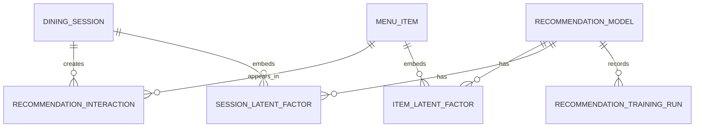
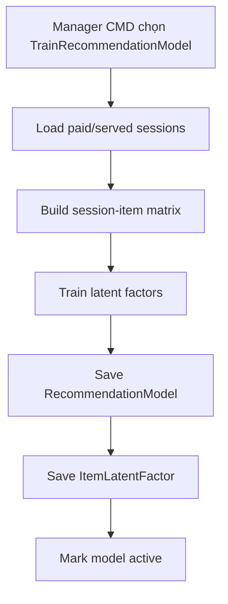
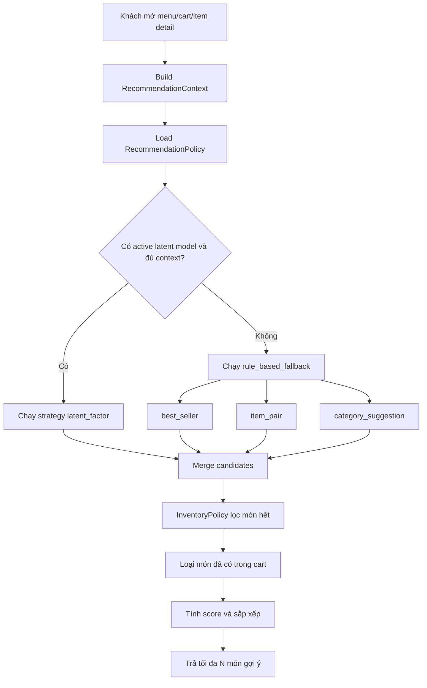

# Module 04 - Food Recommendation

## 1. Mục tiêu

Food Recommendation giúp khách chọn món nhanh hơn và tăng giá trị order. Trong đồ án, module này áp dụng mô hình hybrid:

- `latent_factor`: gợi ý dựa trên ma trận tương tác giữa phiên ăn và món ăn.
- `rule_based_fallback`: gợi ý món bán chạy, món ăn kèm, món thay thế khi chưa đủ dữ liệu.

Vì MVP chưa có tài khoản khách hàng, hệ thống không dùng `Customer` làm user thật. Thay vào đó, mỗi `DiningSession` được xem như một user tạm thời trong mô hình latent factor.

Phân tích AI/ML chi tiết nằm ở [04a-ai-ml-latent-factor-deep-dive.md](04a-ai-ml-latent-factor-deep-dive.md).

## 1.1. Phạm vi Casual dining

| Quyết định | Giá trị |
| --- | --- |
| User trong model | `DiningSession`, không phải customer account |
| Context gợi ý | Cart hiện tại, món đang xem, món bán chạy |
| Mục tiêu | Tăng khả năng gọi thêm món phù hợp |
| Cá nhân hóa khách hàng | Không thuộc MVP |
| Cross-branch model | Không thuộc MVP |

## 2. Phạm vi

| Nội dung | MVP Casual dining | Ngoài phạm vi Casual dining MVP |
| --- | --- | --- |
| Món bán chạy | Gợi ý theo số lượng bán | Theo khung giờ/ngày |
| Món ăn kèm | Cấu hình thủ công item pair | Học từ lịch sử order |
| Món cùng danh mục | Gợi ý khi xem chi tiết món | Theo tag/giá/hành vi |
| Món thay thế | Khi món hết hàng | Similarity nâng cao |
| Latent factor | Dùng `DiningSession` x `MenuItem` | Dùng customer profile thật |
| Cá nhân hóa | Theo món trong session hiện tại | Theo khách hàng/loyalty |
| AI/ML nâng cao | Chưa làm | Model recommendation phức tạp |

## 3. Entity đề xuất

| Entity | Ý nghĩa |
| --- | --- |
| `RecommendationRule` | Rule gợi ý, ví dụ best seller, item pair |
| `ItemPairRule` | Món A thường gợi ý món B |
| `BestSellerSnapshot` | Thống kê món bán chạy theo ngày/tuần |
| `RecommendedItem` | Kết quả gợi ý trả về UI |
| `RecommendationEvent` | Log khách nhìn/thêm món từ gợi ý |
| `RecommendationModel` | Metadata model latent factor đang active |
| `ItemLatentFactor` | Vector ẩn của từng món |
| `SessionLatentFactor` | Vector ẩn của session trong dữ liệu train |
| `RecommendationTrainingRun` | Lịch sử train model |
| `RecommendationInteraction` | Dữ liệu tương tác session-item dùng để train |

## 4. Policy liên quan

### 4.1. RecommendationPolicy

Quyết định danh sách món gợi ý dựa trên context.

Input:

- `sessionId`.
- `viewingItemId`.
- `cartItems`.
- `branchId`.
- `currentTime`.
- `recommendationConfig`.
- `modelVersion`.

Output:

- Danh sách `RecommendedItem`.
- `reason`: vì sao gợi ý.
- `score`: điểm ưu tiên.
- `strategy`: `latent_factor`, `best_seller`, `item_pair`, `replacement`.

### 4.2. InventoryPolicy

Mọi món gợi ý phải kiểm tra còn bán. Không gợi ý món `sold_out`.

## 5. Strategy MVP

| Strategy | Input | Output |
| --- | --- | --- |
| `latent_factor` | Session/cart + item latent vectors | Món có điểm dự đoán cao |
| `best_seller` | Best seller snapshot | Top món bán chạy |
| `item_pair` | Cart item hoặc viewing item | Món ăn kèm cấu hình thủ công |
| `category_suggestion` | Category đang xem | Món cùng category |
| `replacement` | Món hết hàng | Món thay thế cùng category |

## 6. Thiết kế latent factor

### 6.1. Ý tưởng

Latent factor giả định rằng mỗi phiên ăn và mỗi món ăn có thể được biểu diễn bằng một vector ẩn có số chiều nhỏ, ví dụ 8 hoặc 16 chiều.

Nếu:

- `p_s` là vector của `DiningSession`.
- `q_i` là vector của `MenuItem`.

Thì điểm phù hợp giữa session `s` và món `i`:

```text
score(s, i) = dot(p_s, q_i) + itemBias(i)
```

Model học từ lịch sử order. Nếu nhiều session thường gọi cơm gà kèm nước cam, vector của hai món này sẽ có xu hướng gần nhau trong không gian latent.

### 6.2. Ma trận tương tác

Với MVP, dữ liệu train lấy từ các order đã thanh toán hoặc đã served:

| Dữ liệu nguồn | Mapping vào latent factor |
| --- | --- |
| `DiningSession` | User tạm thời |
| `MenuItem` | Item |
| `OrderItem.quantity` | Interaction weight |
| `Order/Bill status` | Chỉ lấy session hợp lệ |

Ma trận tương tác:

```text
R[sessionId][itemId] = interactionWeight
```

Công thức weight đơn giản:

```text
interactionWeight = 1 + log(1 + quantity)
```

Nếu chưa muốn dùng quantity:

```text
interactionWeight = 1
```

### 6.3. Dữ liệu lưu trữ

| Bảng | Field chính | Ý nghĩa |
| --- | --- | --- |
| `recommendation_interactions` | `sessionId`, `itemId`, `weight`, `source` | Dữ liệu train |
| `recommendation_models` | `id`, `version`, `algorithm`, `factorSize`, `status` | Model metadata |
| `item_latent_factors` | `modelId`, `itemId`, `vector`, `bias` | Vector món |
| `session_latent_factors` | `modelId`, `sessionId`, `vector` | Vector session train |
| `recommendation_training_runs` | `modelId`, `startedAt`, `finishedAt`, `metrics` | Lịch sử train |

### 6.4. Sơ đồ dữ liệu



### 6.5. Train model

Với đồ án, không cần train realtime. Có thể train thủ công từ `Manager CMD`.

Workflow:



Thuật toán có thể triển khai đơn giản theo một trong hai hướng:

| Hướng | Mô tả | Phù hợp đồ án |
| --- | --- | --- |
| Matrix factorization bằng SGD | Tự code gradient descent đơn giản | Rất phù hợp để giải thích |
| ALS implicit feedback | Chuẩn hơn cho implicit data | Tốt nhưng phức tạp hơn |

Gợi ý cho MVP: dùng SGD đơn giản để tối ưu:

```text
error = r_ui - dot(p_u, q_i)
p_u = p_u + learningRate * (error * q_i - regularization * p_u)
q_i = q_i + learningRate * (error * p_u - regularization * q_i)
```

### 6.6. Recommend cho session đang active

Khi session mới chưa nằm trong dữ liệu train, không có sẵn `p_s`. Ta suy ra vector session từ các món trong cart/order hiện tại:

```text
currentSessionVector = average(itemLatentVector of cartItems)
```

Sau đó tính điểm:

```text
score(item) = dot(currentSessionVector, itemLatentVector) + itemBias
```

Nếu cart rỗng, dùng fallback:

- Best seller.
- Món nổi bật theo category.
- Rule ăn kèm do manager cấu hình.

### 6.7. Cold start

| Trường hợp | Cách xử lý |
| --- | --- |
| Chưa đủ order history | Dùng best seller và item pair rule |
| Session chưa có cart | Dùng best seller |
| Món mới chưa có vector | Dùng category suggestion |
| Món hết hàng | InventoryPolicy loại bỏ |
| Model chưa train | RecommendationPolicy fallback rule-based |

## 7. Workflow recommendation



## 8. Công thức score hybrid

```text
score =
  latentFactorScore
  + bestSellerBoost
  + itemPairBoost
  + categoryBoost
  - alreadySeenPenalty
```

Ví dụ:

| Nguồn gợi ý | Điểm |
| --- | --- |
| Latent factor | dot(sessionVector, itemVector) |
| Món bán chạy | +30 |
| Món ăn kèm trực tiếp | +50 |
| Cùng category | +10 |
| Đã có trong cart | Loại bỏ |
| Hết hàng | Loại bỏ bởi `InventoryPolicy` |

## 9. Business rules

| Rule ID | Rule | MVP |
| --- | --- | --- |
| RECO_001 | Không gợi ý món hết hàng | Có |
| RECO_002 | Không gợi ý món đã có trong cart | Có |
| RECO_003 | Mỗi request trả tối đa N món | Có |
| RECO_004 | Nếu latent model chưa active thì fallback rule-based | Có |
| RECO_005 | Ghi nhận event khi khách thêm món từ recommendation | Nên có |
| RECO_006 | Chỉ train từ order/session hợp lệ | Có |
| RECO_007 | Món archived/hidden không được đưa vào recommendation | Có |
| RECO_008 | Mỗi kết quả recommendation phải ghi strategy/reason | Nên có |
| RECO_009 | Recommendation không được tự thêm món vào cart | Có |
| RECO_010 | Recommendation phải chạy sau `InventoryPolicy` trước khi trả kết quả | Có |
| RECO_011 | Model latent factor chỉ dùng session/order đã paid hoặc served | Có |

## 10. API/Query gợi ý

| Query | Mô tả |
| --- | --- |
| `GetMenuRecommendations(sessionId)` | Gợi ý khi mở menu |
| `GetCartRecommendations(sessionId)` | Gợi ý dựa trên cart |
| `GetItemRecommendations(itemId)` | Gợi ý khi xem chi tiết món |
| `TrackRecommendationClick` | Log khách click/thêm món |
| `BuildRecommendationInteractions` | Tạo dữ liệu session-item từ order history |
| `TrainRecommendationModel` | Train latent factor model |
| `ActivateRecommendationModel(modelId)` | Kích hoạt model |
| `GetRecommendationModelStatus` | Xem trạng thái model |

## 11. Gợi ý tham số MVP

| Tham số | Giá trị gợi ý |
| --- | --- |
| `factorSize` | 8 hoặc 16 |
| `learningRate` | 0.01 |
| `regularization` | 0.05 |
| `epochs` | 50 đến 100 |
| `minInteractionsToTrain` | 30 session-item interactions |
| `maxRecommendations` | 5 hoặc 6 món |

## 12. Lưu ý triển khai

- Recommendation nên là module đọc dữ liệu, không tự sửa order.
- Khi khách bấm thêm món gợi ý, order module vẫn validate như món thường.
- Latent factor nên train thủ công hoặc theo lệnh từ Manager CMD, không train trong lúc khách order.
- Best seller vẫn nên giữ làm fallback vì dữ liệu MVP thường ít.
- Rule gợi ý ăn kèm vẫn hữu ích cho cold start và demo.
- Vector có thể lưu dạng JSON string/array trong MVP.
- Nếu chưa đủ dữ liệu lịch sử, có thể seed sẵn vài chục session/order giả để model có dữ liệu học.

## 12.1. Edge cases Casual dining

| Edge case | Cách xử lý |
| --- | --- |
| Cart rỗng | Fallback best seller |
| Món gợi ý vừa sold out | `InventoryPolicy` lọc lại ở thời điểm request |
| Model active nhưng thiếu vector cho món mới | Dùng category/best seller fallback cho món đó |
| Khách hủy món được recommend | Ghi `RecommendationEvent`, không phạt model trong MVP |
| Session ghép bàn | Vẫn dùng một `sessionId`, gợi ý dựa trên cart/order chung |
