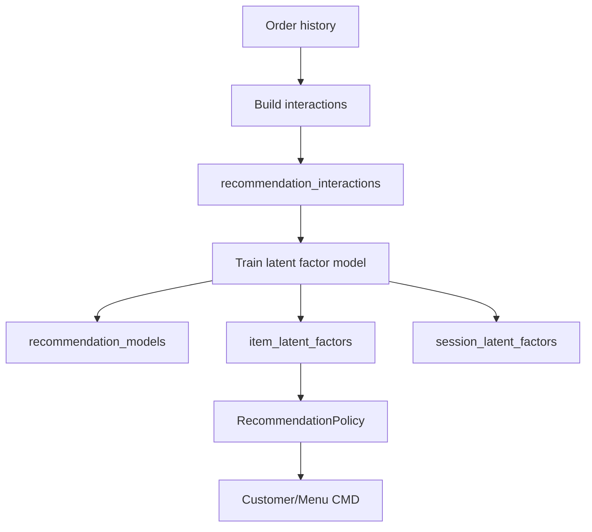
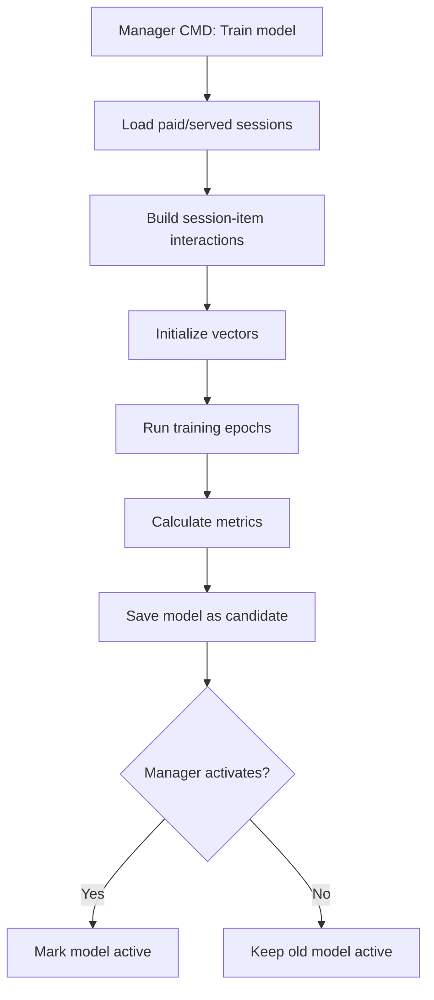

# Module 04A - AI/ML Recommendation Bằng Latent Factor

## 1. Mục tiêu

Tài liệu này phân tích sâu tính năng đề xuất món ăn bằng AI/ML thông qua latent factor. Trong phạm vi MVP, thuật toán được dùng để học quan hệ ẩn giữa **phiên ăn** và **món ăn**, từ đó gợi ý món phù hợp với giỏ hàng hiện tại của khách.

Điểm quan trọng: MVP **không cần lịch sử mua hàng cá nhân của khách hàng**. Hệ thống có thể dùng `DiningSession` như một user tạm thời.

## 1.1. Phạm vi Casual dining only

Latent factor ở đây chỉ phục vụ Casual dining:

- Một session là một lượt khách ngồi ăn tại bàn hoặc nhóm bàn.
- Một session có thể gọi nhiều order.
- Gợi ý tập trung vào món gọi thêm trong bữa, không phải đặt món giao hàng.
- Không dùng reservation, customer loyalty hoặc lịch sử cá nhân.
- Không gợi ý món buffet/course/fine dining.

## 2. Bài toán recommendation trong nhà hàng

Trong hệ thống đặt món tại bàn, recommendation có thể trả lời các câu hỏi:

| Câu hỏi | Ví dụ |
| --- | --- |
| Khách đang xem menu nên gợi ý món nào? | Món bán chạy, món phù hợp với giờ ăn |
| Khách đã thêm món vào cart thì nên gợi ý gì tiếp? | Cơm gà -> nước cam, salad |
| Món khách chọn đang hết thì thay bằng món nào? | Bò lúc lắc hết -> gợi ý cơm gà sốt tiêu |
| Món nào có khả năng được gọi chung? | Lẩu -> rau, mì, nước uống |

Latent factor phù hợp nhất cho câu hỏi: **dựa trên lịch sử các phiên ăn trước, món nào có khả năng hợp với phiên ăn hiện tại?**

## 3. Latent factor là gì

Latent factor là một dạng collaborative filtering. Ý tưởng là:

- Mỗi phiên ăn được biểu diễn bằng một vector ẩn.
- Mỗi món ăn được biểu diễn bằng một vector ẩn.
- Nếu vector phiên ăn và vector món ăn gần nhau, món đó có khả năng phù hợp.

Ký hiệu:

```text
p_s = vector của DiningSession s
q_i = vector của MenuItem i
```

Điểm dự đoán:

```text
score(s, i) = dot(p_s, q_i) + itemBias(i)
```

Ví dụ trực giác:

```text
Session A gọi: Cơm gà, Salad, Nước cam
Session B gọi: Cơm gà, Canh rong biển, Trà đào
Session C gọi: Mì Ý, Salad, Nước cam
```

Model có thể học được rằng `Cơm gà`, `Salad`, `Nước cam` có xu hướng xuất hiện gần nhau trong cùng phiên ăn.

## 4. Thuật toán cần những dữ liệu gì

### 4.1. Dữ liệu bắt buộc

| Dữ liệu | Bảng nguồn | Vai trò |
| --- | --- | --- |
| Phiên ăn | `dining_sessions` | User tạm thời |
| Món ăn | `menu_items` | Item |
| Món đã gọi | `order_items` | Interaction |
| Số lượng | `order_items.quantity` | Trọng số tương tác |
| Trạng thái order/bill | `order_headers`, `bills`, `payments` | Lọc dữ liệu hợp lệ |

### 4.2. Dữ liệu nên có

| Dữ liệu | Vai trò |
| --- | --- |
| Category món | Hỗ trợ fallback/cold start |
| Trạng thái còn/hết | Lọc món không thể gợi ý |
| Thời gian gọi món | Có thể mở rộng gợi ý theo bữa trưa/tối |
| Recommendation event | Đo khách có bấm/thêm món gợi ý không |

### 4.3. Có cần lịch sử mua hàng của khách hàng không

Không bắt buộc.

Trong MVP:

```text
User = DiningSession
Item = MenuItem
Interaction = OrderItem
```

Sau này nếu có tài khoản khách hàng hoặc loyalty:

```text
User = Customer
Item = MenuItem
Interaction = CustomerOrderHistory
```

Vậy latent factor có hai cấp độ:

| Cấp độ | User là gì | Phù hợp |
| --- | --- | --- |
| MVP | `DiningSession` | Không cần định danh khách |
| Mở rộng | `Customer` | Cá nhân hóa theo khách hàng thật |

## 5. Ma trận tương tác

Từ dữ liệu order, tạo ma trận:

```text
R[sessionId][itemId] = interactionWeight
```

Ví dụ:

| Session | Cơm gà | Salad | Nước cam | Mì Ý |
| --- | --- | --- | --- | --- |
| S1 | 1 | 1 | 1 | 0 |
| S2 | 1 | 0 | 1 | 0 |
| S3 | 0 | 1 | 1 | 1 |

Với dữ liệu nhà hàng, phần lớn là implicit feedback: khách gọi món nghĩa là có tương tác, nhưng không có rating 1-5 sao.

Weight đơn giản:

```text
interactionWeight = 1
```

Weight tốt hơn:

```text
interactionWeight = 1 + log(1 + quantity)
```

Nếu muốn tăng độ tin cậy cho session đã thanh toán:

```text
interactionWeight = baseWeight * paymentStatusWeight
```

Ví dụ:

| Điều kiện | Weight |
| --- | --- |
| Order bị hủy | 0 |
| Order served | 1 |
| Bill paid | 1.2 |
| Món được thêm từ recommendation | 1.5 |

## 6. Kiến trúc dữ liệu



Các bảng chính:

| Bảng | Ý nghĩa |
| --- | --- |
| `recommendation_interactions` | Dữ liệu train từ session-item |
| `recommendation_models` | Metadata model |
| `item_latent_factors` | Vector ẩn của món |
| `session_latent_factors` | Vector ẩn của session trong tập train |
| `recommendation_training_runs` | Lịch sử train |
| `recommendation_events` | Log khách xem/click/thêm món gợi ý |

## 7. Training pipeline



Trong MVP, train thủ công là đủ:

- Manager chọn `BuildRecommendationInteractions`.
- Manager chọn `TrainRecommendationModel`.
- Manager xem metric đơn giản.
- Manager chọn `ActivateRecommendationModel`.

Không nên train model trong lúc khách đang order.

## 8. Thuật toán MVP bằng SGD

### 8.1. Tham số

| Tham số | Gợi ý |
| --- | --- |
| `factorSize` | 8 hoặc 16 |
| `learningRate` | 0.01 |
| `regularization` | 0.05 |
| `epochs` | 50 đến 100 |
| `minInteractionsToTrain` | 30 đến 50 |

### 8.2. Công thức

Với mỗi interaction `(session, item, rating)`:

```text
prediction = dot(p_s, q_i) + itemBias_i
error = rating - prediction
```

Cập nhật vector:

```text
p_s = p_s + learningRate * (error * q_i - regularization * p_s)
q_i = q_i + learningRate * (error * p_s - regularization * q_i)
itemBias_i = itemBias_i + learningRate * (error - regularization * itemBias_i)
```

### 8.3. Pseudocode

```text
initialize sessionVectors randomly
initialize itemVectors randomly
initialize itemBias = 0

for epoch in epochs:
  shuffle interactions

  for interaction in interactions:
    s = interaction.sessionId
    i = interaction.itemId
    r = interaction.weight

    prediction = dot(sessionVector[s], itemVector[i]) + itemBias[i]
    error = r - prediction

    oldSessionVector = sessionVector[s]

    sessionVector[s] += lr * (error * itemVector[i] - reg * sessionVector[s])
    itemVector[i] += lr * (error * oldSessionVector - reg * itemVector[i])
    itemBias[i] += lr * (error - reg * itemBias[i])
```

## 9. Gợi ý cho session đang active

Session hiện tại thường chưa có vector trong model vì đây là session mới. Ta suy ra vector từ cart:

```text
currentSessionVector = average(itemVector of cartItems)
```

Nếu cart có trọng số quantity:

```text
currentSessionVector =
  weightedAverage(itemVector, quantity)
```

Sau đó score tất cả món candidate:

```text
score(item) = dot(currentSessionVector, itemVector[item]) + itemBias[item]
```

Rồi lọc:

- Món đã có trong cart.
- Món hết hàng.
- Món hidden/archived.
- Món không phù hợp branch.

Cuối cùng trả top N món.

## 10. Hybrid scoring

Latent factor không nên đứng một mình trong MVP vì dữ liệu ít. Nên kết hợp với rule-based boost:

```text
finalScore =
  latentScore
  + bestSellerBoost
  + itemPairBoost
  + categoryBoost
  - alreadySeenPenalty
```

Ví dụ:

| Thành phần | Vai trò |
| --- | --- |
| `latentScore` | Học từ lịch sử session-item |
| `bestSellerBoost` | Tránh gợi ý món quá lạ khi dữ liệu ít |
| `itemPairBoost` | Đẩy món ăn kèm do manager cấu hình |
| `categoryBoost` | Ưu tiên món liên quan danh mục |
| `alreadySeenPenalty` | Loại món đã có trong cart |

## 11. Cold start

| Tình huống | Xử lý |
| --- | --- |
| Chưa có model | Best seller |
| Chưa đủ order history | Best seller + item pair |
| Cart rỗng | Best seller theo category |
| Món mới chưa có vector | Category suggestion |
| Khách chưa từng đến | Không ảnh hưởng MVP vì dùng session |
| Món hết hàng | `InventoryPolicy` loại bỏ |
| Session đang billing | Không gợi ý thêm món |

## 12. Evaluation

Trong đồ án, không cần metric quá phức tạp, nhưng nên có chỉ số để chứng minh model hoạt động.

### 12.1. Offline metrics

| Metric | Ý nghĩa |
| --- | --- |
| `precision@k` | Trong top K món gợi ý, bao nhiêu món thật sự xuất hiện trong session test |
| `recall@k` | Trong các món session test gọi, model gợi ý trúng bao nhiêu |
| `hitRate@k` | Ít nhất một món gợi ý trúng session test không |

Ví dụ cách test:

```text
1. Lấy lịch sử session đã paid.
2. Với mỗi session, giấu một món đã gọi.
3. Train model bằng phần còn lại.
4. Recommend top K.
5. Kiểm tra món bị giấu có nằm trong top K không.
```

### 12.2. Online/demo metrics

| Metric | Ý nghĩa |
| --- | --- |
| `recommendationShown` | Số lần hiển thị gợi ý |
| `recommendationClicked` | Số lần khách chọn xem món gợi ý |
| `recommendationAddedToCart` | Số lần món gợi ý được thêm vào cart |
| `recommendationConversionRate` | `addedToCart / shown` |

## 13. Explainability

Latent factor khó giải thích trực tiếp vì vector là ẩn. Với MVP, nên tạo reason thân thiện:

| Strategy | Reason hiển thị |
| --- | --- |
| `latent_factor` | "Phù hợp với các món bạn đang chọn" |
| `item_pair` | "Thường được gọi kèm" |
| `best_seller` | "Món bán chạy" |
| `replacement` | "Món thay thế phù hợp" |

Không nên hiển thị công thức ML cho khách.

## 14. Rủi ro và giới hạn

| Rủi ro | Cách giảm |
| --- | --- |
| Dữ liệu ít | Seed lịch sử order, dùng fallback |
| Món mới không có vector | Category fallback |
| Gợi ý toàn món bán chạy | Giới hạn boost popularity |
| Gợi ý món hết hàng | Luôn gọi `InventoryPolicy` |
| Khách không có định danh | Dùng session/cart context |
| Model train lỗi | Không activate model lỗi, fallback old model |
| Session billing vẫn request recommendation | `RecommendationPolicy` trả empty hoặc thông báo đang thanh toán |

## 15. MVP vs mở rộng

| Thành phần | MVP | Mở rộng |
| --- | --- | --- |
| User | `DiningSession` | `Customer` |
| Feedback | Order item implicit | Rating, click, loyalty |
| Train | Manual từ Manager CMD | Scheduled job |
| Algorithm | Matrix factorization SGD | ALS, neural recommender |
| Vector storage | JSON/array | Vector DB hoặc optimized table |
| Evaluation | HitRate/Precision đơn giản | A/B testing |

## 16. Kết luận thiết kế

Latent factor trong MVP nên được triển khai như một strategy của `RecommendationPolicy`, không thay thế hoàn toàn rule-based recommendation.

Thiết kế phù hợp nhất:

```text
RecommendationPolicy
  -> nếu active model và cart có context:
       latent_factor
  -> nếu không:
       rule_based_fallback
  -> luôn:
       InventoryPolicy filter
       remove cart items
       return top N with reason
```

Cách này đủ tính AI/ML để trình bày trong đồ án, nhưng vẫn an toàn khi dữ liệu ít và vẫn phù hợp với nghiệp vụ nhà hàng.
