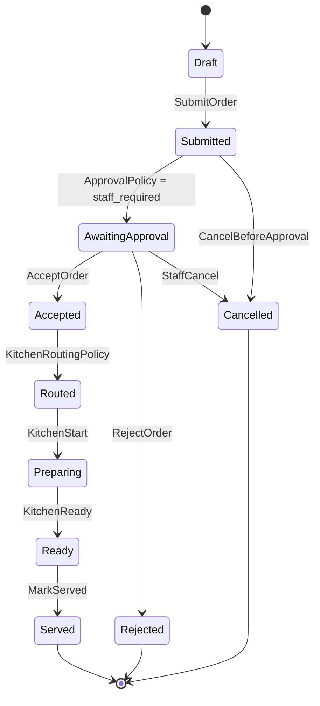
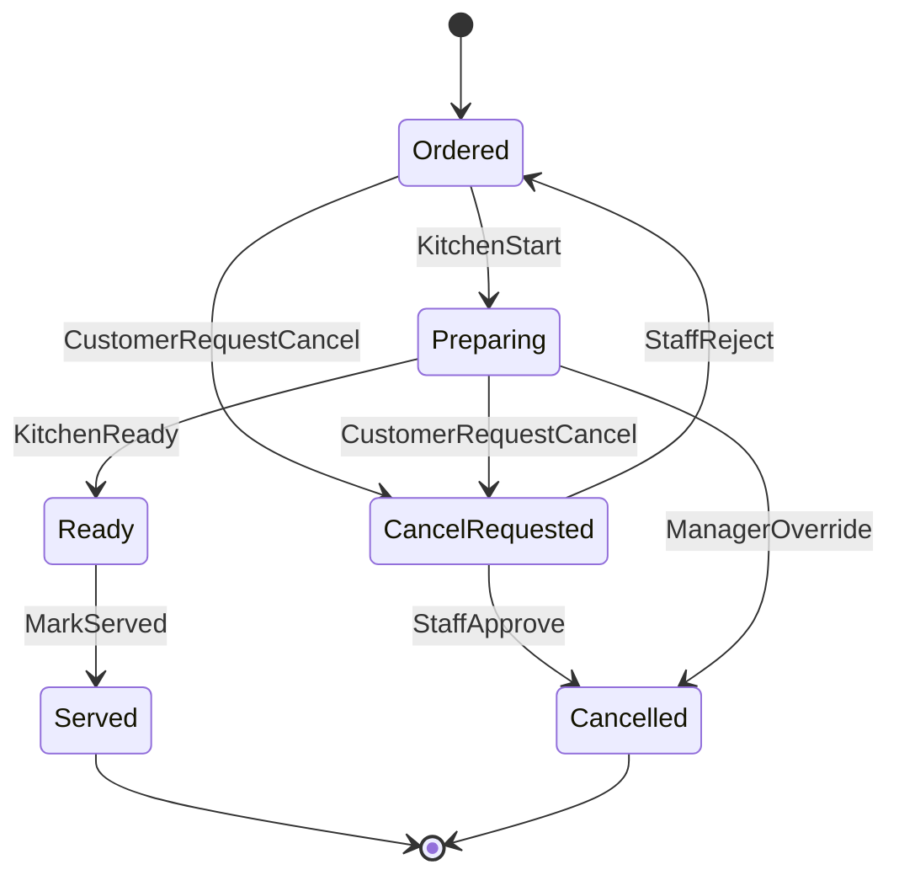
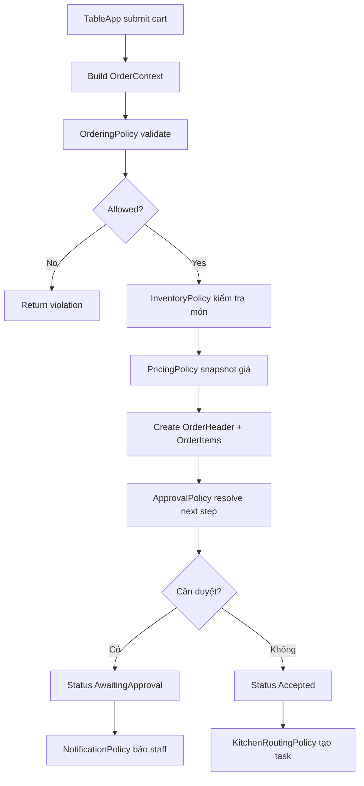
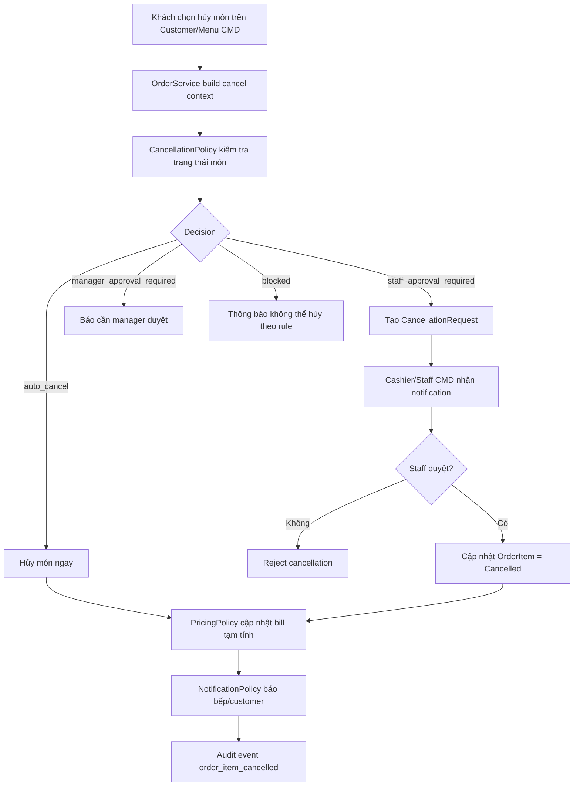

# Module 05 - Order Management

## 1. Mục tiêu

Order Management xử lý giỏ món, gửi order, duyệt order, chia trạng thái và liên kết sang bếp, thanh toán, notification. Đây là module trung tâm của hệ thống.

## 1.1. Phạm vi Casual dining

| Quyết định | Giá trị |
| --- | --- |
| Gọi món | Một session gọi nhiều order |
| Duyệt order | Staff/cashier phải duyệt |
| Auto approve | Không thuộc MVP |
| Hủy món | Hủy theo từng `OrderItem`, không ưu tiên hủy cả order |
| Sửa order | Không sửa trực tiếp, dùng hủy món và đặt lại |
| Order khi billing | Bị chặn |

## 2. Phạm vi

| Nội dung | MVP Casual dining | Ngoài phạm vi Casual dining MVP |
| --- | --- | --- |
| Cart | Khách chọn món trên màn hình bàn | Offline cart |
| Submit order | Một session có nhiều order | Giới hạn lượt gọi |
| Approval | Nhân viên duyệt order | Auto approval |
| Cancel | Khách yêu cầu hủy món đặt nhầm, nhân viên xác nhận trước khi bếp làm | Manager override khi bếp đã làm |
| Edit | Chưa ưu tiên | Sửa order có audit |
| Status | Submitted, Accepted, Preparing, Ready, Served | Partial item status nâng cao |

## 3. Entity đề xuất

| Entity | Thuộc tính chính |
| --- | --- |
| `OrderHeader` | `id`, `sessionId`, `status`, `submittedAt`, `acceptedBy` |
| `OrderItem` | `id`, `orderId`, `menuItemId`, `nameSnapshot`, `quantity`, `unitPrice`, `status` |
| `OrderItemModifier` | `orderItemId`, `modifierName`, `priceDelta` |
| `OrderStatusHistory` | `orderId`, `fromStatus`, `toStatus`, `actorId` |
| `OrderItemStatusHistory` | `orderItemId`, `fromStatus`, `toStatus`, `actorId`, `reason` |
| `CancellationRequest` | `id`, `orderItemId`, `requestedBy`, `reason`, `status`, `resolvedBy` |
| `OrderRejectionReason` | Lý do từ chối/hủy |

## 4. Policy liên quan

### 4.1. OrderingPolicy

Validate khi submit order:

- Bàn có active session.
- Session chưa ở trạng thái billing/closed.
- Cart không rỗng.
- Món còn orderable.
- Modifier hợp lệ.

### 4.2. ApprovalPolicy

Với MVP:

```json
{
  "approvalMode": "staff_required",
  "autoAcceptForLowRiskOrder": false
}
```

Kết quả:

- `awaiting_approval`.
- `auto_accepted`.
- `blocked`.

### 4.3. KitchenRoutingPolicy

Sau khi order accepted, tạo preparation task theo bếp/bar.

### 4.4. CancellationPolicy

Quyết định khách/nhân viên có được hủy món đã đặt nhầm hay không.

Input:

- `actor`.
- `session`.
- `order`.
- `orderItem`.
- `preparationTask`.
- `requestedAt`.
- `branchConfig.ordering`.

Output:

- `allowed`.
- `decision`: `auto_cancel`, `staff_approval_required`, `manager_approval_required`, `blocked`.
- `billAdjustmentRequired`.
- `notifyKitchen`.
- `reasons`.

Config MVP:

```json
{
  "allowCustomerCancel": true,
  "cancelWindowSeconds": 90,
  "allowCancelBeforeKitchenStart": true,
  "managerApprovalWhenPreparing": true,
  "blockCancelAfterServed": true
}
```

## 5. Order lifecycle



## 5.1. Order item lifecycle khi hủy món



## 6. Submit order workflow



## 7. Xử lý edge case: khách đặt nhầm món và muốn hủy

### 7.1. Góc nhìn văn hóa phục vụ

Nhà hàng Casual dining nên thiết kế rule hủy món theo hướng thân thiện nhưng bảo vệ vận hành bếp:

| Giai đoạn món | Cách xử lý đề xuất | Lý do |
| --- | --- | --- |
| Order vừa gửi, chưa nhân viên duyệt | Cho hủy dễ dàng | Bếp chưa bị ảnh hưởng |
| Order đang chờ duyệt | Nhân viên xác nhận hủy | Tránh khách bấm nhầm nhiều lần |
| Order đã duyệt nhưng bếp chưa làm | Cho nhân viên hủy và báo bếp | Vẫn chưa phát sinh chi phí lớn |
| Bếp đã bắt đầu làm | Cần manager duyệt hoặc từ chối lịch sự | Đã phát sinh nguyên liệu/công bếp |
| Món đã ready/served | Không hủy theo luồng thường, xử lý khiếu nại riêng | Đây không còn là “đặt nhầm” đơn giản |

Văn hóa phục vụ nên được thể hiện trong thông báo:

- Không nói cứng “không được hủy”.
- Nói rõ trạng thái món và hướng hỗ trợ.
- Nếu không thể hủy, nhân viên có thể đề xuất đóng gói, đổi món có phụ thu, hoặc manager xem xét giảm giá.

### 7.2. Workflow hủy món đặt nhầm



### 7.3. Bill sau khi hủy món

- Nếu món bị hủy trước khi bếp làm: không tính vào bill.
- Nếu món bị hủy do manager override khi bếp đã làm: tạo `BillAdjustment` hoặc `wastageReason`.
- Nếu món đã served: không dùng luồng cancel, chuyển sang complaint/manager adjustment.

### 7.4. Trạng thái hủy nên lưu

```json
{
  "cancellationRequest": {
    "orderItemId": "order_item_001",
    "requestedBy": "customer_table_01",
    "reason": "Khách đặt nhầm món",
    "status": "staff_approval_required",
    "resolvedBy": "cashier_001"
  }
}
```

## 8. Business rules

| Rule ID | Rule | MVP |
| --- | --- | --- |
| ORDER_001 | Chỉ session active mới được submit order | Có |
| ORDER_002 | Cart phải có ít nhất một món | Có |
| ORDER_003 | Món hết hàng không được submit | Có |
| ORDER_004 | Giá phải snapshot tại thời điểm submit | Có |
| ORDER_005 | Order phải được duyệt trước khi gửi bếp | Có |
| ORDER_006 | Order đã preparing không được hủy trong MVP | Có |
| ORDER_007 | Mọi đổi trạng thái order phải ghi history | Có |
| ORDER_008 | Khách được yêu cầu hủy món trong thời gian cho phép | Có |
| ORDER_009 | Hủy món trước khi bếp làm thì không tính vào bill | Có |
| ORDER_010 | Hủy món đã preparing cần manager approval hoặc bị chặn | Có |
| ORDER_011 | Món đã served không được hủy bằng luồng đặt nhầm | Có |
| ORDER_012 | Hủy món phải ghi audit và lý do | Có |
| ORDER_013 | Không được tạo kitchen task trước khi order accepted | Có |
| ORDER_014 | Nếu một order có nhiều món, hủy một món không ảnh hưởng món còn lại | Có |
| ORDER_015 | Staff reject order phải nhập lý do | Có |
| ORDER_016 | Submit order phải idempotent theo request key | Nên có |

## 9. API/Command gợi ý

| Command/Query | Mô tả |
| --- | --- |
| `SubmitOrder(sessionId, items)` | Khách gửi order |
| `GetOrdersBySession(sessionId)` | Xem order của bàn |
| `AcceptOrder(orderId)` | Nhân viên duyệt |
| `RejectOrder(orderId, reason)` | Nhân viên từ chối |
| `CancelOrder(orderId, reason)` | Hủy order |
| `RequestCancelOrderItem(orderItemId, reason)` | Khách yêu cầu hủy món đặt nhầm |
| `ApproveCancelOrderItem(requestId)` | Nhân viên/manager duyệt hủy món |
| `RejectCancelOrderItem(requestId, reason)` | Nhân viên/manager từ chối hủy |
| `MarkOrderItemServed(orderItemId)` | Đánh dấu món đã phục vụ |

## 10. Edge cases

- Khách submit cùng lúc hai request do bấm nhiều lần.
- Món vừa hết hàng trong lúc khách submit.
- Nhân viên duyệt order sau khi session đã chuyển billing.
- Bếp báo ready một phần order.
- Order bị reject nhưng bill vẫn phải tính đúng các order khác.
- Khách đặt nhầm và yêu cầu hủy khi order đang chờ duyệt.
- Khách yêu cầu hủy sau khi bếp đã bắt đầu làm.
- Khách hủy một món trong order có nhiều món, các món còn lại vẫn tiếp tục.
- Staff duyệt hủy món nhưng kitchen task đã chuyển sang preparing trong cùng lúc.
- Customer submit order ngay sau khi request bill.
- Staff accept order trong lúc cashier đóng session.
- Bếp báo issue sau khi order item đã bị hủy.
- Customer request cancel cùng một order item nhiều lần.

## 10.1. Cách xử lý edge case quan trọng

| Edge case | Cách xử lý |
| --- | --- |
| Submit trùng do bấm nhiều lần | Dùng `clientRequestId` hoặc idempotency key |
| Order accepted khi session billing | `ApprovalPolicy` kiểm tra lại session trước khi accepted |
| Cancel request trùng | Nếu đã có request pending thì trả request hiện tại |
| Kitchen task pending nhưng item cancelled | TaskItem chuyển `cancelled`, không hiển thị bếp |
| Kitchen task preparing nhưng khách xin hủy | `CancellationPolicy` yêu cầu manager approval hoặc block |

## 11. Lưu ý triển khai

- Nên dùng transaction khi tạo order, order item và status history.
- Controller không nên tự validate nghiệp vụ sâu; gọi `OrderService`, service gọi policy.
- Trạng thái order và preparation task nên tách nhau: order là giao dịch khách gọi, task là việc bếp cần làm.
- Nên ưu tiên hủy theo `OrderItem` thay vì hủy cả `OrderHeader`, vì khách thường chỉ đặt nhầm một món.
- Khi hủy món, cần cập nhật cả `OrderItem`, `PreparationTask/TaskItem`, bill tạm tính, notification và audit trong một transaction nếu có thể.
