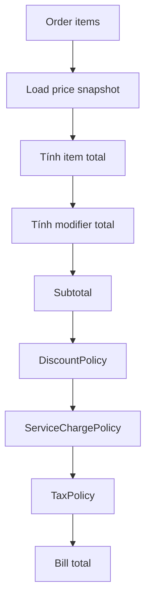

# Module 06 - Pricing, Tax, Fee, Promotion

## 1. Mục tiêu

Module này tính giá order và bill. Nó đảm bảo giá được tính nhất quán, có snapshot, có thể mở rộng phí dịch vụ, VAT, giảm giá và promotion.

## 1.1. Phạm vi Casual dining

| Quyết định | Giá trị |
| --- | --- |
| Giá món | Giá cố định theo item/variant |
| Service charge | Cấu hình phần trăm, có thể bằng 0 |
| VAT | Cấu hình phần trăm, có thể bằng 0 |
| Discount | Giảm giá thủ công bởi manager/cashier |
| Promotion engine | Không thuộc MVP |
| Split bill | Không thuộc MVP |

## 2. Phạm vi

| Nội dung | MVP Casual dining | Ngoài phạm vi Casual dining MVP |
| --- | --- | --- |
| Giá món | Theo item/variant | Giá theo giờ/chi nhánh |
| Modifier price | Cộng thêm vào item | Modifier phức tạp |
| Service charge | Có thể cấu hình phần trăm | Phụ thu phòng/ngày lễ |
| VAT | Có thể bật/tắt | Tax included/excluded |
| Discount | Giảm thủ công trên bill | Voucher/promotion engine |
| Split bill | Không làm | Chia bill theo món/người |

## 3. Entity đề xuất

| Entity | Ý nghĩa |
| --- | --- |
| `PriceSnapshot` | Giá item/modifier tại lúc submit order |
| `BillAdjustment` | Giảm giá, phụ thu, phí dịch vụ |
| `TaxConfig` | Cấu hình thuế |
| `ServiceChargeConfig` | Cấu hình phí dịch vụ |
| `ManualDiscount` | Giảm giá do manager/cashier áp dụng |

## 4. Policy liên quan

### 4.1. PricingPolicy

Input:

- Order items.
- Price snapshot.
- Service charge config.
- Tax config.
- Discount config.

Output:

- `subtotal`.
- `discountTotal`.
- `serviceChargeTotal`.
- `taxTotal`.
- `grandTotal`.
- Breakdown chi tiết.

### 4.2. DiscountPolicy

MVP chỉ cho giảm giá thủ công nếu actor có quyền.

## 5. Pricing pipeline



## 6. Công thức MVP

```text
itemTotal = quantity * (unitPrice + modifierTotal)
subtotal = sum(itemTotal)
discountTotal = manualDiscount
serviceChargeTotal = (subtotal - discountTotal) * serviceChargePercent
taxTotal = (subtotal - discountTotal + serviceChargeTotal) * taxPercent
grandTotal = subtotal - discountTotal + serviceChargeTotal + taxTotal
```

## 7. Business rules

| Rule ID | Rule | MVP |
| --- | --- | --- |
| PRICE_001 | Giá phải snapshot khi submit order | Có |
| PRICE_002 | Bill dùng snapshot, không dùng giá menu hiện tại | Có |
| PRICE_003 | Discount không được làm bill âm | Có |
| PRICE_004 | Chỉ cashier/manager được giảm giá thủ công | Có |
| PRICE_005 | Tax/service charge tính theo config active | Có |
| PRICE_006 | Mọi adjustment phải lưu lý do | Nên có |
| PRICE_007 | Món cancelled không được tính vào subtotal | Có |
| PRICE_008 | Manager override hủy món đang preparing phải tạo adjustment/wastage note | Có |
| PRICE_009 | Bill đã paid không được tính lại do menu đổi giá | Có |

## 8. API/Command gợi ý

| Command/Query | Mô tả |
| --- | --- |
| `CalculateOrderPrice(orderDraft)` | Tính tạm order |
| `CalculateSessionBill(sessionId)` | Tính bill cuối bữa |
| `ApplyManualDiscount(billId)` | Áp dụng giảm giá |
| `UpdateTaxConfig` | Cập nhật VAT |
| `UpdateServiceChargeConfig` | Cập nhật phí dịch vụ |

## 9. Edge cases

- Giá menu thay đổi sau khi order đã accepted.
- Discount được nhập lớn hơn tổng bill.
- Làm tròn tiền gây lệch 1 đơn vị.
- Hủy order sau khi bill đã tính.
- Config thuế thay đổi giữa ngày.
- Món bị hủy sau khi bill draft đã tạo.
- Service charge/tax config đổi khi session đang active.
- Manager áp dụng discount sau khi bill paid.

## 9.1. Cách xử lý edge case quan trọng

| Edge case | Cách xử lý |
| --- | --- |
| Hủy món sau bill draft | Recalculate bill nếu bill chưa paid |
| Config tax đổi giữa session | Bill dùng `configVersion` snapshot của session |
| Discount sau paid | Chặn, hoặc tạo refund flow ngoài MVP |
| Món cancelled preparing | Không tính tiền nếu manager override, ghi adjustment reason |

## 10. Lưu ý triển khai

- Nên dùng kiểu số chính xác cho tiền, tránh float.
- Lưu tiền theo đơn vị nhỏ nhất nếu có thể, ví dụ VND integer.
- Bill nên lưu breakdown để giao diện và báo cáo đọc lại dễ dàng.
