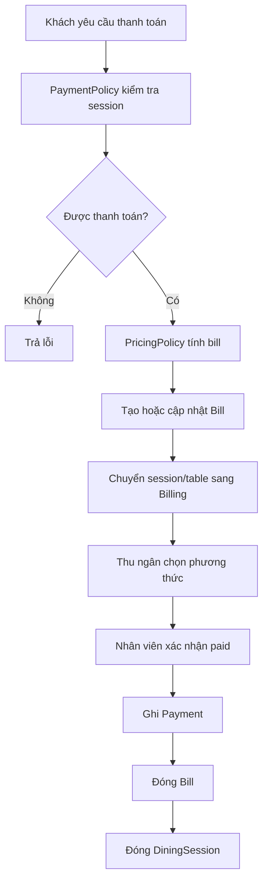

# Module 07 - Payment & Billing

## 1. Mục tiêu

Payment & Billing tổng hợp các order trong một `DiningSession`, tạo bill và ghi nhận thanh toán. Với Casual dining MVP, thanh toán diễn ra cuối bữa và được nhân viên xác nhận thủ công.

## 1.1. Phạm vi Casual dining

| Quyết định | Giá trị |
| --- | --- |
| Bill | Một bill cho một session |
| Thanh toán | Cuối bữa |
| Xác nhận | Cashier/manual |
| QR/gateway | Không thuộc MVP |
| Split bill | Không thuộc MVP |
| Refund | Không thuộc MVP |

## 2. Phạm vi

| Nội dung | MVP Casual dining | Ngoài phạm vi Casual dining MVP |
| --- | --- | --- |
| Bill | Một bill cho một session | Split bill |
| Thời điểm | Cuối bữa | Thanh toán trước |
| Phương thức | Cash/chuyển khoản mô phỏng | POS, ví điện tử |
| Xác nhận | Staff manual confirm | Gateway callback |
| QR | Có thể hiển thị QR mô phỏng | QR thanh toán thật |
| Refund | Không làm | Refund một phần/toàn phần |

## 3. Entity đề xuất

| Entity | Ý nghĩa |
| --- | --- |
| `Bill` | Hóa đơn của session |
| `BillLine` | Dòng món trong bill |
| `Payment` | Giao dịch thanh toán |
| `PaymentMethod` | Cash, transfer, QR mock |
| `PaymentStatusHistory` | Lịch sử trạng thái thanh toán |

## 4. Policy liên quan

### 4.1. PaymentPolicy

Quyết định:

- Có được request bill chưa.
- Có cho gọi thêm món khi đang billing không.
- Phương thức thanh toán nào được hỗ trợ.
- Ai được xác nhận thanh toán.

Config MVP:

```json
{
  "timing": "after_meal",
  "confirmation": "staff_manual",
  "splitBill": false,
  "supportedMethods": ["cash", "bank_transfer_mock"]
}
```

### 4.2. PricingPolicy

Billing luôn gọi PricingPolicy để tính tổng bill.

## 5. Payment flow



## 6. Business rules

| Rule ID | Rule | MVP |
| --- | --- | --- |
| PAY_001 | Chỉ session active mới được request bill | Có |
| PAY_002 | Session đang billing không được submit order mới | Có |
| PAY_003 | Bill chỉ paid khi staff có quyền xác nhận | Có |
| PAY_004 | Không confirm paid hai lần | Có |
| PAY_005 | Bill total phải khớp PricingPolicy | Có |
| PAY_006 | Confirm paid phải ghi audit log | Có |
| PAY_007 | Không cho request bill nếu còn task `preparing` | Có |
| PAY_008 | Bill paid khóa mọi thao tác order/cancel mới | Có |
| PAY_009 | Ghép bàn dùng chung một bill theo session | Có |

## 7. API/Command gợi ý

| Command/Query | Mô tả |
| --- | --- |
| `RequestBill(sessionId)` | Khách/staff yêu cầu thanh toán |
| `GetBill(sessionId)` | Xem bill |
| `ConfirmPayment(billId, method)` | Thu ngân xác nhận paid |
| `CancelBill(billId)` | Hủy bill nếu chưa paid |
| `GetPaymentHistory(sessionId)` | Xem lịch sử thanh toán |

## 8. Edge cases

- Khách yêu cầu thanh toán khi vẫn có món đang preparing.
- Staff xác nhận paid nhưng bill đã bị hủy.
- Một session tạo nhiều bill do bấm nhiều lần.
- Discount thay đổi sau khi bill đã paid.
- Order bị hủy sau khi bill đã paid.
- Customer request bill hai lần liên tục.
- Staff confirm paid khi bill total vừa thay đổi do hủy món.
- Request bill khi có cancel request pending.

## 8.1. Cách xử lý edge case quan trọng

| Edge case | Cách xử lý |
| --- | --- |
| Request bill lặp | Idempotent, trả bill hiện tại |
| Còn món preparing | `PaymentPolicy` chặn request bill |
| Có cancel request pending | Chặn bill hoặc yêu cầu staff xử lý request trước |
| Confirm paid sau bill thay đổi | Re-read bill version trước khi confirm |

## 9. Lưu ý triển khai

- `RequestBill` nên idempotent: gọi nhiều lần vẫn trả về bill hiện tại.
- Khi bill paid, khóa các thao tác order mới.
- Sau payment, table không nên về available ngay mà nên qua `Cleaning`.
