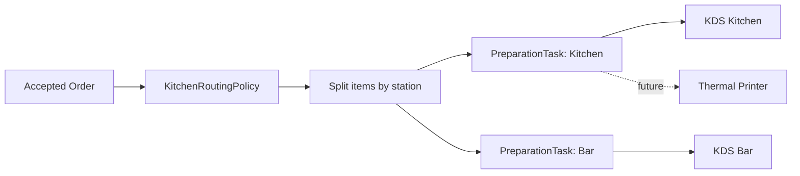
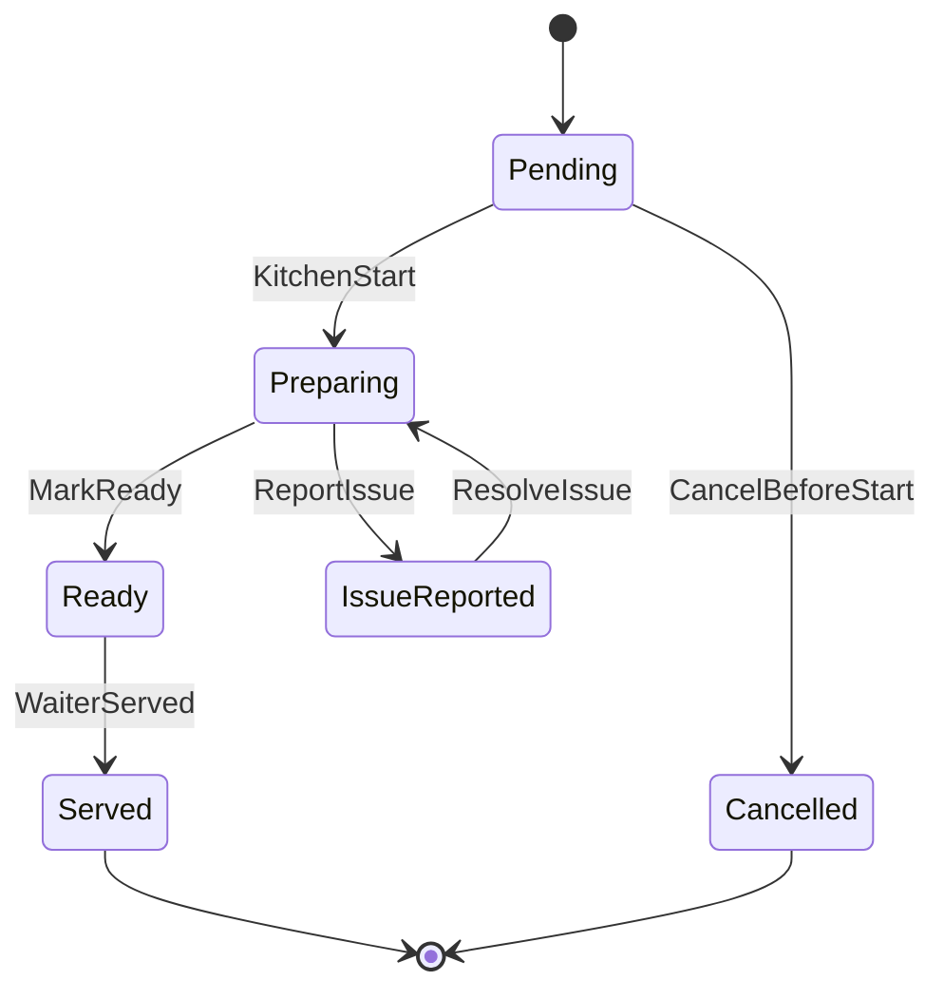

# Module 08 - Kitchen & Preparation Routing

## 1. Mục tiêu

Module này chuyển order đã được duyệt thành các task chuẩn bị cho bếp/bar. Nó giúp nhân viên bếp nhìn được món cần làm và cập nhật trạng thái món.

## 1.1. Phạm vi Casual dining

| Quyết định | Giá trị |
| --- | --- |
| Station | `kitchen` và `bar` |
| Routing | Theo category |
| Output | Kitchen CMD |
| Printer | Không thuộc MVP |
| Course management | Không thuộc MVP |

## 2. Phạm vi

| Nội dung | MVP Casual dining | Ngoài phạm vi Casual dining MVP |
| --- | --- | --- |
| Station | Kitchen và Bar | Nhiều station |
| Routing | Theo category | Theo item/khu vực/tải bếp |
| KDS | Màn hình task đơn giản | KDS nhiều màn hình |
| Printer | Chưa tích hợp thật | Thermal printer |
| SLA | Chưa bắt buộc | Cảnh báo món trễ |

## 3. Entity đề xuất

| Entity | Ý nghĩa |
| --- | --- |
| `PreparationStation` | Bếp, bar |
| `PreparationTask` | Task cần chuẩn bị |
| `TaskItem` | Món trong task |
| `TaskStatusHistory` | Lịch sử trạng thái task |
| `StationRoutingRule` | Rule category/item đi station nào |

## 4. Policy liên quan

### 4.1. KitchenRoutingPolicy

Input:

- Accepted order.
- Order items.
- Category/item.
- Station config.

Output:

- Danh sách preparation task.
- Target station.
- Output device.

Config MVP:

```json
{
  "routingMode": "category_based",
  "rules": [
    { "category": "drink", "station": "bar" },
    { "category": "food", "station": "kitchen" }
  ],
  "output": "kds"
}
```

## 5. Routing flow



## 6. Task lifecycle



## 7. Business rules

| Rule ID | Rule | MVP |
| --- | --- | --- |
| KIT_001 | Chỉ order accepted mới tạo preparation task | Có |
| KIT_002 | Mỗi order item phải route được đến station | Có |
| KIT_003 | Kitchen staff chỉ cập nhật task của station mình | Nên có |
| KIT_004 | Task ready phải thông báo waiter | Có |
| KIT_005 | Task đang preparing không được tự ý hủy trong MVP | Có |
| KIT_006 | Task chỉ tạo sau khi order accepted | Có |
| KIT_007 | TaskItem cancelled không hiển thị trong danh sách pending | Có |
| KIT_008 | Kitchen report issue phải báo staff/cashier | Có |

## 8. API/Command gợi ý

| Command/Query | Mô tả |
| --- | --- |
| `CreatePreparationTasks(orderId)` | Tạo task sau khi accepted |
| `GetStationTasks(stationId)` | KDS lấy danh sách task |
| `StartTask(taskId)` | Bếp bắt đầu làm |
| `MarkTaskReady(taskId)` | Bếp báo ready |
| `ReportTaskIssue(taskId)` | Báo lỗi/hết món |

## 9. Edge cases

- Category chưa cấu hình station.
- Order có cả đồ uống và đồ ăn.
- Bếp báo hết món sau khi order accepted.
- Task ready nhưng session đã billing.
- Một order có nhiều task, một task ready trước task khác.
- Khách hủy món sau khi task đã pending.
- Staff reject order nhưng task đã lỡ tạo do lỗi transaction.
- Kitchen CMD refresh chậm và start task đã cancelled.

## 9.1. Cách xử lý edge case quan trọng

| Edge case | Cách xử lý |
| --- | --- |
| Task pending nhưng item cancelled | TaskItem chuyển `cancelled`, Kitchen CMD lọc ra |
| Kitchen start task đã cancelled | Service validate lại DB, trả lỗi |
| Category chưa có station | `KitchenRoutingPolicy` chặn accept order |
| Một order chia bếp/bar | Mỗi station task riêng, bill vẫn theo order item |

## 10. Lưu ý triển khai

- Task nên tách khỏi order để một order có thể chia nhiều station.
- KDS nên lọc theo station và status.
- Khi task ready, notification module gửi cho waiter.
