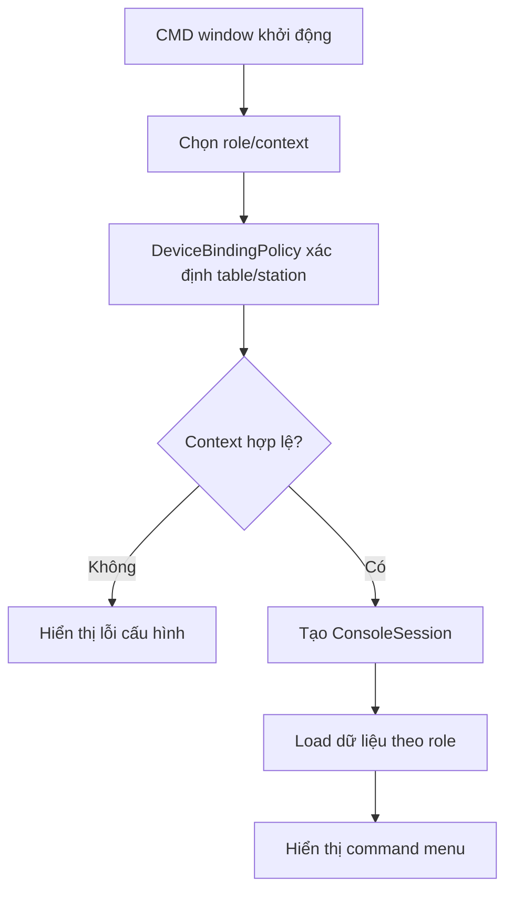

# Module 09 - Device Management

## 1. Mục tiêu

Device Management quản lý thiết bị dùng trong nhà hàng: màn hình bàn, KDS, printer, POS hoặc cảm biến. Với MVP, các thiết bị thật được mô phỏng bằng nhiều cửa sổ CMD/terminal khác nhau.

## 1.1. Phạm vi Casual dining

| Quyết định | Giá trị |
| --- | --- |
| Customer device | Customer/Menu CMD theo bàn |
| Kitchen device | Kitchen CMD theo station |
| Staff device | Cashier/Staff CMD |
| Manager device | Manager CMD |
| Printer/POS/sensor | Không thuộc MVP |

## 2. Phạm vi

| Thiết bị | MVP Casual dining | Ngoài phạm vi Casual dining MVP |
| --- | --- | --- |
| Customer/Menu CMD | Mô phỏng màn hình đặt món tại bàn | Tablet/table screen thật |
| Kitchen CMD | Mô phỏng KDS bếp/bar | Nhiều KDS theo station |
| Cashier/Staff CMD | Mô phỏng màn hình lễ tân/thu ngân | Staff app/web dashboard |
| Manager CMD | Mô phỏng màn hình quản lý | Admin portal |
| Printer | Chỉ thiết kế interface | In phiếu thật |
| POS | Không làm | Tích hợp POS |
| Sensor | Không làm | Cảm biến bàn |
| QR | QR mô phỏng nếu cần | Payment QR thật |

## 3. Entity đề xuất

| Entity | Ý nghĩa |
| --- | --- |
| `Device` | Thiết bị vật lý/logic |
| `DeviceAssignment` | Gán device với bàn/station |
| `ConsoleSession` | Phiên chạy CMD đại diện cho một actor/table/station |
| `DeviceHealthCheck` | Trạng thái online/offline |
| `DeviceType` | `table_screen`, `kds`, `printer`, `pos` |
| `PrinterProfile` | Extension cho máy in |

## 4. Policy liên quan

### 4.1. DeviceBindingPolicy

Quyết định thiết bị có được truy cập bàn/station nào.

MVP:

```json
{
  "customerConsoleBinding": "fixed_table",
  "kitchenConsoleBinding": "fixed_station",
  "allowDynamicAssign": false
}
```

### 4.2. DeviceOutputPolicy

Quyết định output task đi ra thiết bị nào:

- KDS trong MVP.
- Printer là extension.

## 5. Workflow console startup



## 6. Business rules

| Rule ID | Rule | MVP |
| --- | --- | --- |
| DEV_001 | Customer/Menu CMD chỉ thao tác trên bàn được gán | Có |
| DEV_002 | Kitchen CMD chỉ xem task của station được gán | Có |
| DEV_003 | Device offline không xóa session/order | Có |
| DEV_004 | Thay đổi assignment phải do manager thực hiện | Nên có |
| DEV_005 | Printer chưa bật thì không gửi print job | Có |
| DEV_006 | CMD chỉ là UI, không tự xử lý nghiệp vụ | Có |
| DEV_007 | Customer/Menu CMD phải gắn với table/session context hợp lệ | Có |
| DEV_008 | Kitchen CMD chỉ thấy task station của mình | Có |

## 7. API/Command gợi ý

| Command/Query | Mô tả |
| --- | --- |
| `RegisterDevice` | Tạo device |
| `AssignDeviceToTable` | Gán màn hình với bàn |
| `AssignDeviceToStation` | Gán KDS với station |
| `GetDeviceContext(deviceCode)` | Lấy context cho app |
| `StartConsoleSession(role, contextId)` | Tạo phiên CMD cho role/table/station |
| `Heartbeat(deviceId)` | Cập nhật online/offline |

## 8. Edge cases

- Hai thiết bị cùng gán một bàn.
- Device bị xóa nhưng màn hình vẫn gửi request.
- Màn hình bàn mất mạng khi khách đang tạo order.
- KDS offline sau khi order accepted.
- Customer CMD ở bàn cũ sau khi chuyển bàn.
- Kitchen CMD start task đã bị hủy do khách cancel món.
- Manager CMD đổi config khi console khác đang chạy.

## 8.1. Cách xử lý edge case quan trọng

| Edge case | Cách xử lý |
| --- | --- |
| CMD context cũ | `GetDeviceContext` reload từ DB trước command nhạy cảm |
| Kitchen CMD task stale | Service validate task status trước update |
| Manager đổi config | CMD khác dùng config version theo session hiện tại |

## 9. Lưu ý triển khai

- Device context nên được load khi app khởi động.
- Request từ table screen nên mang `deviceCode` hoặc token để xác định bàn.
- Trong MVP không cần xử lý offline queue phức tạp.
- Với CMD MVP, có thể bỏ heartbeat phức tạp và chỉ cần `ConsoleSession` để biết cửa sổ nào đại diện cho role/table/station nào.
- Khi chuyển sang UI thật, giữ lại service/policy, thay lớp console bằng web/tablet/KDS.
