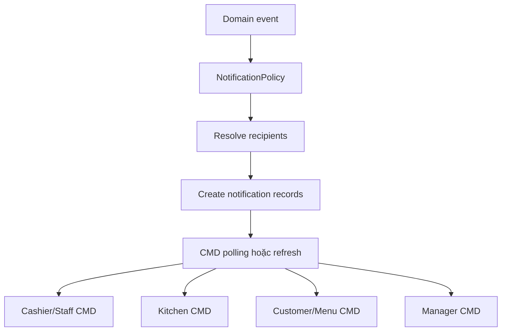

# Module 10 - Notification

## 1. Mục tiêu

Notification gửi thông báo đúng người, đúng màn hình, đúng thời điểm. Trong MVP CMD, notification có thể triển khai bằng record trong database và các cửa sổ CMD tự refresh/polling.

## 1.1. Phạm vi Casual dining

| Quyết định | Giá trị |
| --- | --- |
| Delivery | DB polling/refresh trong CMD |
| Realtime websocket | Không thuộc MVP |
| SMS/email | Không thuộc MVP |
| Notification chính | Order cần duyệt, task ready, cancel request, bill request |

## 2. Phạm vi

| Sự kiện | MVP Casual dining | Ngoài phạm vi Casual dining MVP |
| --- | --- | --- |
| Order mới | Báo staff duyệt | Theo khu vực/ca |
| Order accepted | Báo KDS/bếp | Nhiều station |
| Task ready | Báo waiter | Phân công theo bàn |
| Gọi nhân viên | Báo staff | SLA/cảnh báo trễ |
| Request bill | Báo cashier | QR payment tự động |
| Device/CMD lỗi | Có thể chưa làm | Health alert |

## 3. Entity đề xuất

| Entity | Ý nghĩa |
| --- | --- |
| `Notification` | Bản ghi thông báo |
| `NotificationRecipient` | Người/thiết bị nhận |
| `NotificationTemplate` | Nội dung mẫu |
| `NotificationStatus` | Pending, sent, read |
| `BusinessEvent` | Sự kiện nguồn |

## 4. Policy liên quan

### 4.1. NotificationPolicy

Input:

- Event type.
- Branch.
- Table/session/order.
- Actor.
- Staff roles.

Output:

- Recipient list.
- Channel.
- Priority.
- Message template.

Với MVP, channel chính là `console`.

Config MVP:

```json
{
  "deliveryMode": "console_polling",
  "routes": [
    { "event": "order_submitted", "roles": ["cashier", "reception"] },
    { "event": "order_accepted", "devices": ["kds"] },
    { "event": "task_ready", "roles": ["waiter"] },
    { "event": "bill_requested", "roles": ["cashier"] }
  ]
}
```

## 5. Notification flow



## 6. Business rules

| Rule ID | Rule | MVP |
| --- | --- | --- |
| NOTI_001 | Order submitted phải báo staff duyệt | Có |
| NOTI_002 | Task ready phải báo waiter | Có |
| NOTI_003 | Request bill phải báo cashier | Có |
| NOTI_004 | Không gửi notification cho role không có quyền xem | Có |
| NOTI_005 | Notification nên có trạng thái read/unread | Nên có |
| NOTI_006 | Cancel request phải báo cashier/staff | Có |
| NOTI_007 | Món ready phải báo staff phục vụ, không báo customer trực tiếp là đã giao | Có |
| NOTI_008 | Bill requested phải báo cashier | Có |

## 7. API/Command gợi ý

| Command/Query | Mô tả |
| --- | --- |
| `GetMyNotifications` | Staff xem thông báo |
| `GetConsoleNotifications(role, contextId)` | CMD lấy thông báo theo role/context |
| `MarkNotificationRead` | Đánh dấu đã đọc |
| `EmitBusinessEvent` | Module khác phát event |
| `GetUnreadCount` | Đếm thông báo chưa đọc |

## 8. Edge cases

- Một event gửi trùng nhiều lần.
- Nhân viên không online.
- Order bị hủy sau khi notification đã gửi.
- Role thay đổi sau khi notification được tạo.
- Notification task ready đến muộn sau khi bill requested.
- Cancel request tạo notification nhưng staff đã xử lý từ CMD khác.

## 8.1. Cách xử lý edge case quan trọng

| Edge case | Cách xử lý |
| --- | --- |
| Notification trùng | Dùng `eventId` hoặc idempotency key |
| Notification đã stale | Khi mở notification, service load trạng thái resource mới nhất |
| Staff không online | Notification vẫn pending cho lần refresh sau |

## 9. Lưu ý triển khai

- Trong MVP, notification có thể là record trong database + polling.
- WebSocket là tốt nhưng không bắt buộc nếu thời gian hạn chế.
- Nên để các module phát domain event, notification xử lý sau.
- Mỗi cửa sổ CMD có thể có phím `R` để refresh notification.
- Sau mỗi command, console nên tự gọi lại notification query để hiển thị sự kiện mới.
