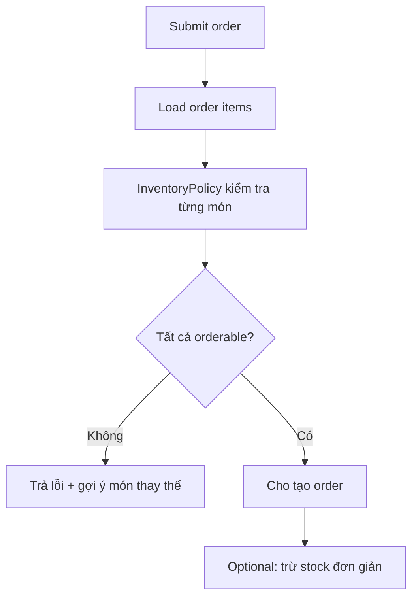
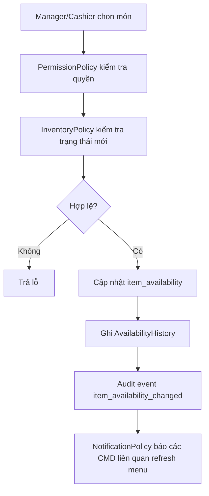

# Module 11 - Inventory & Availability

## 1. Mục tiêu

Inventory & Availability kiểm soát món nào còn bán, món nào hết hàng. MVP chỉ cần quản lý trạng thái món thủ công, không cần kho nguyên liệu phức tạp.

## 1.1. Phạm vi Casual dining

| Quyết định | Giá trị |
| --- | --- |
| Tồn kho | Manual availability |
| Nguyên liệu/recipe | Không thuộc MVP |
| Sold out | Không cho order/recommend |
| Bếp báo hết món | Staff/manager cập nhật availability |
| Low stock alert | Không thuộc MVP |

## 2. Phạm vi

| Nội dung | MVP Casual dining | Ngoài phạm vi Casual dining MVP |
| --- | --- | --- |
| Availability | Manager bật/tắt món | Theo số lượng tồn |
| Stock | Có thể lưu số lượng item đơn giản | Theo nguyên liệu |
| Sold out | Không cho đặt | Cho đặt cần xác nhận |
| Recommendation | Không gợi ý món hết | Gợi ý món thay thế |
| Alert | Chưa làm | Sắp hết món |

## 3. Entity đề xuất

| Entity | Ý nghĩa |
| --- | --- |
| `ItemAvailability` | Trạng thái còn/hết/tạm ngừng bán theo branch |
| `ItemStock` | Số lượng còn lại nếu dùng stock đơn giản |
| `StockMovement` | Lịch sử tăng/giảm stock |
| `AvailabilityHistory` | Ai bật/tắt món |

## 3.1. Bảng lưu trạng thái món

Trạng thái món trong vận hành được lưu ở `item_availability`, không lưu trực tiếp trong `menu_items`.

| Field | Ý nghĩa |
| --- | --- |
| `branchId` | Chi nhánh áp dụng, MVP dùng `branch_main` |
| `itemId` | Món trong `menu_items` |
| `availabilityStatus` | `available`, `sold_out`, `temporarily_unavailable` |
| `isVisible` | Có hiển thị cho khách không |
| `isOrderable` | Có cho đặt không |
| `reason` | Lý do hết món/tạm ngưng |
| `updatedBy` | Staff cập nhật |
| `updatedAt` | Thời điểm cập nhật |

Phân biệt hai loại trạng thái:

| Loại trạng thái | Bảng | Ví dụ | Ý nghĩa |
| --- | --- | --- | --- |
| Trạng thái catalog | `menu_items.catalogStatus` | `draft`, `active`, `hidden`, `archived` | Món có thuộc menu hay không |
| Trạng thái vận hành | `item_availability.availabilityStatus` | `available`, `sold_out` | Hôm nay/hiện tại có bán được không |

## 4. Policy liên quan

### 4.1. InventoryPolicy

Input:

- `menuItemId`.
- `requestedQuantity`.
- `availability`.
- `stock`.

Output:

- `orderable`.
- `visible`.
- `replacementCandidates`.
- `reason`.

MVP:

```json
{
  "mode": "manual_availability",
  "soldOutBehavior": "block_order",
  "hideSoldOutFromRecommendation": true
}
```

## 5. Workflow submit order với inventory



## 5.1. Workflow cập nhật hết món



## 6. Business rules

| Rule ID | Rule | MVP |
| --- | --- | --- |
| INV_001 | Món sold out không được đặt | Có |
| INV_002 | Món sold out không được recommendation | Có |
| INV_003 | Manager/cashier được bật/tắt món | Có |
| INV_004 | Thay đổi availability phải ghi log | Nên có |
| INV_005 | Nếu dùng stock, quantity không được âm | Nên có |
| INV_006 | `item_availability` là nguồn quyết định món có order được không | Có |
| INV_007 | Khi đổi trạng thái món phải ghi `updatedBy`, `updatedAt` | Có |
| INV_008 | Bếp báo hết món sau khi order accepted phải tạo issue, không tự xóa order | Có |
| INV_009 | Món sold out phải bị loại khỏi recommendation | Có |

## 7. API/Command gợi ý

| Command/Query | Mô tả |
| --- | --- |
| `SetItemSoldOut(itemId)` | Đánh dấu hết món |
| `SetItemAvailable(itemId)` | Bật lại món |
| `GetAvailability(itemId)` | Xem trạng thái |
| `SuggestReplacement(itemId)` | Gợi ý món thay thế |

## 8. Edge cases

- Khách đang xem menu cũ khi món vừa hết.
- Hai order cùng đặt món số lượng cuối cùng.
- Bếp báo hết món sau khi order đã accepted.
- Manager bật/tắt nhầm món.
- Bếp báo hết món khi đã có order pending.
- Món sold out nhưng đang nằm trong cart của nhiều bàn.
- Manager bật món available lại khi còn cancel/issue pending.

## 8.1. Cách xử lý edge case quan trọng

| Edge case | Cách xử lý |
| --- | --- |
| Sold out khi cart đang mở | Submit order bị chặn và gợi ý thay thế |
| Sold out sau accepted | Kitchen report issue, staff xử lý đổi/hủy món |
| Available lại | Menu/recommendation hiển thị từ request tiếp theo |

## 9. Lưu ý triển khai

- Nếu chưa làm stock số lượng, chỉ cần `available/sold_out`.
- Order submit luôn phải kiểm tra availability lại, không tin dữ liệu từ frontend.
- Recommendation gọi InventoryPolicy trước khi trả kết quả.
- Menu Catalog lưu thông tin món; Inventory & Availability lưu trạng thái bán hiện tại.
- Customer/Menu CMD nên refresh menu sau khi nhận notification món hết hoặc món bán lại.
