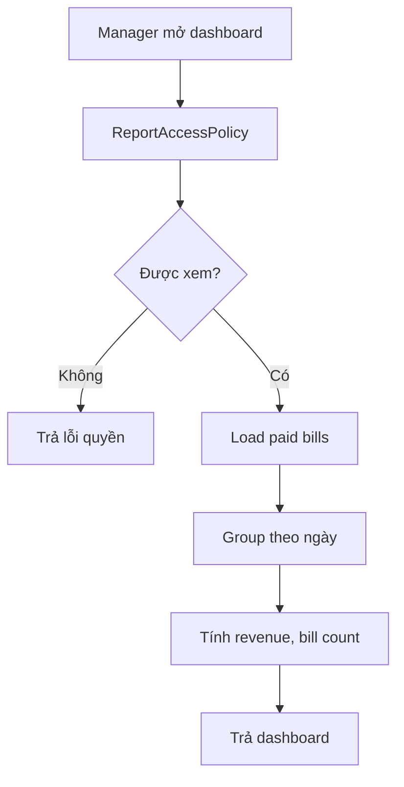

# Module 13 - Reporting

## 1. Mục tiêu

Reporting cung cấp báo cáo vận hành cơ bản cho quản lý: doanh thu, món bán chạy, trạng thái bàn, order bị hủy và hiệu suất bếp.

Ngoài báo cáo, dữ liệu order/session đã thanh toán còn là nguồn đầu vào cho `Food Recommendation`, đặc biệt khi train latent factor model.

## 1.1. Phạm vi Casual dining

| Quyết định | Giá trị |
| --- | --- |
| Doanh thu | Theo bill paid |
| Món bán chạy | Theo served/paid order item |
| Hiệu suất bếp | Theo preparation task |
| Báo cáo chi nhánh | Một branch |
| Báo cáo tài chính phức tạp | Không thuộc MVP |

## 2. Phạm vi

| Báo cáo | MVP Casual dining | Ngoài phạm vi Casual dining MVP |
| --- | --- | --- |
| Doanh thu ngày | Có | Theo ca/chi nhánh |
| Món bán chạy | Có | Theo khung giờ |
| Trạng thái bàn | Có | Tỷ lệ sử dụng bàn |
| Order bị hủy/từ chối | Có | Phân tích nguyên nhân |
| Hiệu suất bếp | Cơ bản | SLA nâng cao |

## 3. Entity/nguồn dữ liệu

| Nguồn | Dữ liệu |
| --- | --- |
| `Bill` | Doanh thu |
| `Payment` | Phương thức thanh toán |
| `OrderItem` | Món bán chạy |
| `DiningSession` | Thời gian dùng bàn |
| `PreparationTask` | Thời gian bếp |
| `AuditEvent` | Hành động hủy/sửa |
| `RecommendationInteraction` | Dữ liệu train recommendation được build từ order history |

## 4. Policy liên quan

### 4.1. ReportAccessPolicy

Chỉ manager được xem báo cáo tổng quan trong MVP.

Input:

- Actor.
- Report type.
- Branch scope.

Output:

- `allowed`.
- Data scope được phép xem.

## 5. Workflow báo cáo doanh thu

## 6. Chỉ số MVP

| Chỉ số | Công thức |
| --- | --- |
| Doanh thu ngày | Sum `Bill.grandTotal` với bill paid |
| Số bill | Count paid bills |
| Món bán chạy | Sum quantity theo `OrderItem` |
| Order bị từ chối | Count order status `Rejected` |
| Thời gian bếp | `task.readyAt - task.startedAt` |

## 7. Business rules

| Rule ID | Rule | MVP |
| --- | --- | --- |
| RPT_001 | Chỉ manager xem báo cáo tổng | Có |
| RPT_002 | Chỉ bill paid được tính doanh thu | Có |
| RPT_003 | Order rejected/cancelled không tính doanh thu | Có |
| RPT_004 | Món bán chạy tính theo order served/paid | Nên có |
| RPT_005 | Báo cáo phải lọc theo branch | Có |
| RPT_006 | Món cancelled không tính top selling | Có |
| RPT_007 | Order rejected không tính doanh thu | Có |
| RPT_008 | Recommendation training chỉ dùng session hợp lệ | Có |

## 7.1. Edge cases

| Edge case | Cách xử lý |
| --- | --- |
| Bill paid rồi refund ngoài hệ thống | Không thuộc MVP, cần manual adjustment nếu muốn |
| Món cancelled trước bếp làm | Không tính bán chạy |
| Món cancelled manager override khi preparing | Tính wastage/adjustment, không tính revenue item |
| Session ghép bàn | Report theo session, không nhân đôi theo số bàn |

## 8. API/Query gợi ý

| Query | Mô tả |
| --- | --- |
| `GetDailyRevenue(date)` | Doanh thu ngày |
| `GetTopSellingItems(dateRange)` | Món bán chạy |
| `GetTableStatusSummary` | Tổng quan trạng thái bàn |
| `GetKitchenPerformance(dateRange)` | Hiệu suất bếp |
| `GetCancelledOrders(dateRange)` | Order bị hủy/từ chối |
| `BuildRecommendationInteractions(dateRange)` | Tạo dữ liệu train latent factor từ order history |

## 9. Lưu ý triển khai

- MVP có thể query trực tiếp từ database, chưa cần data warehouse.
- Best seller cho recommendation có thể lấy từ report này.
- Latent factor recommendation có thể dùng order/session history đã paid hoặc served làm dữ liệu train.
- Nếu dữ liệu ít, chưa cần batch aggregation.
