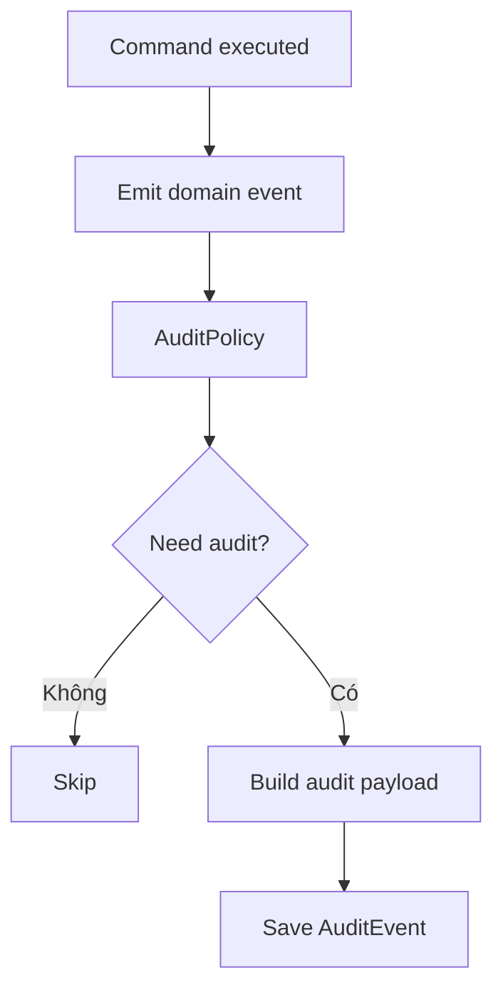

# Module 14 - Audit Log & Configuration Versioning

## 1. Mục tiêu

Audit Log giúp truy vết hành động quan trọng. Configuration Versioning giúp biết order/bill được xử lý theo cấu hình nào tại thời điểm phát sinh.

## 1.1. Phạm vi Casual dining

| Quyết định | Giá trị |
| --- | --- |
| Audit | Bắt buộc cho order/payment/cancel/config/menu |
| Config version | Lưu version Casual dining config |
| Rollback config | Không thuộc MVP |
| Event sourcing đầy đủ | Không thuộc MVP |

## 2. Phạm vi

| Nội dung | MVP Casual dining | Ngoài phạm vi Casual dining MVP |
| --- | --- | --- |
| Audit order | Duyệt, hủy, từ chối | Diff chi tiết |
| Audit payment | Confirm paid | Gateway event |
| Audit menu | Bật/tắt món, sửa giá | Version menu đầy đủ |
| Config version | Lưu version hiện tại | Rollback config |
| Event log | Ghi domain event cơ bản | Event sourcing |

## 3. Entity đề xuất

| Entity | Ý nghĩa |
| --- | --- |
| `AuditEvent` | Hành động đã xảy ra |
| `AuditActor` | Ai thực hiện |
| `ConfigVersion` | Version cấu hình |
| `ConfigChangeLog` | Lịch sử thay đổi config |
| `DomainEvent` | Event nghiệp vụ |

## 4. Policy liên quan

### 4.1. AuditPolicy

Quyết định sự kiện nào bắt buộc ghi log.

Input:

- Event type.
- Actor.
- Resource.
- Before/after state.

Output:

- Có cần audit không.
- Mức độ: normal/high.
- Payload cần lưu.

Config MVP:

```json
{
  "auditEvents": [
    "table_opened",
    "order_submitted",
    "order_accepted",
    "order_cancelled",
    "payment_confirmed",
    "menu_item_price_changed",
    "item_sold_out_changed",
    "config_changed"
  ]
}
```

## 5. Audit flow



## 6. Business rules

| Rule ID | Rule | MVP |
| --- | --- | --- |
| AUD_001 | Hành động nhạy cảm phải ghi actor | Có |
| AUD_002 | Payment confirmed bắt buộc audit | Có |
| AUD_003 | Order cancelled/rejected bắt buộc audit | Có |
| AUD_004 | Sửa giá hoặc availability phải audit | Có |
| AUD_005 | Config thay đổi phải tăng version | Nên có |
| AUD_006 | Audit log không được sửa/xóa bởi staff thường | Có |
| AUD_007 | Hủy món đặt nhầm phải lưu reason, actor, trạng thái món lúc hủy | Có |
| AUD_008 | Manager override phải audit mức high | Có |
| AUD_009 | Confirm payment phải snapshot bill total | Có |

## 6.1. Edge cases

| Edge case | Cách xử lý |
| --- | --- |
| Command thành công nhưng audit fail | Nên cùng transaction với action quan trọng |
| Config đổi khi session active | Session lưu `configVersion`, audit config change |
| Staff phủ nhận đã hủy món | Audit có actor, role, reason, timestamp |
| Payment tranh chấp | Audit lưu bill total, method, confirmedBy |

## 7. Configuration versioning

Khi config thay đổi, tạo `ConfigVersion` mới.

Ví dụ:

```json
{
  "version": "v2",
  "changedBy": "manager_001",
  "changedAt": "2026-06-04T13:00:00",
  "changes": {
    "serviceChargePercent": {
      "from": 5,
      "to": 8
    }
  }
}
```

Order/bill nên lưu `configVersion` để biết đã dùng rule nào.

## 8. API/Command gợi ý

| Command/Query | Mô tả |
| --- | --- |
| `GetAuditEvents(resourceId)` | Xem log theo resource |
| `GetConfigVersions(branchId)` | Xem lịch sử config |
| `CreateConfigVersion` | Tạo version mới |
| `GetOrderAuditTrail(orderId)` | Xem lịch sử order |

## 9. Lưu ý triển khai

- Audit log nên append-only.
- Không cần event sourcing đầy đủ trong MVP.
- Nên lưu `actorId`, `actorRole`, `resourceType`, `resourceId`, `eventType`, `payload`.
- Audit giúp bảo vệ đồ án khi demo các tình huống hủy món, sửa giá, xác nhận thanh toán.
