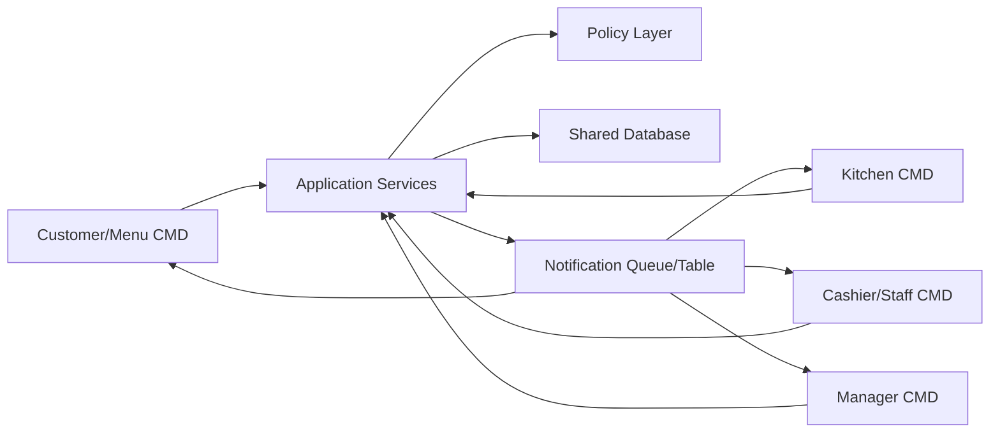
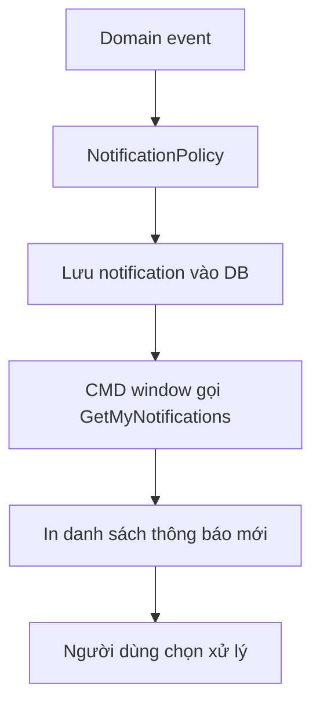

# Module 15 - Console CMD Runtime

## 1. Mục tiêu

Trong MVP, hệ thống chưa cần triển khai web app, tablet UI hoặc KDS thật. Thay vào đó, mỗi khu vực vận hành chạy bằng một cửa sổ CMD/terminal riêng:

- Cửa sổ khách/menu tại bàn.
- Cửa sổ bếp/bar.
- Cửa sổ thu ngân/lễ tân.
- Cửa sổ quản lý.

Cách này giúp đồ án tập trung vào nghiệp vụ, domain model và policy layer trước khi đầu tư giao diện.

## 1.1. Phạm vi Casual dining

| Console | Phạm vi |
| --- | --- |
| Customer/Menu CMD | Một bàn/session đang active |
| Cashier/Staff CMD | Mở bàn, duyệt order, xử lý cancel, thanh toán |
| Kitchen CMD | Xem và cập nhật task bếp/bar |
| Manager CMD | Menu, config, report, recommendation train |

## 2. Các cửa sổ CMD đề xuất

| Cửa sổ | Actor mô phỏng | Module thao tác |
| --- | --- | --- |
| `Customer/Menu CMD` | Khách tại bàn | Menu, Recommendation, Order, Payment request |
| `Kitchen CMD` | Bếp/bar | Preparation task, task status |
| `Cashier/Staff CMD` | Lễ tân/thu ngân/phục vụ | Table, approval, payment, notification |
| `Manager CMD` | Quản lý | Menu, inventory, reporting, config |

## 3. Luồng chạy demo



## 4. Nguyên tắc thiết kế

| Nguyên tắc | Ý nghĩa |
| --- | --- |
| CMD chỉ là UI | Không đặt nghiệp vụ trong menu console |
| Service xử lý nghiệp vụ | Console gọi application service |
| Policy vẫn được dùng | Mọi command vẫn đi qua policy |
| Dùng database chung | Các cửa sổ nhìn cùng một trạng thái |
| Notification bằng polling | CMD có thể refresh định kỳ hoặc bằng phím |

## 5. Mô hình command loop

Mỗi cửa sổ CMD có thể chạy một vòng lặp:

```text
1. Hiển thị menu thao tác
2. Nhận lựa chọn từ người dùng
3. Gọi application service tương ứng
4. Service gọi policy và xử lý command
5. In kết quả ra màn hình
6. Refresh notification hoặc trạng thái mới
```

## 6. Ví dụ command theo cửa sổ

### 6.1. Customer/Menu CMD

| Command | Mô tả |
| --- | --- |
| `ViewMenu` | Xem menu theo category |
| `ViewRecommendations` | Xem món gợi ý |
| `AddToCart` | Thêm món vào giỏ |
| `SubmitOrder` | Gửi order |
| `RequestCancelOrderItem` | Yêu cầu hủy món đặt nhầm |
| `ViewOrderStatus` | Xem trạng thái món |
| `RequestService` | Gọi nhân viên |
| `RequestBill` | Yêu cầu thanh toán |

### 6.2. Kitchen CMD

| Command | Mô tả |
| --- | --- |
| `ViewPendingTasks` | Xem món chờ làm |
| `StartTask` | Chuyển task sang preparing |
| `MarkTaskReady` | Báo món ready |
| `ReportIssue` | Báo lỗi hoặc hết món |

### 6.3. Cashier/Staff CMD

| Command | Mô tả |
| --- | --- |
| `OpenTable` | Mở bàn |
| `MergeTable` | Ghép bàn |
| `TransferTable` | Chuyển bàn |
| `ViewSubmittedOrders` | Xem order chờ duyệt |
| `AcceptOrder` | Duyệt order |
| `RejectOrder` | Từ chối order |
| `ApproveCancelOrderItem` | Duyệt yêu cầu hủy món đặt nhầm |
| `RejectCancelOrderItem` | Từ chối yêu cầu hủy món |
| `ViewBill` | Xem bill |
| `ConfirmPayment` | Xác nhận thanh toán |
| `MarkTableCleaned` | Đánh dấu bàn đã dọn |

### 6.4. Manager CMD

| Command | Mô tả |
| --- | --- |
| `CreateMenuItem` | Thêm món |
| `UpdateMenuItem` | Sửa món |
| `SetItemSoldOut` | Đánh dấu hết món |
| `ConfigureRecommendationRule` | Cấu hình món gợi ý |
| `BuildRecommendationInteractions` | Tạo dữ liệu train từ order history |
| `TrainRecommendationModel` | Train latent factor model |
| `ActivateRecommendationModel` | Kích hoạt model recommendation |
| `ViewDailyRevenue` | Xem doanh thu ngày |
| `ViewTopSellingItems` | Xem món bán chạy |
| `ViewAuditLog` | Xem audit log |

## 7. Notification trong CMD

Vì chưa cần realtime UI, notification có thể triển khai bằng polling:



Các cách polling đơn giản:

- Người dùng bấm `R` để refresh.
- Console tự refresh mỗi vài giây.
- Sau mỗi command, console tự load notification mới.

## 8. Policy áp dụng trong console

Console không tự check nghiệp vụ bằng `if else`. Console chỉ gọi command/service.

Ví dụ đúng:

```text
Cashier CMD -> AcceptOrder(orderId)
OrderService -> PermissionPolicy
OrderService -> ApprovalPolicy
OrderService -> KitchenRoutingPolicy
OrderService -> NotificationPolicy
```

Ví dụ không nên:

```text
Cashier CMD tự kiểm tra role
Cashier CMD tự đổi order sang accepted
Cashier CMD tự tạo kitchen task
```

## 9. Gợi ý cấu trúc chương trình

```text
src/
  console/
    customer_menu_console
    kitchen_console
    cashier_console
    manager_console
  application/
    table_service
    order_service
    menu_service
    kitchen_service
    payment_service
  policies/
    table_policy
    ordering_policy
    payment_policy
    kitchen_routing_policy
    notification_policy
  domain/
    entities
    value_objects
  infrastructure/
    database
    repositories
```

## 10. Lưu ý triển khai

- Có thể chạy mỗi CMD với một role mặc định để demo nhanh.
- Nếu có login, mỗi cửa sổ đăng nhập bằng staff khác nhau.
- Customer/Menu CMD cần biết đang đại diện cho `tableId` nào.
- Kitchen CMD cần biết đang xem `stationId` nào.
- Tất cả cửa sổ dùng chung database để đồng bộ trạng thái.
- Khi sau này làm web/tablet, chỉ thay lớp console UI, giữ lại service và policy.

## 10.1. Edge cases runtime

| Edge case | Cách xử lý |
| --- | --- |
| Hai CMD xử lý cùng order | Service validate status và dùng transaction |
| Customer CMD submit khi session billing | `OrderingPolicy` chặn |
| Kitchen CMD thao tác task stale | Reload task trước update |
| Cashier CMD confirm payment stale bill | Re-read bill version trước confirm |
| Manager CMD đổi config | Session active giữ config version cũ |
