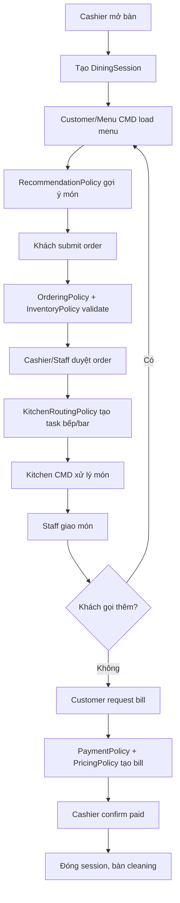

# Modules - Casual Dining Business Analysis

## 1. Phạm vi chốt

Toàn bộ thư mục `docs/modules` hiện được chốt theo một sản phẩm duy nhất: **nhà hàng Casual dining**.

Hệ thống không còn phân tích như một platform chung cho buffet, cafe, fast food hoặc fine dining. Các nhánh đó chỉ được xem là ý tưởng mở rộng trong tương lai và không phải phạm vi triển khai.

## 2. Casual dining trong hệ thống này là gì

Casual dining là mô hình nhà hàng phục vụ tại bàn:

- Khách ngồi tại bàn.
- Nhân viên mở bàn và tạo `DiningSession`.
- Khách gọi món nhiều lần trong một phiên bàn.
- Nhân viên xác nhận order trước khi gửi bếp.
- Bếp/bar chuẩn bị món theo task.
- Nhân viên phục vụ giao món.
- Cuối bữa khách thanh toán một bill cho toàn phiên.
- Nhà hàng có thể ghép bàn/chuyển bàn nhưng vẫn giữ một session và một bill.

## 3. Quyết định nghiệp vụ nền

| Nhóm | Quyết định |
| --- | --- |
| Nhà hàng | Một nhà hàng Casual dining |
| Chi nhánh | Một chi nhánh trong MVP |
| Mở bàn | Nhân viên mở thủ công |
| Gọi món | Khách gọi món tại bàn bằng Customer/Menu CMD |
| Duyệt order | Staff/cashier duyệt trước khi xuống bếp |
| Gọi nhiều lần | Một session có nhiều order |
| Hủy món đặt nhầm | Cho yêu cầu hủy theo trạng thái bếp |
| Bếp/bar | Nhận task qua Kitchen CMD |
| Thanh toán | Cuối bữa, cashier xác nhận thủ công |
| Recommendation | Latent factor theo `DiningSession x MenuItem` + fallback |
| Reservation | Không thuộc MVP |
| Payment gateway | Không thuộc MVP |
| Multi-tenant SaaS | Không thuộc MVP |

## 4. Module map

| Module | Trách nhiệm chính |
| --- | --- |
| [00-policy-layer.md](00-policy-layer.md) | Baseline policy cho Casual dining |
| [01-tenant-restaurant-branch.md](01-tenant-restaurant-branch.md) | Nhà hàng, chi nhánh, config cố định |
| [02-table-dining-session.md](02-table-dining-session.md) | Bàn, session, ghép/chuyển bàn |
| [03-menu-catalog.md](03-menu-catalog.md) | Menu, món, category, modifier |
| [04-food-recommendation.md](04-food-recommendation.md) | Gợi ý món hybrid |
| [04a-ai-ml-latent-factor-deep-dive.md](04a-ai-ml-latent-factor-deep-dive.md) | Phân tích AI/ML latent factor |
| [05-order-management.md](05-order-management.md) | Order, duyệt order, hủy món đặt nhầm |
| [06-pricing-tax-fee-promotion.md](06-pricing-tax-fee-promotion.md) | Tính tiền, phí, thuế, giảm giá thủ công |
| [07-payment-billing.md](07-payment-billing.md) | Bill cuối bữa và thanh toán thủ công |
| [08-kitchen-preparation-routing.md](08-kitchen-preparation-routing.md) | Routing món đến bếp/bar |
| [09-device-management.md](09-device-management.md) | CMD/device context |
| [10-notification.md](10-notification.md) | Notification qua DB polling |
| [11-inventory-availability.md](11-inventory-availability.md) | Trạng thái còn/hết món |
| [12-staff-role-permission.md](12-staff-role-permission.md) | Role và permission |
| [13-reporting.md](13-reporting.md) | Báo cáo vận hành |
| [14-audit-configuration-versioning.md](14-audit-configuration-versioning.md) | Audit và config version |
| [15-console-mvp-runtime.md](15-console-mvp-runtime.md) | Runtime nhiều CMD |

## 5. Workflow nghiệp vụ tổng quát

## 6. Nguyên tắc phân tích edge case

Mỗi edge case trong Casual dining phải trả lời được:

| Câu hỏi | Ý nghĩa |
| --- | --- |
| Xảy ra ở trạng thái nào? | Bàn/order/task/bill đang ở đâu |
| Actor nào được xử lý? | Customer, cashier, waiter, kitchen, manager |
| Policy nào quyết định? | Không xử lý bằng `if else` ở CMD |
| Dữ liệu nào phải cập nhật? | Entity, history, audit, notification |
| Có ảnh hưởng bill không? | Tính tiền, hủy tiền, adjustment |
| Có cần thông báo không? | Bếp, khách, staff, manager |
