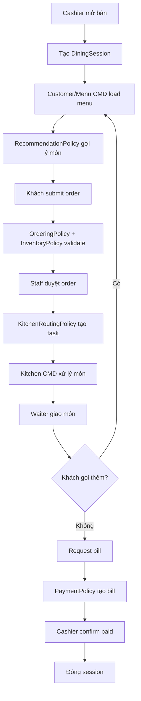

# 00 - Product Overview

## 1. Mục tiêu

Mô tả tổng quan hệ thống đặt món tại bàn cho nhà hàng Casual dining. Tài liệu này giúp người triển khai hiểu sản phẩm, module, actor và luồng nghiệp vụ trước khi đi vào từng module con.

## 2. Actor chính

| Actor | Trách nhiệm |
| --- | --- |
| Khách tại bàn | Xem menu, nhận gợi ý, đặt món, yêu cầu thanh toán |
| Cashier/Staff | Mở bàn, duyệt order, xử lý hủy món, xác nhận thanh toán |
| Waiter | Giao món, xử lý gọi nhân viên |
| Kitchen/Bar | Chuẩn bị món và cập nhật trạng thái task |
| Manager | Cấu hình nhà hàng, menu, báo cáo, audit, train recommendation |
| System | Áp dụng policy, ghi audit, tạo notification |
| Policy Governance | Chuẩn hóa policy contract, deny code, audit và notification |

## 3. Luồng tổng quát

## 4. Các tài liệu con

Nên đọc `../17-policy-governance/README.md` ngay sau overview để hiểu rule chung trước khi đi vào từng module.

| File | Nội dung |
| --- | --- |
| [system-context.md](system-context.md) | Context, boundary, actor-system |
| [module-map.md](module-map.md) | Module map và dependency |
| [end-to-end-workflow.md](end-to-end-workflow.md) | Workflow nghiệp vụ đầy đủ |
| [scope-and-assumptions.md](scope-and-assumptions.md) | Scope, assumption, ngoài phạm vi |
