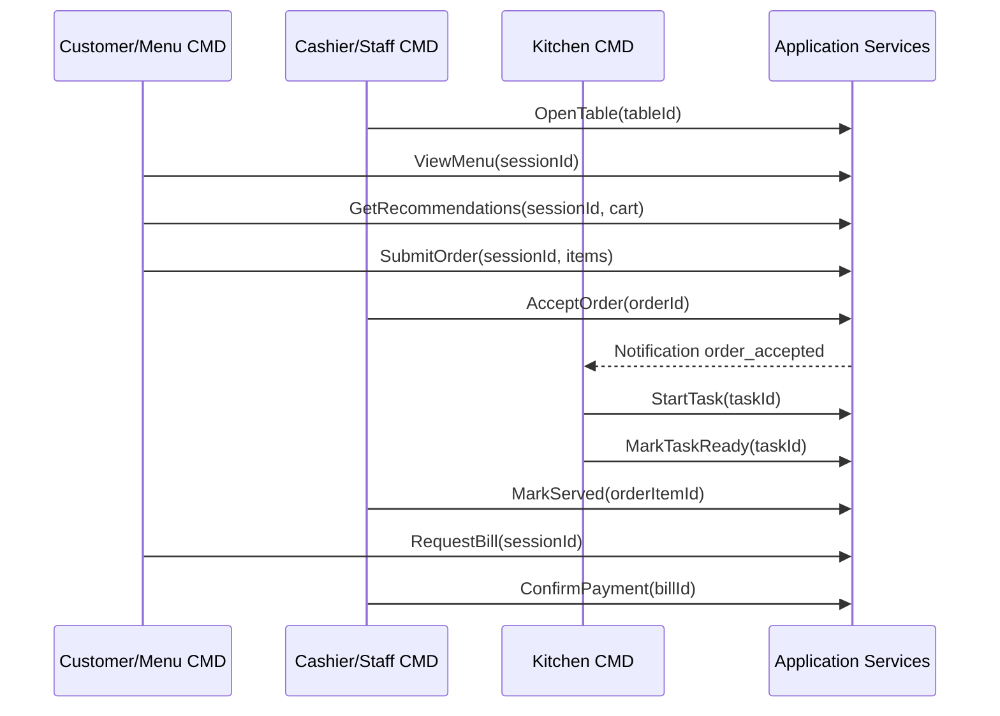

# End-to-End Workflow

## 1. Happy path

| Bước | Actor | Command | Module |
| --- | --- | --- | --- |
| 1 | Cashier | `OpenTable` | Table Session |
| 2 | Customer | `ViewMenu` | Menu Inventory |
| 3 | Customer | `ViewRecommendations` | Recommendation |
| 4 | Customer | `SubmitOrder` | Order Management |
| 5 | Cashier | `AcceptOrder` | Order Management |
| 6 | Kitchen | `StartTask` | Kitchen Fulfillment |
| 7 | Kitchen | `MarkTaskReady` | Kitchen Fulfillment |
| 8 | Waiter | `MarkServed` | Kitchen/Order |
| 9 | Customer | `RequestBill` | Payment Billing |
| 10 | Cashier | `ConfirmPayment` | Payment Billing |
| 11 | Manager | `ViewDailyRevenue` | Reporting |

## 2. Sequence

## 3. Required cross-cutting behavior

| Behavior | Rule |
| --- | --- |
| Permission | Mọi command nhạy cảm gọi `PermissionPolicy` |
| Revalidation | Service luôn đọc DB mới nhất trước khi đổi trạng thái |
| Audit | Payment, cancel, config, menu price change phải audit |
| Notification | Domain event tạo notification qua `NotificationPolicy` |
| Pricing | Bill chỉ tính order item không bị cancelled |
