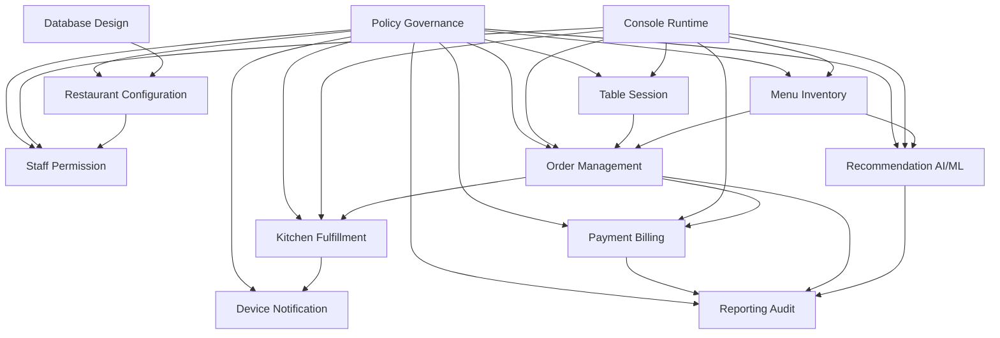

# Module Map

## 1. Module dependency

## 2. Module ownership

| Module | Source of truth |
| --- | --- |
| Restaurant Configuration | `branch_configs`, `feature_flags` |
| Table Session | `dining_tables`, `dining_sessions`, `dining_session_tables` |
| Menu Inventory | `menu_items`, `item_availability` |
| Order Management | `order_headers`, `order_items`, `cancellation_requests` |
| Kitchen Fulfillment | `preparation_tasks`, `task_items` |
| Payment Billing | `bills`, `bill_lines`, `payments` |
| Recommendation AI/ML | `recommendation_models`, `item_latent_factors` |
| Staff Permission | `staff_users`, `roles`, `permissions` |
| Device Notification | `console_sessions`, `notifications` |
| Reporting Audit | `audit_events`, paid bill/order history |
| Policy Governance | Policy contract, deny codes, audit/notification mapping |

## 3. Cross-cutting governance

| Concern | Owner |
| --- | --- |
| Policy contract format | `17-policy-governance/policy-contract-template.md` |
| Official policy catalog | `17-policy-governance/policy-catalog.md` |
| Error/deny code | `17-policy-governance/deny-error-codes.md` |
| Audit and notification mapping | `17-policy-governance/audit-notification-mapping.md` |
| Policy scenario coverage | `17-policy-governance/policy-test-matrix.md` |
