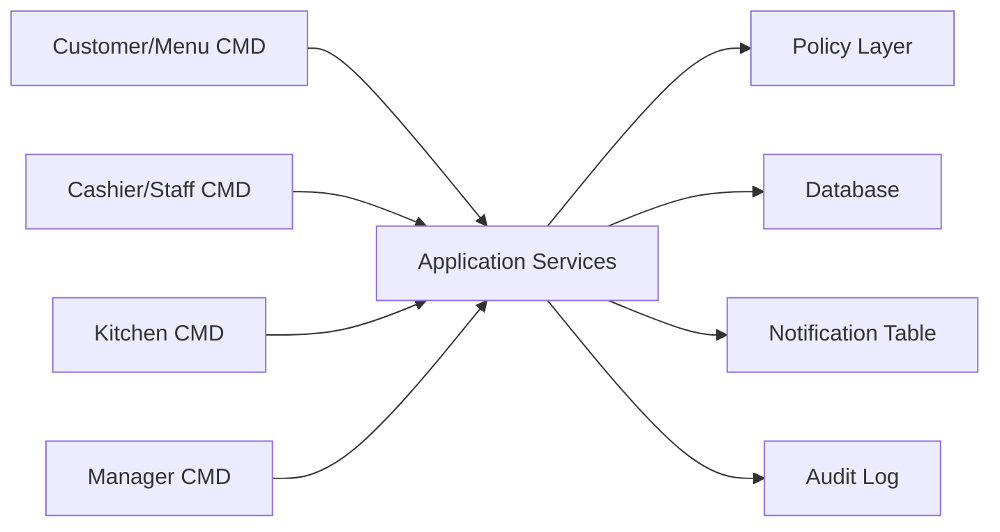

# System Context

## 1. Boundary

Hệ thống phục vụ một nhà hàng Casual dining trong MVP. Các ứng dụng bên ngoài như payment gateway, thermal printer thật, web/tablet UI thật không nằm trong phạm vi triển khai.

## 2. System responsibilities

| Trách nhiệm | Mô tả |
| --- | --- |
| Session control | Mở bàn, ghép bàn, chuyển bàn, đóng bàn |
| Order control | Submit, duyệt, reject, hủy món |
| Fulfillment | Tạo task bếp/bar, tracking trạng thái |
| Billing | Tính bill và xác nhận thanh toán |
| Recommendation | Gợi ý món theo session/cart |
| Governance | Permission, audit, reporting |

## 3. External dependencies trong MVP

| Dependency | Cách xử lý MVP |
| --- | --- |
| Payment gateway | Không tích hợp, cashier confirm thủ công |
| Printer | Không tích hợp, Kitchen CMD thay thế |
| Tablet UI | Không làm, Customer/Menu CMD thay thế |
| Realtime socket | Không cần, notification polling qua DB |
