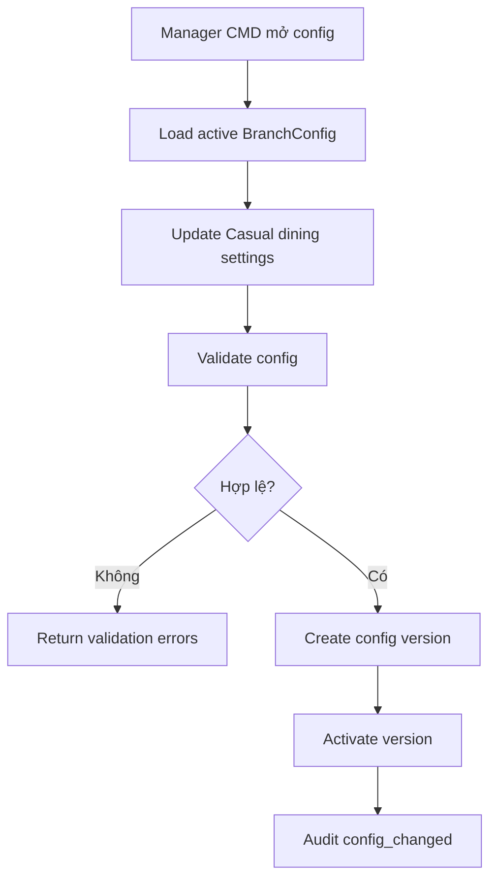

# 01 - Restaurant Configuration

## 1. Mục tiêu

Lưu cấu hình vận hành cố định cho nhà hàng Casual dining. MVP không có wizard chọn nhiều mô hình; `businessProfile` luôn là `casual_dining`.

## 2. Actor

| Actor | Vai trò |
| --- | --- |
| Manager | Xem/sửa cấu hình chi nhánh |
| System | Load config active cho policy |
| Cashier/Staff | Bị ảnh hưởng bởi config khi thao tác |

## 3. Phạm vi

| In scope | Out of scope |
| --- | --- |
| Một tenant, một restaurant, một branch | SaaS multi-tenant |
| `BranchConfig` versioned | Onboarding đa loại nhà hàng |
| Feature flags cho Casual dining | Buffet/cafe/fast-food profile |

## 4. Workflow

