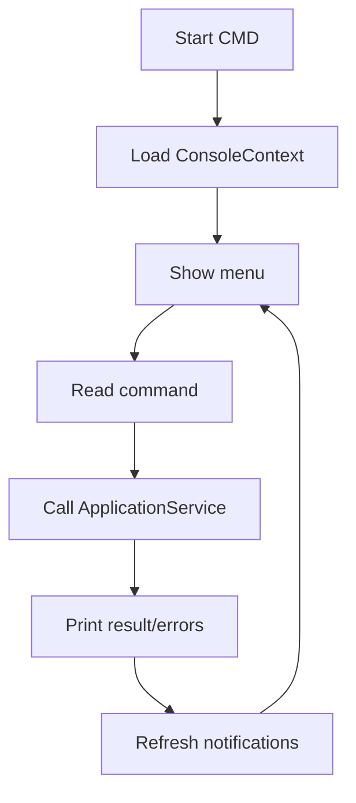

# 02 - Console Runtime

## 1. Mục tiêu

MVP mô phỏng UI bằng nhiều cửa sổ CMD. Mỗi CMD chỉ là lớp nhập/xuất, mọi nghiệp vụ nằm trong application service và policy.

## 2. Console apps

| Console | Context | Actor |
| --- | --- | --- |
| Customer/Menu CMD | `tableId`, `sessionId` | Customer |
| Cashier/Staff CMD | `staffId`, `role` | Cashier/Waiter |
| Kitchen CMD | `stationId`, `staffId` | Kitchen |
| Manager CMD | `staffId`, `branchId` | Manager |

## 3. Runtime workflow

