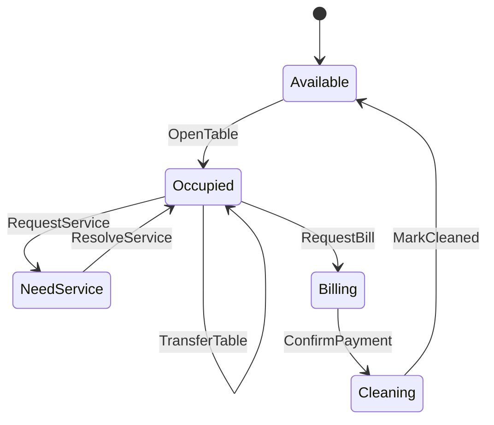

# 03 - Table Session

## 1. Mục tiêu

Quản lý bàn vật lý và `DiningSession`. Một session là một lượt khách đang ăn tại một bàn hoặc nhóm bàn.

## 2. Actor

| Actor | Thao tác |
| --- | --- |
| Cashier/Staff | Mở bàn, ghép bàn, chuyển bàn, request bill |
| Customer | Gọi nhân viên, xem trạng thái bàn của mình |
| Manager | Xem trạng thái bàn tổng |

## 3. Workflow

