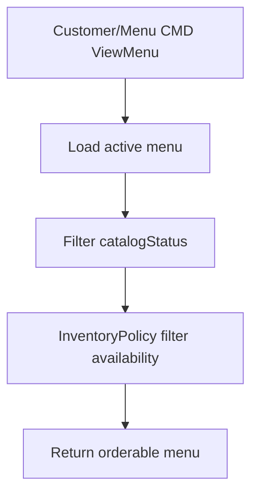

# 04 - Menu Inventory

## 1. Mục tiêu

Quản lý menu, món ăn, modifier và trạng thái bán hiện tại. Module này là nguồn dữ liệu cho order, kitchen, billing và recommendation.

## 2. Phân biệt trạng thái

| Loại | Bảng | Ý nghĩa |
| --- | --- | --- |
| `catalogStatus` | `menu_items` | Món thuộc catalog không |
| `availabilityStatus` | `item_availability` | Hiện tại còn bán không |

## 3. Workflow

