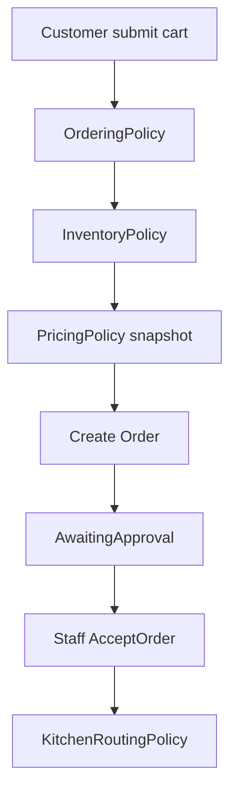

# 05 - Order Management

## 1. Mục tiêu

Quản lý giỏ hàng, submit order, staff approval, trạng thái order item và hủy món đặt nhầm. Đây là module trung tâm của Casual dining.

## 2. Actor

| Actor | Thao tác |
| --- | --- |
| Customer | Submit order, yêu cầu hủy món |
| Cashier/Staff | Duyệt/reject order, duyệt hủy món |
| Manager | Override hủy món đang preparing |
| Kitchen | Nhận task sau khi order accepted |

## 3. Workflow submit

