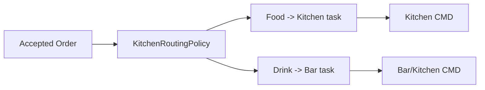

# 06 - Kitchen Fulfillment

## 1. Mục tiêu

Chuyển order accepted thành task cho bếp/bar, tracking trạng thái chuẩn bị và báo cho staff khi món ready.

## 2. Actor

| Actor | Thao tác |
| --- | --- |
| Kitchen/Bar | Xem task, start, ready, report issue |
| Staff/Waiter | Nhận món ready, mark served |
| Cashier | Nhận issue khi bếp báo hết món |

## 3. Routing workflow

