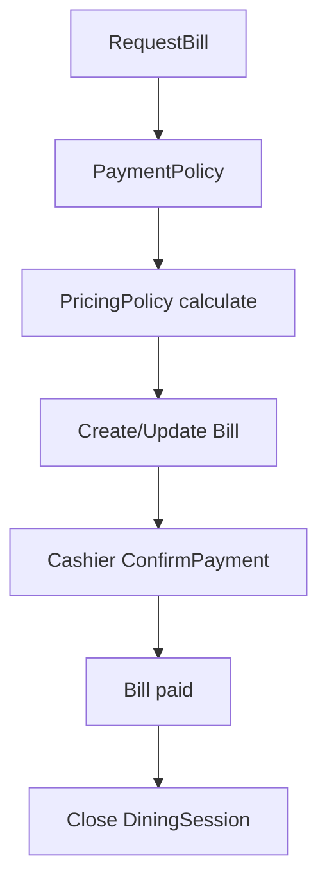

# 07 - Payment Billing

## 1. Mục tiêu

Tạo bill cuối bữa cho một `DiningSession`, tính tiền từ các món không bị hủy và cashier xác nhận thanh toán thủ công.

## 2. Actor

| Actor | Thao tác |
| --- | --- |
| Customer | Request bill |
| Cashier | Xem bill, confirm payment |
| Manager | Discount/adjustment nếu cần |

## 3. Workflow

