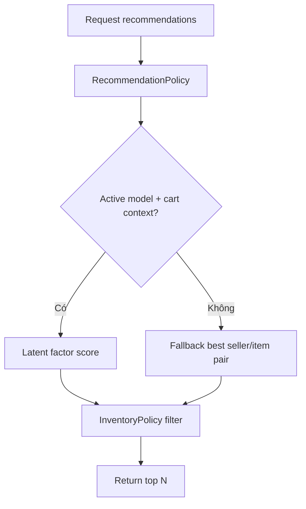

# 08 - Recommendation AI/ML

## 1. Mục tiêu

Gợi ý món cho khách trong session hiện tại bằng hybrid recommendation: latent factor theo `DiningSession x MenuItem`, item-pair rule và rule-based fallback.

Phần thuật toán và công thức toán chi tiết nằm tại [algorithm-design.md](algorithm-design.md).

## 2. Actor

| Actor | Thao tác |
| --- | --- |
| Customer | Xem món gợi ý |
| Manager | Train/activate model |
| System | Track recommendation events |

## 3. Workflow recommend



## 4. Công thức tổng quan

Với phiên hiện tại `s` và món ứng viên `j`:

```text
score(j) =
    w_lf   * dot(x_current, y_j)
  + w_pop  * popularity(j)
  + w_pair * pair_score(C, j)
  + w_cat  * category_boost(C, j)
  + w_time * time_boost(j, now)
  - w_prep * prep_penalty(j)
```

Trong đó:

| Ký hiệu | Ý nghĩa |
| --- | --- |
| `x_current` | Vector khẩu vị suy ra từ món trong giỏ/order hiện tại |
| `y_j` | Vector ẩn của món `j` học từ lịch sử order |
| `C` | Tập món khách đã chọn hoặc đã gọi |
| `popularity(j)` | Độ phổ biến của món theo lịch sử món đã phục vụ |
| `pair_score(C, j)` | Mức độ món `j` thường đi kèm các món trong `C` |
| `category_boost(C, j)` | Tăng điểm cho nhóm còn thiếu như đồ uống/tráng miệng |
| `time_boost(j, now)` | Tăng điểm theo thời điểm bán tốt |
| `prep_penalty(j)` | Giảm điểm món làm lâu khi cần |

Trước khi trả kết quả, hệ thống luôn filter theo policy:

```text
catalogStatus = ACTIVE
availabilityStatus = AVAILABLE
item not already in cart/order
session.status = ACTIVE
```

## 5. Lý do chọn hướng này

| Lựa chọn | Lý do |
| --- | --- |
| `DiningSession x MenuItem` | Không cần tài khoản khách nhưng vẫn dùng được dữ liệu order |
| Implicit feedback | Nhà hàng có số lượng gọi món, không có rating sao |
| Latent factor | Có mô hình toán rõ, học quan hệ ẩn giữa món |
| Hybrid score | Kết hợp học máy với nghiệp vụ nhà hàng |
| Fallback rule-based | Vẫn chạy khi dữ liệu ít hoặc chưa train model |
