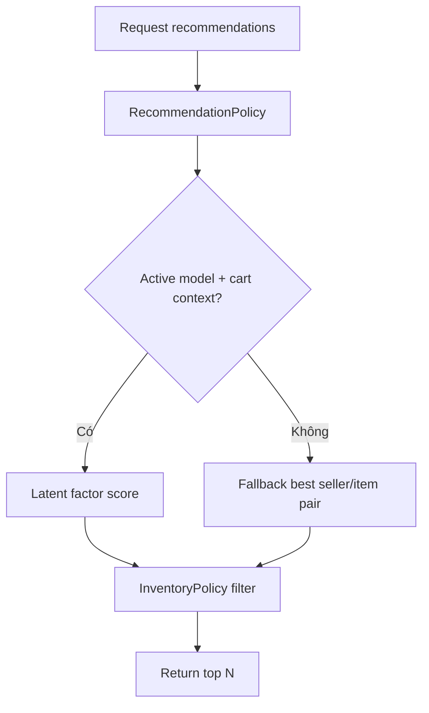

# 08 - Recommendation AI/ML

## 1. Mục tiêu

Gợi ý món cho khách trong session hiện tại bằng hybrid recommendation: latent factor theo `DiningSession x MenuItem` và rule-based fallback.

## 2. Actor

| Actor | Thao tác |
| --- | --- |
| Customer | Xem món gợi ý |
| Manager | Train/activate model |
| System | Track recommendation events |

## 3. Workflow recommend

