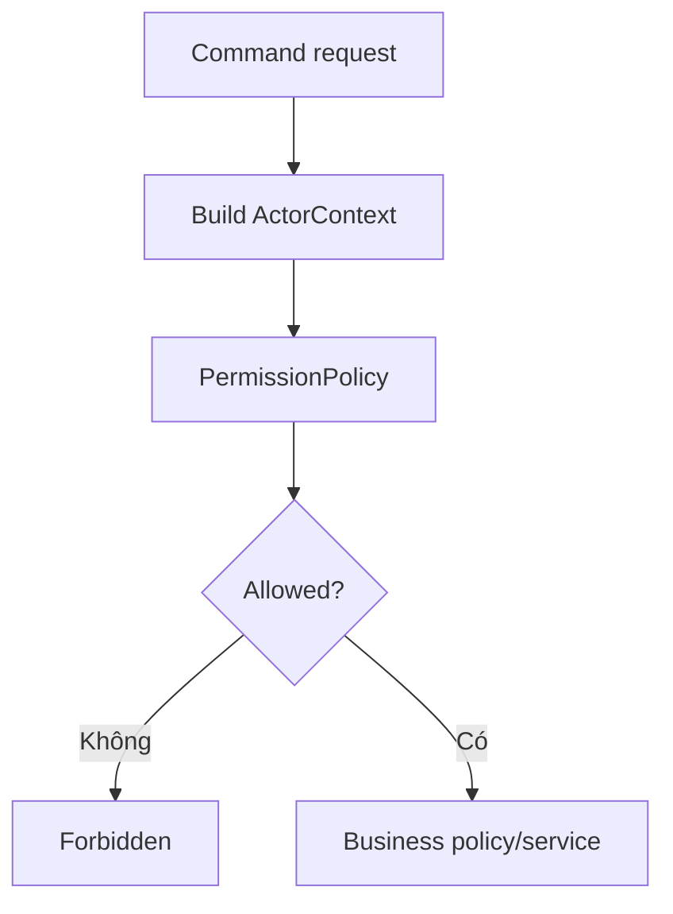

# 09 - Staff Permission

## 1. Mục tiêu

Quản lý nhân viên, vai trò và quyền thao tác. Mọi command nhạy cảm phải đi qua `PermissionPolicy`.

## 2. Role MVP

| Role | Trách nhiệm |
| --- | --- |
| `manager` | Config, menu, report, audit, override |
| `cashier` | Mở bàn, duyệt order, thanh toán |
| `waiter` | Giao món, xử lý service request |
| `kitchen` | Xử lý task bếp/bar |
| `customer` | Xem menu, submit order, request bill |

## 3. Workflow

