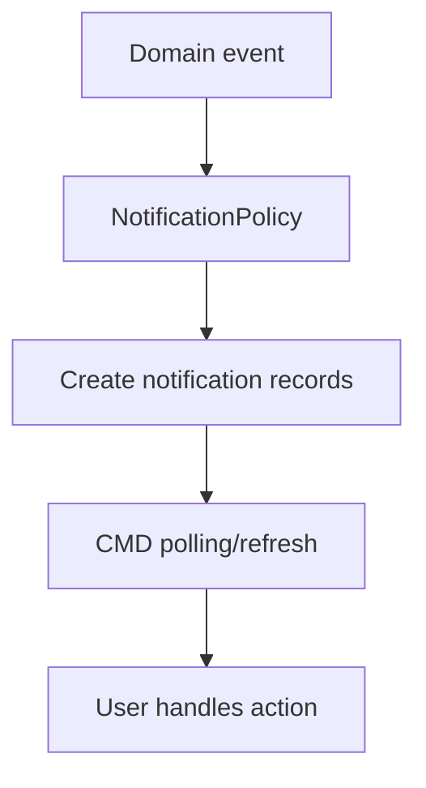

# 10 - Device Notification

## 1. Mục tiêu

Quản lý context CMD/device và notification giữa các vai trò. MVP dùng DB polling, không cần realtime socket.

## 2. Device mapping

| Device/CMD | Context |
| --- | --- |
| Customer/Menu CMD | `tableId`, `sessionId` |
| Kitchen CMD | `stationId` |
| Cashier/Staff CMD | `staffId`, `role` |
| Manager CMD | `staffId`, `branchId` |

## 3. Workflow

