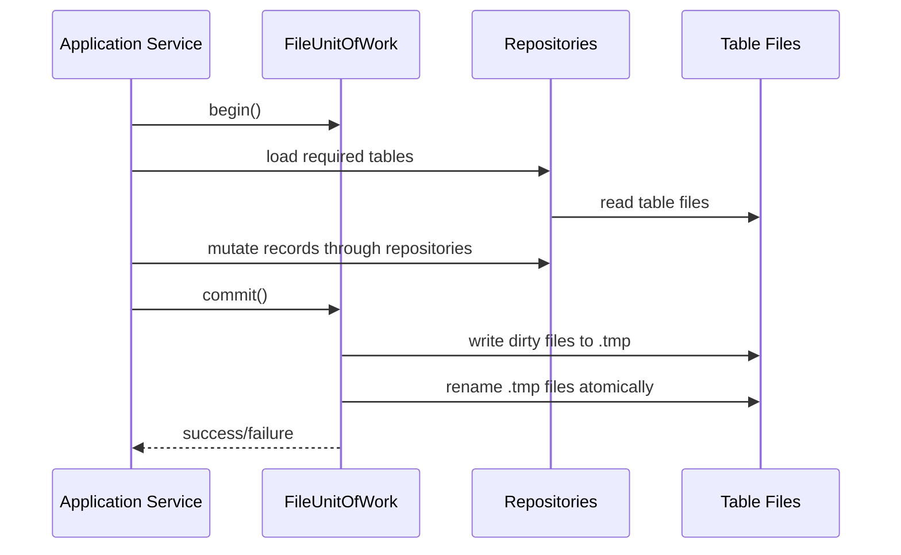

# File Storage Strategy

## 1. Quyết Định Thiết Kế

MVP vẫn được phép dùng `.txt`, nhưng **không dùng một file `restaurant_db.txt` duy nhất làm database tổng**.

Thiết kế chính thức cho C++ MVP:

```text
data/
  db/
    _meta/
      schema_version.txt
    core/
      dining_tables.txt
      dining_sessions.txt
      dining_session_tables.txt
    menu/
      menu_items.txt
      item_availability.txt
    orders/
      order_headers.txt
      order_items.txt
      cancellation_requests.txt
      idempotency_keys.txt
    kitchen/
      preparation_tasks.txt
      task_items.txt
      kitchen_issues.txt
    billing/
      bills.txt
      bill_lines.txt
      payments.txt
    staff/
      staff_users.txt
      role_permissions.txt
    governance/
      notifications.txt
      audit_events.txt
    recommendation/
      recommendation_interactions.txt
      recommendation_models.txt
      item_latent_factors.txt
      recommendation_events.txt
```

Mỗi file `.txt` tương ứng một logical table trong `table-groups.md`.

## 2. Vì Sao Không Dùng Một File Tổng

| Vấn đề với một file tổng | Ảnh hưởng nghiệp vụ |
| --- | --- |
| Mọi command phải đọc/ghi toàn bộ database | Dễ chậm và khó debug khi dữ liệu tăng |
| Module nào cũng biết cấu trúc toàn cục | Service dễ phụ thuộc sai module |
| Không có ownership theo bảng | Order có thể sửa billing/kitchen tùy tiện |
| Khó migration | Thêm `bill_lines` hoặc `kitchen_issues` dễ làm hỏng parser |
| Khó transaction theo command | `AcceptOrder` cập nhật order/task/audit không rõ boundary |
| Khó bảo vệ edge case | Bill stale, idempotency, kitchen issue cần bảng riêng để policy đọc rõ |

Một file tổng chỉ phù hợp giai đoạn prototype rất sớm, không phù hợp với business design hiện tại.

## 3. Format File Chuẩn

Mỗi table file dùng pipe-delimited text:

```text
# table=order_headers
# columns=id|sessionId|status|note|createdAt|clientRequestId|version
1|10|SUBMITTED|Submitted from customer|2026-06-20 10:15:00|T01-REQ-001|1
```

Quy tắc format:

| Rule | Quy định |
| --- | --- |
| Comment | Dòng bắt đầu bằng `#` được bỏ qua khi load |
| Delimiter | Dùng `|` |
| Escape | `\|`, `\n`, `\r`, `\\` cho text field |
| Boolean | `1` hoặc `0` |
| Timestamp | String `YYYY-MM-DD HH:mm:ss` theo local time |
| Missing field | Loader dùng default nếu file cũ thiếu field |
| Unknown extra field | Loader bỏ qua để backward compatible |

## 4. Table Ownership

| Folder | Owner repository | Ghi chú |
| --- | --- | --- |
| `core/` | `TableSessionRepository` | Bàn, session, ghép/chuyển bàn |
| `menu/` | `MenuInventoryRepository` | Menu catalog và availability |
| `orders/` | `OrderRepository` | Order, item, cancel, idempotency submit |
| `kitchen/` | `KitchenRepository` | Task, task item, issue |
| `billing/` | `BillingRepository` | Bill snapshot, bill line, payment |
| `staff/` | `StaffRepository` | Actor, role, permission |
| `governance/` | `NotificationRepository`, `AuditRepository` | Event, audit, notification |
| `recommendation/` | `RecommendationRepository` | Interaction/model/vector/event |

Repository chỉ được đọc/ghi file thuộc ownership của nó. Cross-module workflow phải đi qua service + `UnitOfWork`.

## 5. Unit Of Work Cho `.txt`

Do `.txt` không có transaction thật như SQLite, MVP dùng `FileUnitOfWork`:



Quy tắc commit:

| Rule | Cách xử lý |
| --- | --- |
| Dirty table only | Chỉ ghi file có thay đổi |
| Atomic per file | Ghi `table.txt.tmp`, sau đó rename sang `table.txt` |
| Multi-file command | Ghi tất cả tmp trước, rename theo thứ tự cố định |
| Commit fail | Giữ file cũ nếu chưa rename; nếu rename một phần thì audit recovery khi app khởi động |
| Server mode | Một process server giữ mutex nên tránh ghi đồng thời |
| CMD fallback | Dùng coarse lock file `data/db/_meta/write.lock` trước khi commit |

MVP chấp nhận transaction không hoàn hảo như database thật, nhưng phải có boundary rõ để giải thích khi bảo vệ đồ án.

## 6. Command Transaction Boundaries

| Command | Dirty tables |
| --- | --- |
| `OpenTable` | `dining_sessions`, `dining_session_tables`, `dining_tables`, `audit_events`, `notifications` |
| `MergeTables` | `dining_session_tables`, `dining_tables`, `order_headers`, `audit_events`, `notifications` |
| `SubmitOrder` | `order_headers`, `order_items`, `idempotency_keys`, `audit_events`, `notifications` |
| `AcceptOrder` | `order_headers`, `order_items`, `preparation_tasks`, `task_items`, `audit_events`, `notifications` |
| `CustomerDecision` | `order_headers`, `order_items`, `audit_events`, `notifications` |
| `ReportKitchenIssue` | `preparation_tasks`, `kitchen_issues`, `order_items`, `audit_events`, `notifications` |
| `ResolveKitchenIssue` | `kitchen_issues`, `preparation_tasks`, `order_items`, `audit_events`, `notifications` |
| `CreateBill` | `bills`, `bill_lines`, `dining_sessions`, `audit_events`, `notifications` |
| `ConfirmPayment` | `bills`, `payments`, `idempotency_keys`, `dining_sessions`, `dining_tables`, `audit_events`, `notifications` |
| `ReopenBill` | `bills`, `dining_sessions`, `audit_events`, `notifications` |

## 7. Migration Từ File Tổng Hiện Tại

Refactor code sau này có hai lựa chọn:

| Lựa chọn | Khi nào dùng |
| --- | --- |
| Reset seed sang layout mới | Khuyến nghị cho đồ án, đơn giản và sạch |
| Import `restaurant_db.txt` cũ | Chỉ cần nếu muốn giữ dữ liệu demo đang chạy |

MVP chính thức chọn **reset seed sang layout mới**. File `data/restaurant_db.txt` có thể giữ trong một phase chuyển tiếp nhưng không còn là storage mục tiêu.

## 8. Acceptance Criteria

- Không còn một file tổng chứa toàn bộ table.
- Mỗi logical table có file `.txt` riêng.
- Mỗi repository chỉ load/save table mình sở hữu.
- Service không gọi parser file trực tiếp.
- Policy chỉ đọc dữ liệu qua service/repository context, không tự đọc file.
- `restaurant_mvp test` vẫn pass sau khi đổi storage.
