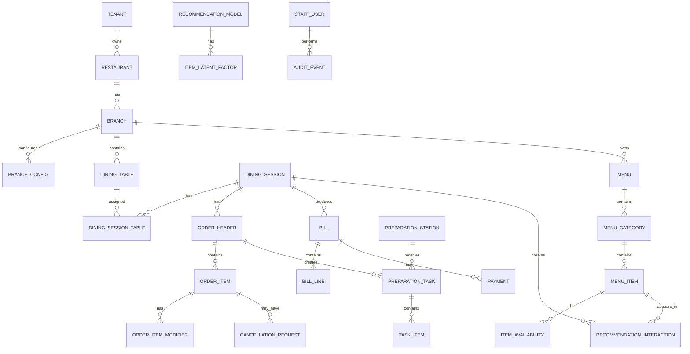

# Relationships

## 1. ERD tổng hợp

## 2. Important constraints

| Constraint | Reason |
| --- | --- |
| One active session per table | Tránh order sai bàn |
| Unique `clientRequestId` per session | Chống submit order trùng |
| Unique availability per branch/item | Một nguồn trạng thái món |
| One active bill per session | MVP không split bill |
| One active recommendation model | Gợi ý nhất quán |

## 3. Index checklist

| Table | Index |
| --- | --- |
| `dining_session_tables` | active `tableId` |
| `order_headers` | `sessionId`, `status` |
| `preparation_tasks` | `stationId`, `status` |
| `bills` | `sessionId`, `status` |
| `notifications` | `eventId`, `eventType` |
| `audit_events` | `resourceType`, `resourceId`, `createdAt` |

## 4. Policy-related relationship rules

| Relationship | Policy impact |
| --- | --- |
| `dining_sessions` → `order_headers` | Billing gates phải xem tất cả order trong session |
| `order_items` → `task_items` | Cancellation policy cần biết task status của từng item |
| `preparation_tasks` → `kitchen_issue` | Kitchen issue chặn bill và cần audit |
| `bills` → `bill_lines` → `order_items` | Bill calculation phải trace item nào bị tính/loại |
| `bills.sessionVersion` → `dining_sessions.version` | Bill stale nếu session đổi sau khi bill tạo |
| `audit_events.correlationId` → command request | Giải thích toàn bộ command xuyên service |

Các relationship này là bắt buộc để policy deny có bằng chứng dữ liệu, không chỉ là message chung chung.
