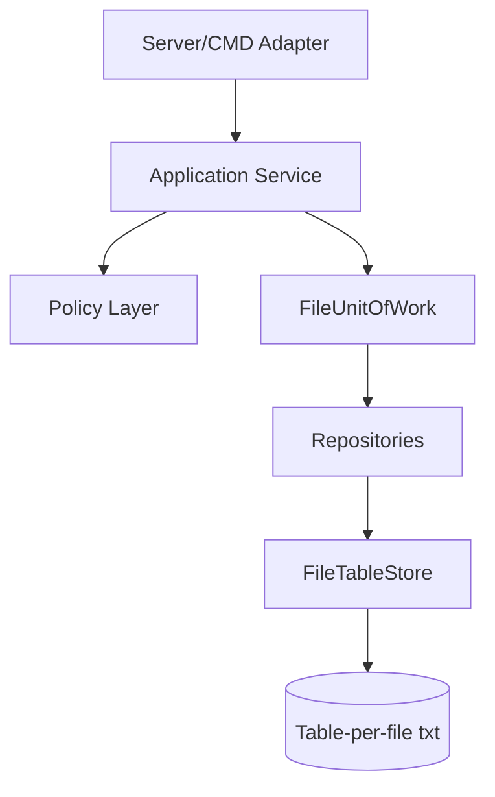
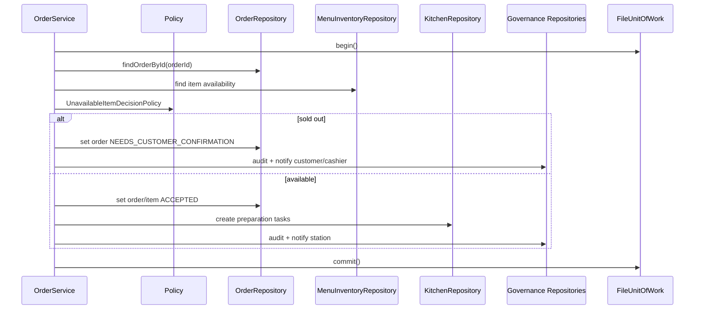

# Repository Design

## 1. Mục Tiêu

Repository là lớp trung gian giữa application service và file storage.

Repository chịu trách nhiệm:

- Load/save record theo table.
- Tìm record theo khóa chính/khóa nghiệp vụ.
- Tạo id mới.
- Đánh dấu dirty table cho `FileUnitOfWork`.

Repository **không chịu trách nhiệm**:

- Quyết định business rule.
- Tự gửi notification.
- Tự ghi audit theo ý riêng.
- Tự gọi policy.
- Tự sửa dữ liệu ngoài ownership.

## 2. Architecture



Service orchestrates workflow. Repository only persists state.

## 3. Target C++ Folder

```text
src/
  infrastructure/
    storage/
      file_table_store.hpp
      file_table_store.cpp
      file_unit_of_work.hpp
      file_unit_of_work.cpp
      row_codec.hpp
      row_codec.cpp
  repositories/
    table_session_repository.hpp
    table_session_repository.cpp
    menu_inventory_repository.hpp
    menu_inventory_repository.cpp
    order_repository.hpp
    order_repository.cpp
    kitchen_repository.hpp
    kitchen_repository.cpp
    billing_repository.hpp
    billing_repository.cpp
    staff_repository.hpp
    staff_repository.cpp
    notification_repository.hpp
    notification_repository.cpp
    audit_repository.hpp
    audit_repository.cpp
    recommendation_repository.hpp
    recommendation_repository.cpp
```

`FileDatabase` hiện tại chỉ là transitional adapter. Mục tiêu refactor là chuyển dần service sang repositories.

## 4. Shared Contracts

### 4.1 FileTableStore

| Method | Purpose |
| --- | --- |
| `loadRows(tableName)` | Đọc raw rows từ file table |
| `saveRows(tableName, rows)` | Ghi rows ra `.tmp` rồi commit |
| `exists(tableName)` | Kiểm tra table file tồn tại |
| `ensureTable(tableName, columns)` | Tạo file nếu chưa có |

### 4.2 FileUnitOfWork

| Method | Purpose |
| --- | --- |
| `begin()` | Bắt đầu command boundary |
| `repository<T>()` | Lấy repository dùng chung context |
| `markDirty(tableName)` | Đánh dấu table cần ghi |
| `commit()` | Ghi tất cả dirty table |
| `rollback()` | Bỏ staged change |

### 4.3 Repository Result

Repository trả dữ liệu hoặc technical error. Business deny vẫn dùng `PolicyDecision` ở service/policy layer.

```text
RepositoryResult<T>
  ok
  value
  errorMessage
```

Không dùng repository result để trả `PERMISSION_DENIED`, `BILL_BLOCKED`, `ITEM_SOLD_OUT`.

## 5. Repository Catalog

### 5.1 TableSessionRepository

Owned files:

- `core/dining_tables.txt`
- `core/dining_sessions.txt`
- `core/dining_session_tables.txt`

| Method | Purpose |
| --- | --- |
| `findTableByCode(code)` | Tìm bàn theo mã |
| `findActiveSessionByTable(code)` | Lấy session đang phục vụ |
| `createSession(tableIds, guestCount)` | Tạo session mới |
| `attachTable(sessionId, tableId, role)` | Ghép bàn vào session |
| `detachTable(sessionId, tableId)` | Gỡ bàn khi chuyển bàn |
| `setTableStatus(tableId, status)` | Đổi trạng thái bàn |
| `touchSession(sessionId)` | Tăng `version`, làm stale bill open |

### 5.2 MenuInventoryRepository

Owned files:

- `menu/menu_items.txt`
- `menu/item_availability.txt`

| Method | Purpose |
| --- | --- |
| `findItemById(itemId)` | Lấy menu item |
| `listActiveItems()` | Menu customer thấy |
| `listAllItems()` | Menu manager thấy |
| `getAvailability(itemId)` | Trạng thái orderable |
| `setAvailability(itemId, status, reason)` | Đổi sold-out/available |

### 5.3 OrderRepository

Owned files:

- `orders/order_headers.txt`
- `orders/order_items.txt`
- `orders/cancellation_requests.txt`
- `orders/idempotency_keys.txt`

| Method | Purpose |
| --- | --- |
| `findOrderById(orderId)` | Lấy order header |
| `listOrdersBySession(sessionId)` | Lấy toàn bộ order của session |
| `listPendingOrders()` | Cashier approval queue |
| `createOrder(sessionId, cart, clientRequestId)` | Tạo header/item |
| `setOrderStatus(orderId, status)` | Đổi order state |
| `setOrderItemStatus(itemId, status, note)` | Đổi item state |
| `findIdempotency(scope, key, operation)` | Chống double submit/pay |
| `saveIdempotency(scope, key, operation, entityId)` | Lưu replay pointer |

### 5.4 KitchenRepository

Owned files:

- `kitchen/preparation_tasks.txt`
- `kitchen/task_items.txt`
- `kitchen/kitchen_issues.txt`

| Method | Purpose |
| --- | --- |
| `createTasksForAcceptedOrder(orderId)` | Tạo task theo station |
| `listTasksByStation(station, statuses)` | Board kitchen/bar |
| `findTaskById(taskId)` | Lấy task |
| `setTaskStatus(taskId, status)` | Start/ready/served/issue |
| `createIssue(taskId, orderItemId, reason)` | Bếp báo issue |
| `resolveIssue(issueId, resolution)` | Staff xử lý issue |

### 5.5 BillingRepository

Owned files:

- `billing/bills.txt`
- `billing/bill_lines.txt`
- `billing/payments.txt`
- `orders/idempotency_keys.txt`

| Method | Purpose |
| --- | --- |
| `findBillById(billId)` | Lấy bill |
| `findOpenBillBySession(sessionId)` | Một bill open/session |
| `createBill(sessionId, sessionVersion)` | Tạo bill header |
| `replaceBillLines(billId, lines)` | Snapshot item được tính tiền |
| `markBillStale(billId)` | Bill lỗi thời |
| `voidBill(billId)` | Reopen bill |
| `confirmPayment(billId, method, paidAmount, key)` | Lưu payment |

### 5.6 StaffRepository

Owned files:

- `staff/staff_users.txt`
- `staff/role_permissions.txt`

| Method | Purpose |
| --- | --- |
| `findActor(actor)` | Tìm staff/customer demo actor |
| `roleForActor(actor)` | Resolve role |
| `hasPermission(role, permissionKey)` | Permission matrix |
| `listPermissions(actor)` | API `GET /api/staff/permissions` |

### 5.7 Governance Repositories

Owned files:

- `governance/notifications.txt`
- `governance/audit_events.txt`

| Repository | Method | Purpose |
| --- | --- | --- |
| `NotificationRepository` | `append(channel, type, entity)` | Tạo notification |
| `NotificationRepository` | `listAfter(channel, afterId, limit)` | Polling UI |
| `AuditRepository` | `append(action, actor, entity, payload)` | Audit action quan trọng |
| `AuditRepository` | `recent(limit)` | Manager audit log |

### 5.8 RecommendationRepository

Owned files:

- `recommendation/recommendation_interactions.txt`
- `recommendation/recommendation_models.txt`
- `recommendation/item_latent_factors.txt`
- `recommendation/recommendation_events.txt`

| Method | Purpose |
| --- | --- |
| `appendInteraction(sessionId, itemId, weight)` | Lịch sử mua/interaction |
| `activeModel()` | Model latent factor đang active |
| `itemFactors(modelId)` | Vector item |
| `appendRecommendationEvent(...)` | Log recommendation exposure/click/add |

## 6. Service-To-Repository Matrix

| Service | Repositories used |
| --- | --- |
| `TableSessionService` | `TableSessionRepository`, `AuditRepository`, `NotificationRepository` |
| `MenuInventoryService` | `MenuInventoryRepository`, `AuditRepository`, `NotificationRepository` |
| `OrderService` | `OrderRepository`, `TableSessionRepository`, `MenuInventoryRepository`, `KitchenRepository`, `AuditRepository`, `NotificationRepository` |
| `KitchenService` | `KitchenRepository`, `OrderRepository`, `AuditRepository`, `NotificationRepository` |
| `BillingService` | `BillingRepository`, `OrderRepository`, `KitchenRepository`, `TableSessionRepository`, `AuditRepository`, `NotificationRepository` |
| `RecommendationService` | `RecommendationRepository`, `OrderRepository`, `MenuInventoryRepository` |
| `ReportingService` | `BillingRepository`, `OrderRepository`, `AuditRepository` |

## 7. Example Workflow

### AcceptOrder



## 8. Repository Rules

| Rule | Meaning |
| --- | --- |
| No business decision | Repository không tự deny nghiệp vụ |
| No direct cross-owner mutation | Repository không sửa table ngoài ownership |
| No UI wording | Repository không chứa message cho UI |
| No hidden side effect | Gọi `setTaskStatus` không tự gửi notification |
| Deterministic save | Record output sort theo `id` nếu có |
| Backward compatible load | Missing field dùng default |

Nếu vi phạm các rule này, code sẽ quay lại tình trạng service/persistence trộn lẫn và khó bảo vệ nghiệp vụ.
