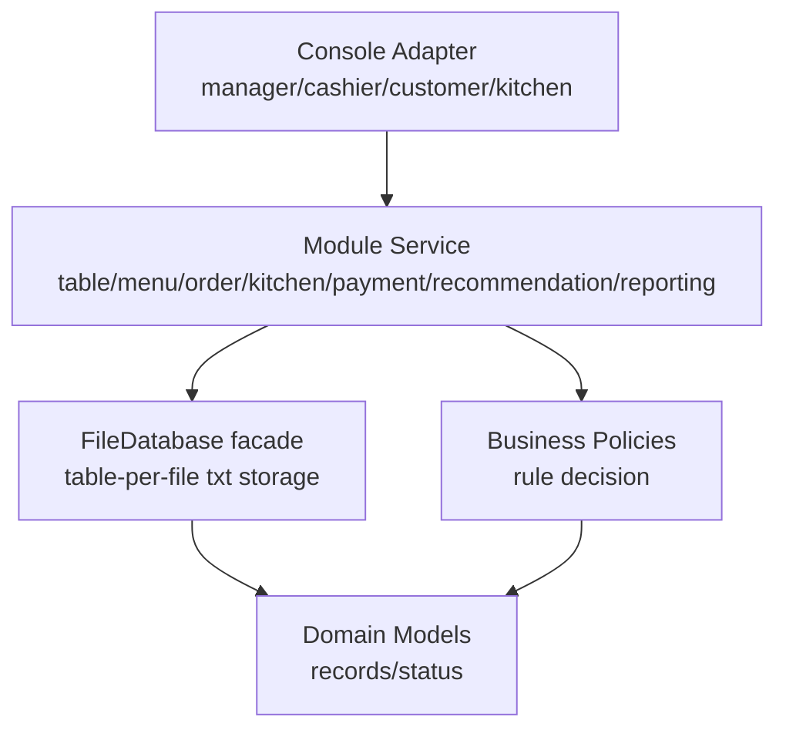

# Code Architecture Map

Tài liệu này liên kết thiết kế nghiệp vụ Casual dining trong `docs/product-design/` với cấu trúc code C++ hiện tại.

## Layered Architecture

## Product Module To Code Module

| Product-design module | Code module | Trách nhiệm |
|---|---|---|
| `03-table-session` | `src/modules/table_session/` | Mở bàn, ghép bàn, chuyển bàn, dọn bàn |
| `04-menu-inventory` | `src/modules/menu_inventory/` | Hiển thị menu, đổi trạng thái `AVAILABLE` / `SOLD_OUT` |
| `05-order-management` | `src/modules/order_management/` | Submit order, staff approval, reject, request/approve cancel |
| `06-kitchen-fulfillment` | `src/modules/kitchen_fulfillment/` | Task cho `kitchen` / `bar`, start, ready |
| `07-payment-billing` | `src/modules/payment_billing/` | Tính bill, loại món hủy, xác nhận thanh toán |
| `08-recommendation-ai-ml` | `src/modules/recommendation_ai_ml/` | Recommendation latent-factor MVP |
| `11-reporting-audit` | `src/modules/reporting_audit/` | Doanh thu đã thanh toán, audit log |
| `12-database-design` | `src/infrastructure/storage/`, `src/infrastructure/file_database.*` | Persistence MVP bằng nhiều `.txt` theo bảng |

## Policy Mapping

| Policy | File | Rule đang áp dụng |
|---|---|---|
| `TableSessionPolicy` | `src/policies/business_policies.cpp` | Chỉ mở bàn khi `AVAILABLE` và chưa có session |
| `MenuAvailabilityPolicy` | `src/policies/business_policies.cpp` | Chỉ đặt món khi `catalogStatus=ACTIVE` và `availabilityStatus=AVAILABLE` |
| `OrderApprovalPolicy` | `src/policies/business_policies.cpp` | Chỉ duyệt order ở trạng thái `SUBMITTED` |
| `CancelPolicy` | `src/policies/business_policies.cpp` | Khách chỉ xin hủy khi món chưa vào giai đoạn bếp đang làm; staff chỉ duyệt nếu task còn `PENDING` |
| `BillingPolicy` | `src/policies/business_policies.cpp` | Chỉ tạo bill khi không còn order/task/cancel request đang chờ |

## Target Policy Layer

| Product policy group | C++ target | Ghi chú |
|---|---|---|
| Permission/scope | `src/policies/permission_policy.*` | Chạy trước business policy |
| Table/session | `src/policies/table_policy.*` | Open/merge/transfer/cleaning |
| Menu/inventory | `src/policies/menu_policy.*` | Catalog/availability/modifier/price |
| Order/cancel | `src/policies/order_policy.*` | Submit/accept/idempotency/cancel |
| Kitchen | `src/policies/kitchen_policy.*` | Routing/task state/issue |
| Billing/payment | `src/policies/billing_policy.*` | Bill gate/calculation/stale/payment |
| Notification/audit | `src/policies/governance_policy.*` | Audit required + notification route |

Mọi policy nên trả về `PolicyDecision` theo contract trong `17-policy-governance`.

## Console Adapter

| Actor | File | Ghi chú |
|---|---|---|
| Manager | `src/console/manager_console.cpp` | Quản lý menu availability, revenue, audit |
| Cashier | `src/console/cashier_console.cpp` | Mở bàn, duyệt order, xử lý hủy, bill |
| Customer | `src/console/customer_console.cpp` | Xem menu, recommendation, đặt món, xin hủy, xin bill |
| Kitchen/Bar | `src/console/kitchen_console.cpp` | Nhận task, bắt đầu làm, báo ready |

## Nguyên tắc triển khai

- `console/` không tự quyết định business rule, chỉ gọi service.
- `modules/` chứa use case theo từng nghiệp vụ.
- `policies/` trả lời câu hỏi “có được phép làm không?”.
- `infrastructure/` chịu trách nhiệm lưu/đọc dữ liệu.
- `domain/` chỉ chứa dữ liệu/trạng thái dùng chung.
- Controller/API/CMD không được tự viết rule thay policy; chúng chỉ map `PolicyDecision` sang message/HTTP response.
