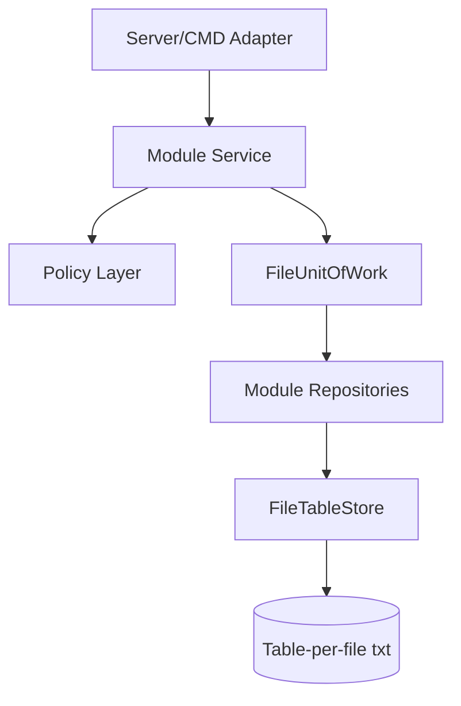

# Persistence Refactor Plan

## 1. Mục Tiêu

Refactor từ `FileDatabase` một file tổng sang kiến trúc:

```text
Application Service
→ Repository
→ FileUnitOfWork
→ FileTableStore
→ nhiều .txt theo bảng
```

Mục tiêu là cải thiện kiến trúc mà không đổi business behavior đã có.

## 2. Nguyên Tắc Refactor

| Nguyên tắc | Quy định |
| --- | --- |
| Không sửa nghiệp vụ trong phase persistence | Behavior hiện tại phải giữ nguyên |
| Refactor theo module | Không thay toàn bộ `FileDatabase` trong một commit lớn |
| Test đi trước | `restaurant_mvp test` phải pass sau từng phase |
| Backward compatible tạm thời | Có thể giữ `FileDatabase` như adapter trong phase chuyển tiếp |
| Web là demo chính | Sau refactor, server/web flow phải vẫn chạy |

## 3. Target Architecture



## 4. Phase 0 - Freeze Current Behavior

| Task | Done when |
| --- | --- |
| Ghi lại current scenario tests | `restaurant_mvp test` pass |
| Ghi lại expected API smoke test | `/api/health`, `/api/menu`, `/api/staff/permissions` pass |
| Reset seed rõ ràng | `scripts/reset.bat` trả về data demo sạch |

Không bắt đầu refactor nếu test P0 chưa pass.

## 5. Phase 1 - Extract Storage Primitives

Tạo lớp hạ tầng nhưng chưa đổi service.

| Component | Responsibility |
| --- | --- |
| `RowCodec` | Escape/unescape field |
| `FileTableStore` | Load/save row list từ một table file |
| `FileUnitOfWork` | Track dirty tables và commit |
| `TableName` constants | Tránh hard-code path |

Acceptance criteria:

- Có thể đọc/ghi một table file độc lập.
- Unit test hoặc internal test cho escape `|`, newline, backslash.
- Chưa đụng order/kitchen/billing workflow.

## 6. Phase 2 - Seed Layout Mới

Thay seed từ một file tổng sang nhiều table file.

| Task | Done when |
| --- | --- |
| Tạo `data/db/_meta/schema_version.txt` | Có version hiện tại |
| Seed core/menu/staff | Web có thể đọc tables/menu/permissions |
| Seed governance empty tables | Audit/notification append được |
| Reset script cập nhật | `scripts/reset.bat` tạo layout mới |

MVP chọn reset seed, không bắt buộc migrate dữ liệu cũ.

## 7. Phase 3 - Repository Adapter Layer

Tạo repository nhưng có thể đọc từ `FileDatabase` adapter trong giai đoạn đầu.

| Repository | First milestone |
| --- | --- |
| `StaffRepository` | Permission policy không còn đọc trực tiếp `FileDatabase` |
| `MenuInventoryRepository` | Menu list/set availability dùng repo |
| `AuditRepository` | Audit append/recent dùng repo |
| `NotificationRepository` | Notification append/poll dùng repo |

Acceptance criteria:

- Manager menu availability vẫn chạy.
- Notification polling vẫn chạy.
- Audit log vẫn hiển thị.

## 8. Phase 4 - Refactor Core Workflow Repositories

Refactor theo thứ tự ít rủi ro đến nhiều rủi ro.

| Order | Module | Why |
| ---: | --- | --- |
| 1 | `TableSessionRepository` | Nền cho session/order/bill |
| 2 | `OrderRepository` | Cần idempotency và sold-out decision |
| 3 | `KitchenRepository` | Cần issue/task state |
| 4 | `BillingRepository` | Cần bill line/payment/stale |

Sau mỗi module:

- Build.
- Run `restaurant_mvp test`.
- Smoke test web flow ngắn.

## 9. Phase 5 - Remove Single-File Dependency

| Task | Done when |
| --- | --- |
| Service không nhận `FileDatabase&` | Nhận `UnitOfWork&` hoặc repository bundle |
| `src/infrastructure/file_database.*` không còn là source chính | Chỉ còn migration/compat hoặc bị xóa |
| `data/restaurant_db.txt` không còn được tạo bởi reset | Data nằm trong `data/db/**` |
| README cập nhật | Không còn hướng dẫn storage một file |

## 10. Compatibility Strategy

| Need | Decision |
| --- | --- |
| Giữ dữ liệu cũ | Không bắt buộc cho đồ án |
| Demo ổn định | Reset seed layout mới trước demo |
| Rollback nếu refactor lỗi | Giữ branch/backup phase trước hoặc giữ adapter trong 1 phase |
| CMD support | CMD gọi service mới, không đọc repository trực tiếp |

## 11. Acceptance Test Checklist

| Scenario | Expected |
| --- | --- |
| Double submit | Replay existing order |
| Sold-out accept | Order `NEEDS_CUSTOMER_CONFIRMATION` |
| Customer replacement | Cashier accept lại tạo task |
| Kitchen issue | Bill bị chặn |
| Resolve issue | Bill tạo được |
| Payment thiếu tiền | Deny `PAYMENT_AMOUNT_INVALID` |
| Bill stale | Deny `BILL_STALE_RECALCULATE_REQUIRED` |
| Reopen bill | Bill `VOIDED`, session `ACTIVE` |
| Permission deny | Customer không accept order, kitchen không pay bill |
| Web smoke | Health/menu/permissions endpoints pass |

## 12. Không Làm Trong Refactor Này

- Không chuyển SQLite.
- Không thêm ORM.
- Không thêm authentication thật.
- Không đổi recommendation algorithm.
- Không đổi policy business behavior đã được test.

Refactor persistence chỉ thay cách lưu/đọc dữ liệu, không phải viết lại nghiệp vụ.
