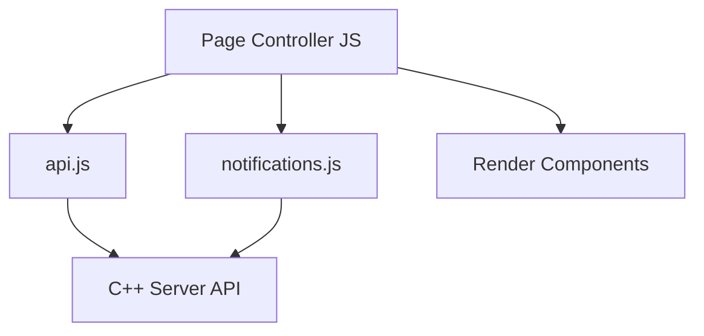

# Frontend State And Components

## 1. Nguyên Tắc State

Frontend chia state thành 2 loại:

| Loại state | Owner | Ví dụ |
|---|---|---|
| Server state | C++ server | table state, session, order, task, bill, menu availability |
| Local UI state | Browser | cart, selected category, modal open/close, last notification id |

Frontend không được xem local state là dữ liệu thật của hệ thống.

## 2. Customer Page State

```js
const state = {
  tableCode: "T01",
  session: null,
  menuItems: [],
  recommendations: [],
  cart: [],
  orders: [],
  bill: null,
  notifications: {
    channel: "customer:T01",
    lastId: 0
  }
};
```

| Component | Server state cần load | Local state |
|---|---|---|
| SessionBanner | `GET /api/tables/T01/session` | none |
| MenuGrid | `GET /api/menu` | selectedCategory |
| RecommendationStrip | `GET /api/sessions/{id}/recommendations` | none |
| CartPanel | none | cart |
| OrderStatusPanel | `GET /api/sessions/{id}/orders` | none |
| BillPanel | bill API response | none |
| ToastContainer | notification API | toast queue |

## 3. Cashier Page State

```js
const state = {
  tables: [],
  pendingOrders: [],
  cancelRequests: [],
  openBills: [],
  notifications: {
    channel: "cashier",
    lastId: 0
  }
};
```

| Component | API | Khi nào reload |
|---|---|---|
| TableBoard | `GET /api/tables` | `TABLE_OPENED`, `BILL_PAID`, manual refresh |
| PendingOrderQueue | `GET /api/orders/pending` | `NEW_ORDER` |
| CancelRequestPanel | `GET /api/cancel-requests` | `CANCEL_REQUESTED` |
| OpenBillPanel | `GET /api/bills/open` | `BILL_REQUESTED` |
| NotificationBadge | `GET /api/notifications` | polling |

## 4. Kitchen/Bar Page State

```js
const state = {
  station: "kitchen",
  tasks: [],
  notifications: {
    channel: "kitchen",
    lastId: 0
  }
};
```

| Component | API | Khi nào reload |
|---|---|---|
| TaskColumnPending | `GET /api/kitchen/tasks?station=kitchen` | `TASK_CREATED` |
| TaskColumnPreparing | `GET /api/kitchen/tasks?station=kitchen` | task start/ready |
| TaskColumnReady | `GET /api/kitchen/tasks?station=kitchen` | task ready |

## 5. Manager Page State

```js
const state = {
  menuItems: [],
  revenueSummary: null,
  auditEvents: [],
  notifications: {
    channel: "manager",
    lastId: 0
  }
};
```

| Component | API |
|---|---|
| MenuAvailabilityTable | `GET /api/menu?includeHidden=true` |
| RevenueSummary | `GET /api/reports/summary` |
| AuditLog | `GET /api/audit-events?limit=50` |

## 6. Component Interaction



## 7. UX Rule Khi State Thay Đổi

- Nếu server trả lỗi business rule, hiển thị message từ server.
- Nếu notification đến, reload đúng component liên quan.
- Nếu user đang nhập form, không reload toàn page.
- Nếu mất kết nối server, giữ UI hiện tại và hiện badge disconnected.

## 8. Policy Decision Components

| Required action | Component behavior |
|---|---|
| `RELOAD_STATE` | Reload resource liên quan, giữ user trên màn hình hiện tại |
| `ASK_CUSTOMER_TO_MODIFY_ORDER` | Mở modal chỉnh order: bỏ món, thay món, hủy order, gọi nhân viên |
| `CALL_STAFF` | Hiện nút gọi nhân viên và gửi notification |
| `ASK_MANAGER_OVERRIDE` | Ẩn action với customer, hiện cashier/manager workflow |
| `RESOLVE_ORDER_OR_KITCHEN_WORK` | Cashier view hiển thị blocker list trước khi bill |
| `RECALCULATE_BILL` | Cashier view disable confirm payment, hiện nút tính lại bill |

Frontend không cache quyết định policy lâu dài; sau mỗi notification quan trọng phải reload state từ API.
