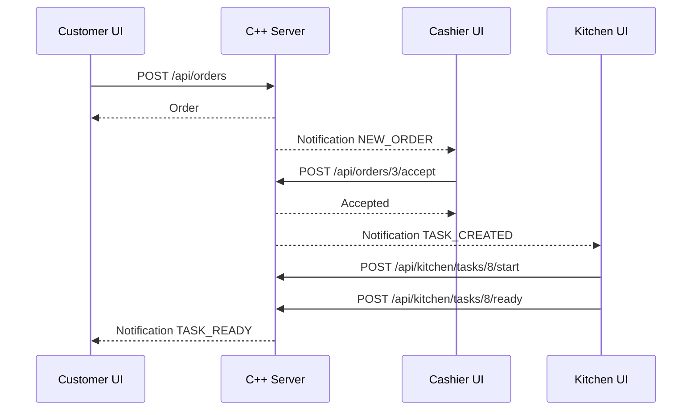

# Frontend UI/UX Design

## 1. Lý Do Chuyển Từ CMD Sang Web UI

CMD hiện tại phù hợp để kiểm thử nghiệp vụ, nhưng không phù hợp làm trải nghiệm sản phẩm:

| Vấn đề CMD | Ảnh hưởng | Web UI cải thiện |
|---|---|---|
| Không có thông báo tự nhiên | Cashier/bếp phải tự refresh | Toast notification + badge |
| Nhập số menu thủ công | Dễ nhầm thao tác | Button/card trực quan |
| Không có layout theo vai trò | Màn hình dài, khó nhìn | Dashboard riêng cho từng actor |
| Không có trạng thái realtime | Người dùng không biết ai vừa làm gì | Polling notification |
| Khó hiển thị menu/cart/bill đẹp | UX khách hàng kém | Card menu, cart panel, bill summary |

## 2. Actor Và Màn Hình

| Actor | Trang | Mục tiêu chính |
|---|---|---|
| Customer | `customer.html?table=T01` | Xem menu, nhận đề xuất, đặt món, xem trạng thái, yêu cầu bill |
| Cashier | `cashier.html` | Quản lý bàn, duyệt order, xử lý hủy món, tạo bill, xác nhận thanh toán |
| Kitchen | `kitchen.html?station=kitchen` | Xem task món ăn, start, mark ready |
| Bar | `kitchen.html?station=bar` | Xem task đồ uống, start, mark ready |
| Manager | `manager.html` | Quản lý menu availability, xem doanh thu, audit |

## 3. Customer UI

### Layout Đề Xuất

```text
┌─────────────────────────────────────────────────────────────┐
│ Table T01 · Session ACTIVE                    🔔 2          │
├───────────────────────┬─────────────────────────────────────┤
│ Category Filter       │ Cart                                │
│ [All] [Food] [Drink]  │ - Grilled Chicken Rice x2           │
│                       │ Total: 138,000 VND                  │
│ Menu Cards            │ [Submit Order]                      │
│ [Item] [Add]          │                                     │
│ [Item] [Add]          │ Order Status                        │
│                       │ #3 Waiting cashier approval         │
│ Recommended           │                                     │
│ [Orange Juice 82%]    │ [Request Bill]                      │
└───────────────────────┴─────────────────────────────────────┘
```

### Thành Phần Chính

| Component | Dữ liệu | Hành động |
|---|---|---|
| Session banner | `GET /api/tables/{code}/session` | Hiện bàn đã được mở hay chưa |
| Menu cards | `GET /api/menu` | Add to cart |
| Recommendation | `GET /api/sessions/{id}/recommendations` | Add suggested item |
| Cart panel | local state + menu item price | Submit order |
| Order status | `GET /api/sessions/{id}/orders` | Request cancel item |
| Bill box | `POST /api/sessions/{id}/bill` | Request bill |
| Toast | `GET /api/notifications` | Hiện event mới |

### UX Rule

- Nếu bàn chưa được cashier mở, customer page hiện “Bàn chưa được kích hoạt. Vui lòng gọi nhân viên.”
- Nếu món hết hàng, card disable nút `Add`.
- Sau khi submit order, cart clear và order mới hiện trạng thái “Chờ lễ tân xác nhận”.
- Khi cashier accept order, customer nhận toast “Order đã được xác nhận và gửi xuống bếp.”

## 4. Cashier UI

### Layout Đề Xuất

```text
┌─────────────────────────────────────────────────────────────┐
│ Cashier Dashboard                           🔔 NEW_ORDER 3  │
├───────────────┬────────────────────┬───────────────────────┤
│ Table Board   │ Pending Orders     │ Bills / Cancel        │
│ T01 Serving   │ #3 Table T01       │ Bill #2 OPEN          │
│ T02 Empty     │ [Accept] [Reject]  │ Cancel item #7        │
│ T03 Cleaning  │                    │ [Approve]             │
└───────────────┴────────────────────┴───────────────────────┘
```

### Thành Phần Chính

| Component | API | Hành động |
|---|---|---|
| Table board | `GET /api/tables` | Open, merge, transfer, mark cleaned |
| Pending order queue | `GET /api/orders/pending` | Accept/reject |
| Cancel requests | `GET /api/cancel-requests` | Approve cancel |
| Open bills | `GET /api/bills/open` | Confirm payment |
| Notification panel | `GET /api/notifications?channel=cashier` | Badge + toast |

### UX Rule

- Cashier không phải tự refresh; notification `NEW_ORDER` hiện badge.
- Khi click notification, pending order list reload.
- Accept order hiển thị kết quả rõ: “Đã gửi 2 item xuống bếp, 1 item xuống bar.”
- Nếu bill bị chặn vì bếp còn task, UI hiển thị lý do từ server.

## 5. Kitchen/Bar UI

### Layout Đề Xuất

```text
┌─────────────────────────────────────────────────────────────┐
│ Kitchen Board                                  🔔 TASK 1    │
├───────────────────┬───────────────────┬───────────────────┤
│ Pending           │ Preparing         │ Ready             │
│ #8 Beef Noodle    │ #7 Chicken Rice   │ #6 Spring Rolls   │
│ Table T01         │ Table T02         │ Table T03         │
│ [Start]           │ [Ready]           │                   │
└───────────────────┴───────────────────┴───────────────────┘
```

### UX Rule

- Task chia theo cột `PENDING`, `PREPARING`, `READY`.
- Bếp chỉ thấy task của `station=kitchen`.
- Bar chỉ thấy task của `station=bar`.
- Khi cashier accept order, bếp/bar nhận notification `TASK_CREATED`.
- Khi task ready, cashier/customer nhận notification `TASK_READY`.

## 6. Manager UI

| Khu vực | Chức năng |
|---|---|
| Menu availability | Set món `AVAILABLE` / `SOLD_OUT` |
| Revenue summary | Doanh thu đã thanh toán |
| Best sellers | Món bán chạy |
| Audit log | Lịch sử hành động quan trọng |

## 7. End-To-End Web UX Flow


