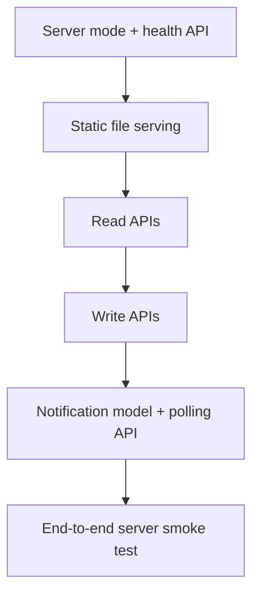

# C++ Server/API Implementation Plan

## 1. Mục Tiêu Triển Khai

Thêm server backend:

```text
C++ HTTP Server
+ REST API
+ static file serving
+ notification store
+ polling API
```

Frontend implementation được tách riêng ở [14-web-frontend-ui-ux/implementation-plan.md](../14-web-frontend-ui-ux/implementation-plan.md).

## 2. Phase 1 - Server Skeleton

### Công Việc

- Thêm mode:
  - `restaurant_mvp server`
- Thêm folder:

```text
src/server/
  http_server.hpp
  http_server.cpp
  api_router.hpp
  api_router.cpp
  json_helpers.hpp
  json_helpers.cpp
```

- Thêm static serving cho folder `web/`.

### Tiêu Chí Hoàn Thành

- Chạy được `restaurant_mvp server`.
- Mở được `http://localhost:8080`.
- `GET /api/health` trả JSON.

## 3. Phase 2 - Read APIs

### API Cần Có

- `GET /api/tables`
- `GET /api/menu`
- `GET /api/tables/{code}/session`
- `GET /api/orders/pending`
- `GET /api/kitchen/tasks?station=kitchen`
- `GET /api/bills/open`

## 4. Phase 3 - Write APIs

### API Cần Có

- `POST /api/tables/{code}/open`
- `POST /api/orders`
- `POST /api/orders/{orderId}/accept`
- `POST /api/orders/{orderId}/reject`
- `POST /api/kitchen/tasks/{taskId}/start`
- `POST /api/kitchen/tasks/{taskId}/ready`
- `POST /api/sessions/{sessionId}/bill`
- `POST /api/bills/{billId}/pay`

## 5. Phase 4 - Notification Store + Polling

### Data Cần Thêm

```text
notifications
- id
- channel
- type
- message
- entityType
- entityId
- createdAt
```

### API Cần Có

- `GET /api/notifications?channel=cashier&after=0`

### Tiêu Chí Hoàn Thành

- Customer đặt món -> server tạo `NEW_ORDER` cho cashier.
- Cashier accept -> server tạo `TASK_CREATED` cho kitchen/bar.
- Kitchen ready -> server tạo `TASK_READY` cho customer/cashier.

## 6. Phase 5 - Stabilization

- Validate input ở API.
- Validate business rule bằng policy.
- Chuẩn hóa error code.
- Thêm idempotency cho submit order.
- Test edge case hủy món/bill.

## 7. Không Làm Trong Server MVP

| Ngoài scope | Lý do |
|---|---|
| Login thật | MVP có thể dùng actor hard-code |
| WebSocket | Polling đủ cho demo |
| Payment gateway | Casual dining MVP thanh toán thủ công |
| Multi-tenant SaaS | Scope chỉ một nhà hàng casual dining |

## 8. Thứ Tự Code Khuyến Nghị


