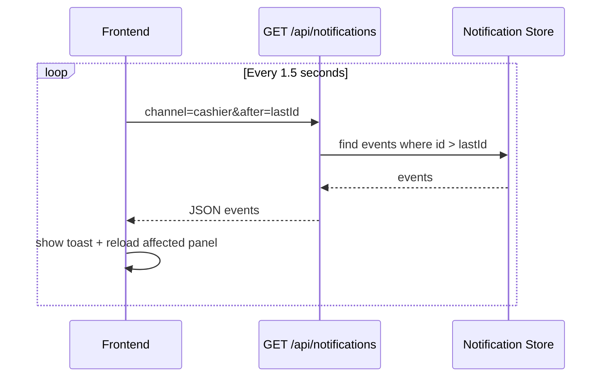

# Notification Polling Design

Tài liệu này mô tả **server-side notification model, channel, event type và polling API**. Cách hiển thị toast/badge trên frontend nằm ở [14-web-frontend-ui-ux/notification-ux.md](../14-web-frontend-ui-ux/notification-ux.md).

## 1. Vấn Đề Cần Giải Quyết

Ở CMD MVP hiện tại:

```text
Cashier mở bàn -> Customer không tự biết
Customer đặt món -> Cashier không tự biết
Cashier accept order -> Kitchen không tự biết
Kitchen ready -> Cashier/Customer không tự biết
```

Web UI cần cơ chế:

```text
Server tạo notification
Frontend polling notification mới
Frontend hiện toast/badge và reload đúng panel liên quan
```

## 2. Notification Record

```cpp
struct NotificationRecord {
    int id;
    std::string channel;
    std::string type;
    std::string message;
    std::string entityType;
    int entityId;
    std::string createdAt;
};
```

## 3. Channel Design

| Channel | Người nhận | Ví dụ |
|---|---|---|
| `cashier` | Lễ tân/cashier | New order, bill requested, cancel requested |
| `kitchen` | Bếp món ăn | Food task created |
| `bar` | Quầy nước | Drink task created |
| `manager` | Quản lý | Payment completed, audit important |
| `customer:T01` | Màn hình bàn T01 | Table opened, order accepted, item ready |

## 4. Event Type

| Type | Producer | Consumer |
|---|---|---|
| `TABLE_OPENED` | Cashier opens table | `customer:T01` |
| `NEW_ORDER` | Customer submits order | `cashier` |
| `ORDER_ACCEPTED` | Cashier accepts order | `customer:T01` |
| `ORDER_REJECTED` | Cashier rejects order | `customer:T01` |
| `TASK_CREATED` | Order accepted | `kitchen` / `bar` |
| `TASK_READY` | Kitchen marks ready | `cashier`, `customer:T01` |
| `CANCEL_REQUESTED` | Customer requests cancel | `cashier` |
| `CANCEL_APPROVED` | Cashier approves cancel | `customer:T01` |
| `BILL_REQUESTED` | Customer requests bill | `cashier` |
| `BILL_PAID` | Cashier confirms payment | `customer:T01`, `manager` |
| `MENU_CHANGED` | Manager changes menu | active customer channels, `cashier` |

## 5. Polling Flow



## 6. JavaScript Polling Example

```js
let lastNotificationId = Number(localStorage.getItem("cashier:lastNotificationId") || 0);

async function pollNotifications(channel) {
  try {
    const response = await fetch(`/api/notifications?channel=${encodeURIComponent(channel)}&after=${lastNotificationId}`);
    const payload = await response.json();

    if (!payload.ok) {
      console.warn(payload.error.message);
      return;
    }

    for (const event of payload.data.events) {
      lastNotificationId = Math.max(lastNotificationId, event.id);
      showToast(event.message);
      handleNotification(event);
    }

    localStorage.setItem("cashier:lastNotificationId", String(lastNotificationId));
  } catch (error) {
    showConnectionBadge("Server disconnected");
  }
}

setInterval(() => pollNotifications("cashier"), 1500);
```

## 7. Polling Interval

| Interval | Đánh giá |
|---|---|
| 500ms | Gần realtime nhưng hơi nhiều request |
| 1000ms | Rất ổn cho demo |
| 1500ms | Cân bằng tốt |
| 3000ms | Có thể cảm giác chậm |

Khuyến nghị MVP: `1000ms` hoặc `1500ms`.

## 8. Edge Cases

| Case | Xử lý |
|---|---|
| Frontend mất mạng/server tắt | Hiện badge disconnected, tiếp tục retry |
| Polling trùng event | Dùng `lastNotificationId` |
| User mở 2 tab cashier | Cả 2 tab nhận event, chấp nhận được cho MVP |
| Event đến khi user đang nhập form | Không reload toàn trang, chỉ reload panel |
| Event cũ quá nhiều | Server giới hạn `limit=50` |
| Notification bị mất do frontend refresh | Lưu `lastNotificationId` trong `localStorage` |
