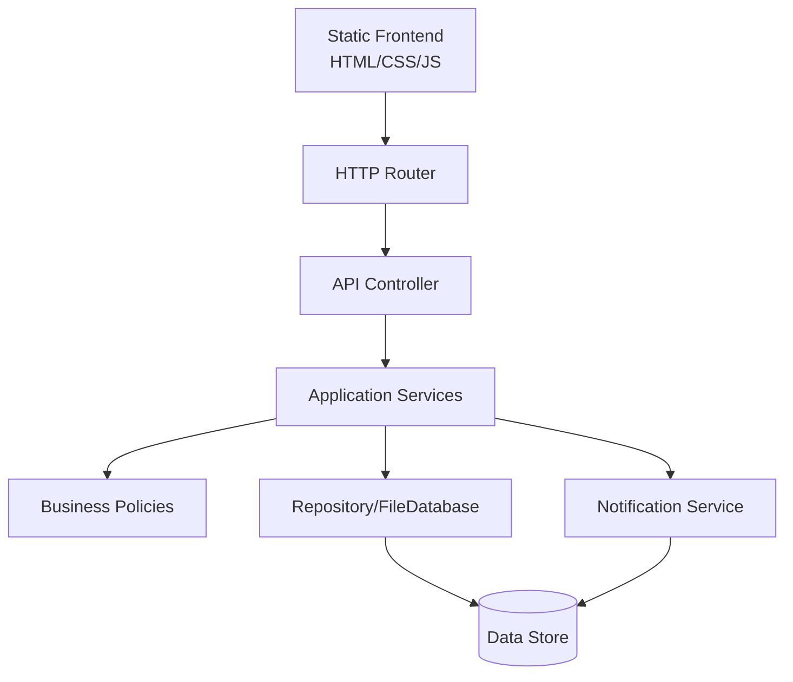
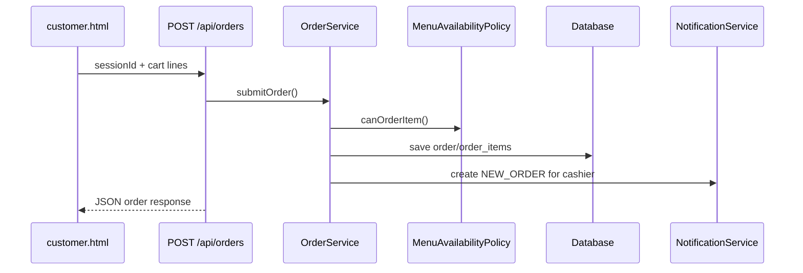

# C++ Server Architecture

## 1. Vai Trò Của Server

Server là process trung tâm chịu trách nhiệm:

- Nhận request từ frontend.
- Gọi application service theo module nghiệp vụ.
- Áp dụng business policy.
- Lưu dữ liệu.
- Tạo notification.
- Trả response JSON cho frontend.

Server giải quyết hạn chế lớn của CMD:

```text
CMD hiện tại = nhiều process cùng đọc file, không biết nhau vừa làm gì
Web server = một process trung tâm điều phối toàn bộ trạng thái
```

## 2. Runtime Đề Xuất

```text
restaurant_mvp server
```

Server chạy tại:

```text
http://localhost:8080
```

Frontend mở bằng browser:

```text
http://localhost:8080/customer.html?table=T01
http://localhost:8080/cashier.html
http://localhost:8080/kitchen.html?station=kitchen
http://localhost:8080/kitchen.html?station=bar
http://localhost:8080/manager.html
```

## 3. Thư Viện Server C++ Đề Xuất

| Lựa chọn | Đánh giá |
|---|---|
| `cpp-httplib` | Phù hợp MVP, single-header, dễ đưa vào đồ án |
| Crow | API đẹp hơn nhưng thêm dependency/framework |
| Raw WinSock | Không khuyến nghị, tốn thời gian vào socket thay vì nghiệp vụ |

Khuyến nghị: dùng `cpp-httplib` cho MVP.

## 4. Layer Architecture



## 5. Mapping Code Hiện Tại Sang Server

| Code hiện tại | Vai trò sau khi có server |
|---|---|
| `src/domain/` | Giữ nguyên record/entity |
| `src/policies/` | Giữ nguyên business rule |
| `src/modules/` | Giữ nguyên application service, có thể bổ sung DTO |
| `src/infrastructure/` | Tạm giữ file database, sau có thể đổi SQLite |
| `src/console/` | Giữ làm debug CLI |
| `src/server/` | Thêm HTTP router/controller |
| `web/` | Static frontend files |

## 6. Request Flow



## 7. State Ownership

| State | Owner | Frontend có được tự sửa không? |
|---|---|---|
| Table state | Server | Không |
| Dining session | Server | Không |
| Menu availability | Server | Không |
| Cart | Frontend local state | Có, trước khi submit |
| Order status | Server | Không |
| Kitchen task status | Server | Không |
| Notification last seen id | Frontend local state | Có |

## 8. Concurrency MVP

Trong giai đoạn đầu, server là một process duy nhất nên giảm nhiều lỗi so với nhiều CMD ghi file cùng lúc.

MVP có thể dùng:

- In-memory mutex khi đọc/ghi database.
- Save file sau mỗi command.
- Notification append vào database.

Nếu nâng cấp SQLite:

- Dùng transaction.
- Dùng index.
- Dùng foreign key.

## 9. Error Handling

Response lỗi nên thống nhất:

```json
{
  "ok": false,
  "error": {
    "code": "TABLE_NOT_ACTIVE",
    "message": "Table T01 has no active dining session.",
    "requiredAction": "OPEN_TABLE_FIRST",
    "context": {"tableCode": "T01"}
  },
  "correlationId": "REQ-20260620-0001"
}
```

Server phải map `PolicyDecision` từ application service sang response này; controller không tự tạo business rule riêng.
